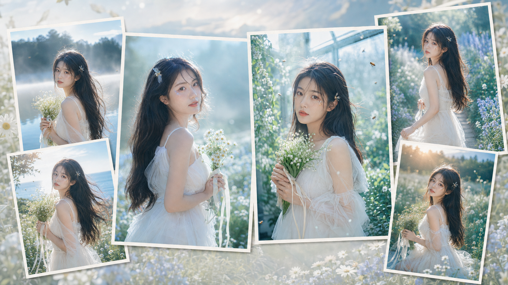
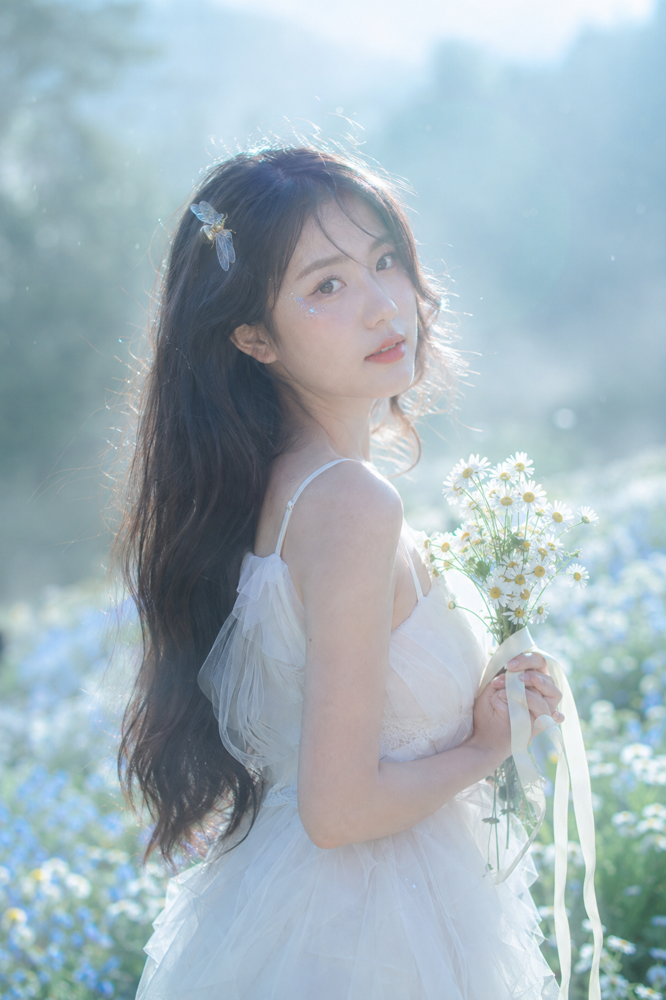
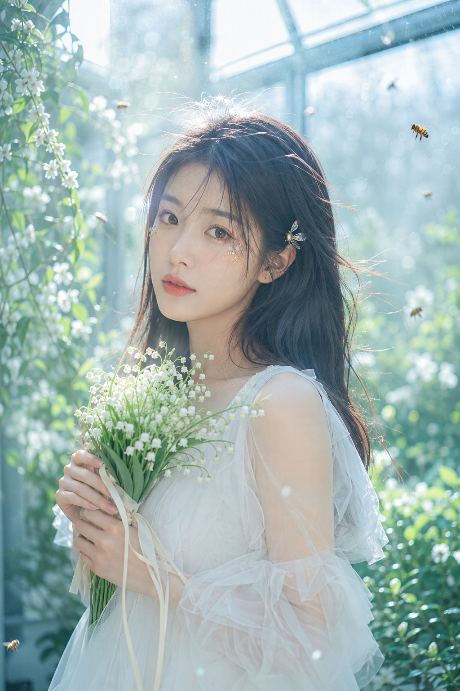
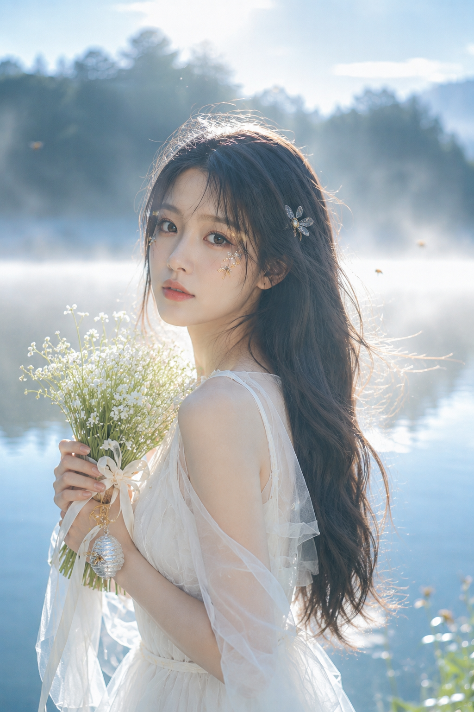
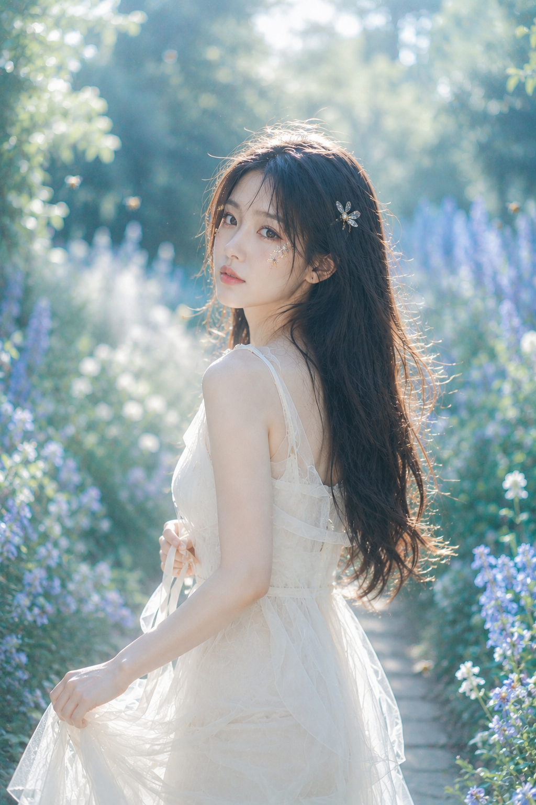
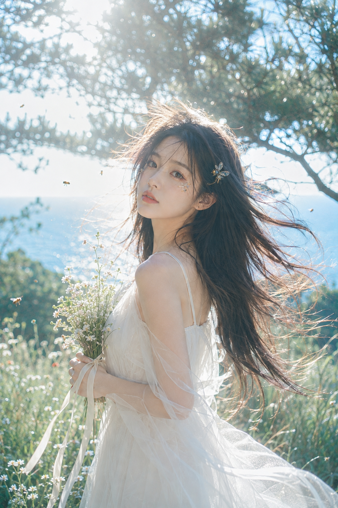
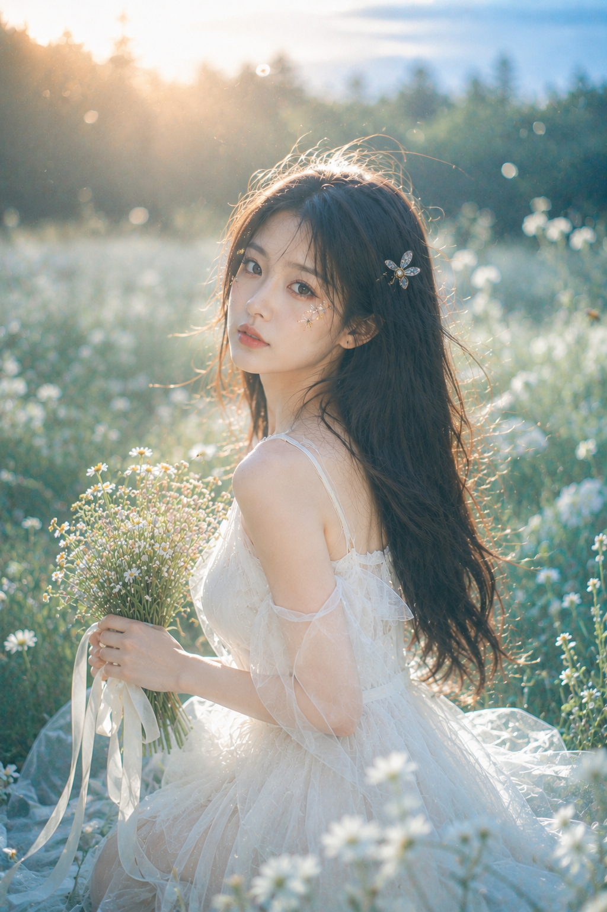

# 花境回眸的六种状态，怎样拍出自然发生的女友感瞬间？

花境写真最难的不是花多，而是人物不能像被摆进去。把视线留给镜头、把手交给花束，画面才有刚刚被看见的松弛感。

---

### 01｜晨雾花坡：用回头代替正面站定

微侧身回眸会让肩线、头发和视线自然形成对角线；白色缎带负责把双手安放在画面里。下面保留一份可直接使用的原版提示词。

竖版 2:3，清晨薄雾花坡中的梦幻人像摄影，一位 24 岁成年东亚女生站在开满浅白与淡蓝野花的缓坡上，黑棕色超长自然长发轻盈蓬松，被晨风轻轻吹起，五官自然清秀，面部干净，健康自然肤色，皮肤通透细腻并保留自然纹理，眼神安静温柔，微微侧身回头看向镜头。她穿象牙白轻薄吊带纱裙，层叠薄纱与雪纺质感，服装完整不透肤，双手轻轻拢在身前，指间垂落数条奶油白细缎带，并轻握一小束白色雏菊。发间停着一只小巧半透明蜜蜂饰物，耳侧和眼尾下方点缀极小面积金色与浅蓝色蜜蜂元素亮片妆。场景为带有清晨雾气的花坡，背景完全虚化为浅青绿色草地、冷蓝天空、远处模糊树林与奶油白圆形散景。柔和晨光从侧后方穿过薄雾照亮头发与肩膀，形成银白色轮廓光和发丝高光，空气中有细小漂浮光尘，轻微镜头炫光、柔焦 bloom 与薄雾晕染，高曝光、低对比、冷青蓝绿色调，85mm 人像镜头，f1.8，大光圈浅景深，中近景半身构图，梦幻、清透、轻盈、电影感，无文字，无水印，无 logo，避免过度磨皮，避免塑料感，避免多余人物，避免错误手部，避免 AI 美女脸、网红感、过度精修、塑料皮肤、暗沉肤色、明显痘印、明显皱纹、斑点、面部变形。

---

### 02｜玻璃温室：让光从顶部落下来

温室的重点是玻璃顶的斜向逆光，它把白裙和白花分开，也保留薄荷绿的呼吸感。

---

### 03｜湖畔晨雾：把动作收得更轻

不要让人直直站着。用小花、蜂巢吊饰和自然下垂的丝带，给手部一个安静的去处；雾白湖面会替人物留出空间。

---

### 04｜蓝紫花径：留出弯曲的纵深

花径要像一条引导线，而不是背景墙。让人物停在中央略转身，3/4 侧脸能同时保留脸部辨识度和行进感。

---

### 05｜海边草甸：让风成为第二个动作

海风吹起头发和裙摆时，人物不必做大动作。把远海、松树和白花压进浅景深，画面会有真实的户外空气感。

---

### 06｜暮光草地：把视线留在最后一秒

低位跪坐要把重心放回花束和眼神，避免用力摆拍。暮光只打亮发丝边缘，能留下白花草地最轻的一层情绪。

---

跟 AI 沟通时，先锁定“回眸、手部道具、侧逆光”三件事，再替换花坡、温室或海边；不要只堆叠梦幻形容词，否则人物会失去落点。

---

## 往期回顾

- 蓝绿梦光盛夏六景：一套写法拍出轻盈清透人像感
- 看似随手拍的居家女友照，原来靠这6个自然光镜头
- 晨雾绒光：六个窗光瞬间，让自然自拍像刚刚发生

#GPTImage2 #千问 #豆包 #生图提示词 #Prompt #女友感自拍系列 #花境回眸
