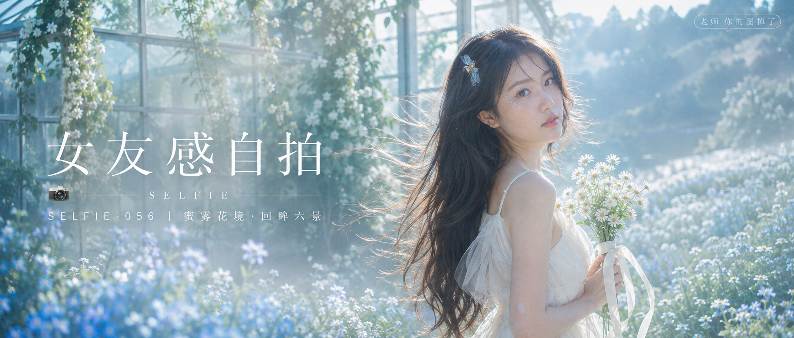

# SELFIE-056-蜜雾花境·回眸六景 封面

## 封面提示词

蜜雾光庭视觉概念，高级时尚人像摄影，清晨雾白花坡与通透玻璃温室在背景中交叠，一位 24 岁成年东亚女生置于画面右侧，面部占画面三分之一以上，清晰的 3/4 回眸，黑棕色长发被晨风托起，五官精致自然、面部立体清晰、皮肤光泽细腻、眼神有神灵动、妆感干净清透、轮廓清晰上镜；穿象牙白层叠纱裙，服装完整得体，手持白色雏菊与细缎带，发间一只小巧蓝金色半透明蜜蜂饰物。前景有失焦的浅蓝花朵，后景是薄荷绿藤蔓、雾白光尘和湖蓝天空，金色微光与冷青蓝晨雾形成冷暖对比，侧逆光打亮颧骨与发丝，电影感光影、高清锐利、色彩层次丰富、视觉冲击力强、构图黄金比例、前景虚化背景、色调统一精致、画面有张力，2.35:1 电影横构图，无文字，无水印，无 logo，避免 AI 美女脸、网红感、过度精修、塑料皮肤、暗沉肤色、明显痘印、明显皱纹、斑点、面部变形。

【文字排版-必须完整保留，不得省略或简化任何一项】画面左侧垂直居中偏下叠加文字排版：超大号衬线字体米白色主文案「女友感自拍」，主文案正下方一条细横线左端带📷横线中央有透明英文水印 SELFIE，横线下方等宽白色字体副文案「SELFIE-056 ｜ 蜜雾花境·回眸六景」；右上角浅色半透明圆角底衬配小号文字「老师 你的图掉了」（署名文字，必须出现，不可省略）；无整体蒙层，文字直接压图。【文字排版结束】

## 封面图片

