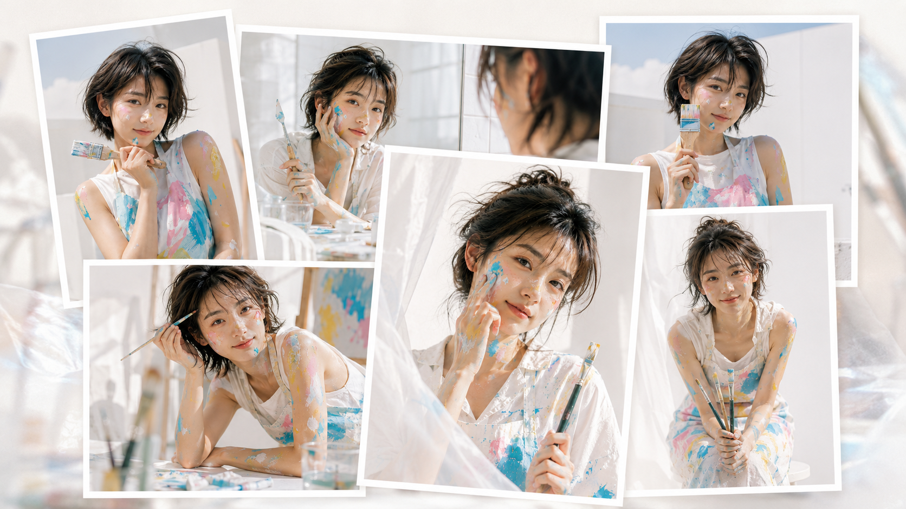
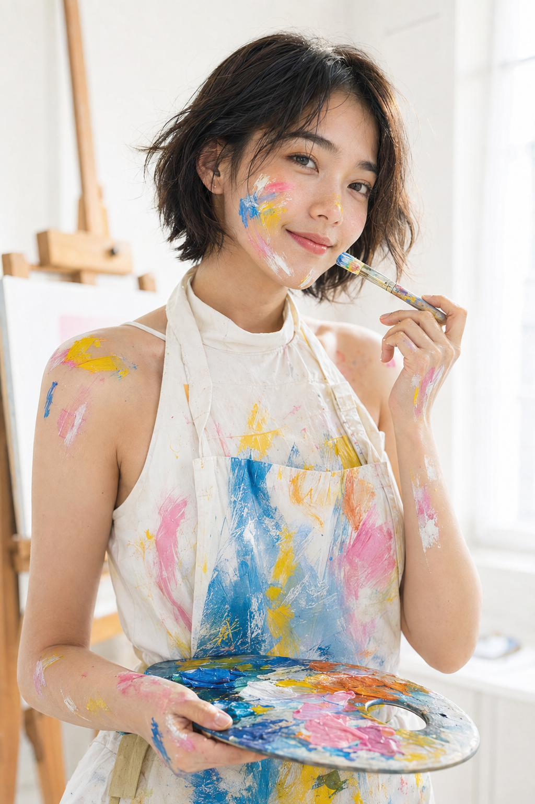
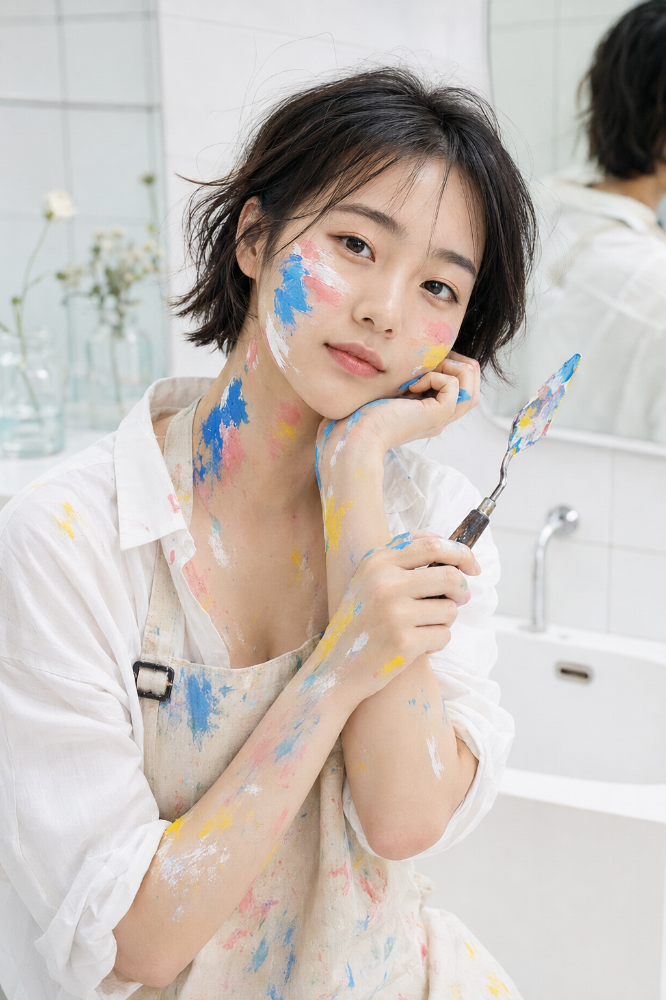
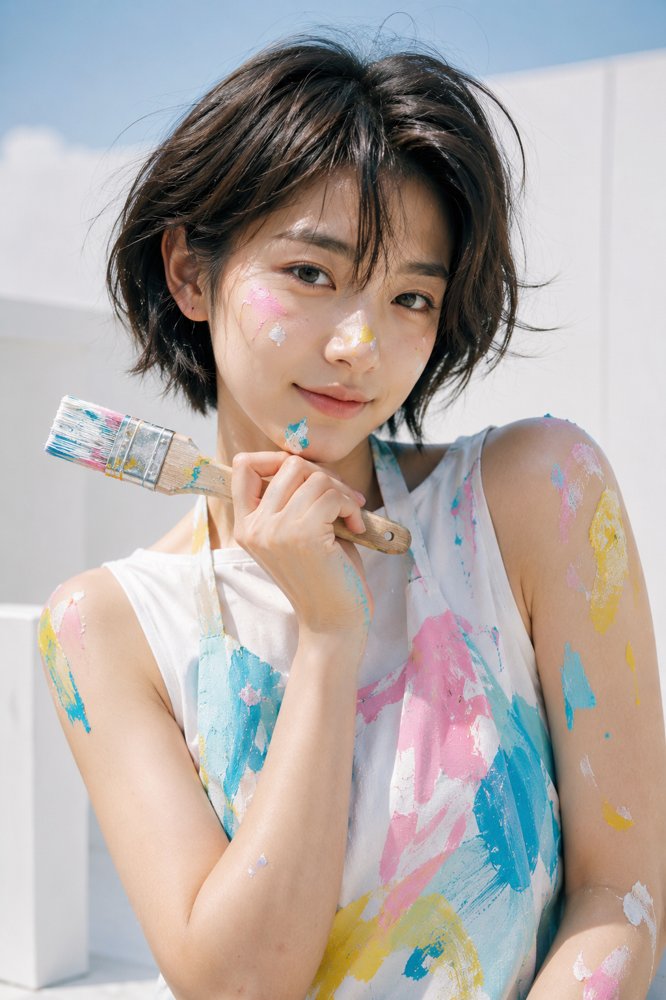
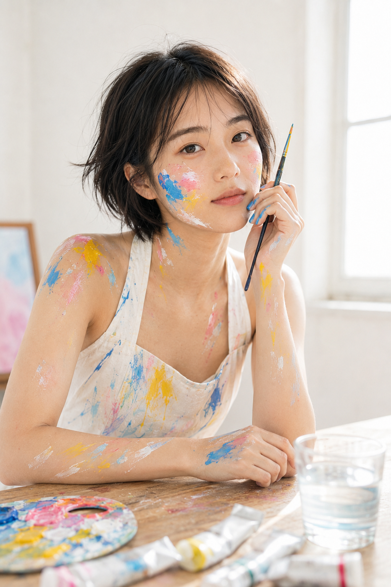
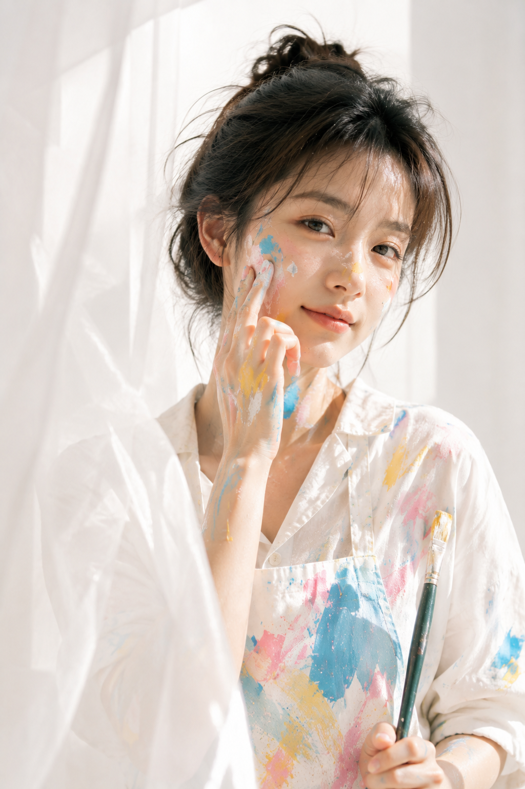
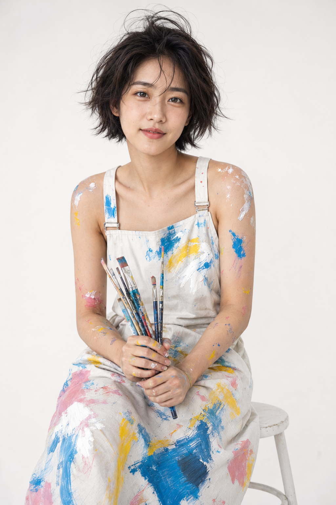

# 高明度彩绘少女不显脏，6个画室镜头拆开讲清楚

**本期关键词：** 高明度白底。彩色不铺满背景，只落在服装、皮肤和少量道具上，画面就会有轻快的创作感。白色空间留得越完整，颜料越显干净。

**核心变量：** 固定湖蓝、柠檬黄、樱花粉、白色四种颜料，人物始终在白色空间里，以自然侧窗光统一六个场景。

---

**#01 ｜ 窗边调色盘**

这张保留完整原版写法：先锁定干净的人物状态，再交代颜料落点，最后用窗光和焦段收住质感。

生成一张竖版 2:3 的高明度清新艺术人像写真，明亮通透的白色画室窗边，一位 24 岁成年东亚女生半身近景入镜，黑棕色松散短发与自然碎发，五官自然清秀、面部干净、健康自然肤色、自然皮肤纹理、眼神真实。她穿白色高领围裙式画室上衣，衣料上有湖蓝、柠檬黄、樱花粉、少量橙色与白色的随性抽象丙烯笔触；脸颊、鼻梁、下巴、手背和肩线有自然厚涂颜料痕迹，像刚完成绘画创作。她一手将调色盘自然贴近腰侧，另一手举细长画笔停在脸颊旁，嘴角轻松上扬，神情俏皮安静。背景为纯白墙面、虚化原木画架与窗光，布景极简；柔和自然侧窗光、高调曝光、色彩清爽鲜艳，日系生活杂志与艺术写真结合，50mm 人像镜头、浅景深、高清写实，不要文字、logo、水印、第二人物。避免 AI 美女脸、网红感、过度精修、塑料皮肤、暗沉肤色、明显痘印、明显皱纹、斑点、面部变形

> 测试结论：调色盘靠近腰侧，比贴近脸部更容易保住面部留白。

---

**#02 ｜ 镜前调色刀**

镜面只作为背景反射，不抢主体。轻托下巴 + 小号调色刀能把视线自然引回脸部，瓷砖与玻璃器皿保持虚化即可。

---

**#03 ｜ 天台扁平刷**

白墙和少量天空高光负责留白，画笔停在下巴旁而非做夸张表情。动作越轻，彩绘质感越像被随手抓到。

---

**#04 ｜ 原木桌边笔触**

让画笔、颜料管和玻璃杯退到前景虚化区；正脸靠近画面中心，原木只做一小块暖色支撑，白底才不会单薄。

---

**#05 ｜ 纱帘蓝色笔触**

这张的关键是前景白纱：它只模糊边缘，不盖住眼神和颜料纹理。手指轻晕开一小块湖蓝，就足够制造正在创作的瞬间。

---

**#06 ｜ 白棚圆凳画笔**

白棚最怕背景空而人也平。坐姿微前倾、画笔聚在身前，再留一层柔和投影，画面会有更稳定的纵深和比例。

---

**给 AI 的沟通顺序：** 先说清人物与白色空间，再指定四色体系，接着给一个自然动作，最后补镜头、光线和负向约束。不要同时堆叠太多布景和道具，白底才是这组图的主控变量。

你更想把这套彩绘放进窗边、天台还是纯白影棚？

---

## 往期回顾

- 花境回眸的六种状态，怎样拍出自然发生的女友感瞬间？
- 蓝绿梦光盛夏六景：一套写法拍出轻盈清透人像感
- 看似随手拍的居家女友照，原来靠这6个自然光镜头

#GPTImage2 #千问 #豆包 #生图提示词 #Prompt #女友感自拍 #彩绘少女
