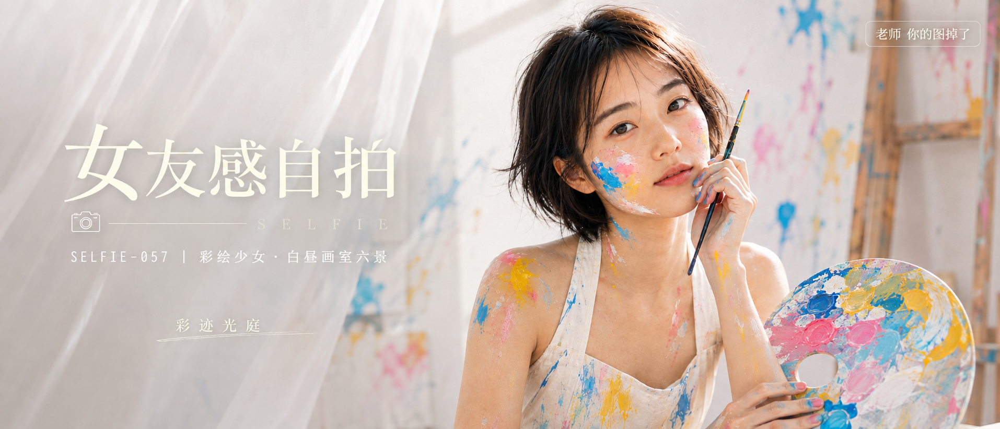

# SELFIE-057-彩绘少女·白昼画室六景 封面

## 封面提示词

生成一张精美吸睛的 2.35:1 电影横构图人像封面，视觉概念为「彩迹光庭」：明亮通透的白色画室里，一位 24 岁成年东亚女生以清晰正脸和轻微 3/4 侧脸出现在画面右侧，面部占画面三分之一以上，黑棕色蓬松短发、白色画室围裙上衣沾有湖蓝、柠檬黄、樱花粉和白色的厚涂颜料；她手持调色盘与细画笔，画笔和半透明纱帘形成前景，彩色笔触在白墙与原木画架间延展，构成冷暖色对比、前中后景层次与几何留白。五官精致自然、面部立体清晰、皮肤光泽细腻、眼神有神灵动、妆感干净清透、轮廓清晰上镜；柔光环绕面部并以侧逆光打亮颧骨，高明度白底配鲜明彩绘色彩，电影感光影、高清锐利、色彩层次丰富、视觉冲击力强、构图黄金比例、画面有张力、商业海报级完成度。避免 AI 美女脸、网红感、过度精修、塑料皮肤、暗沉肤色、明显痘印、明显皱纹、斑点、面部变形、文字乱码、裁切人物五官。

【文字排版-必须完整保留，不得省略或简化任何一项】画面左侧垂直居中偏下叠加文字排版：超大号衬线字体米白色主文案「女友感自拍」，主文案正下方一条细横线左端带📷横线中央有透明英文水印 SELFIE，横线下方等宽白色字体副文案「SELFIE-057 ｜ 彩绘少女·白昼画室六景」；以小号装饰文字加入视觉概念「彩迹光庭」但不挤压人物面部；右上角浅色半透明圆角底衬配小号文字「老师 你的图掉了」（署名文字，必须出现，不可省略）；无整体蒙层，文字直接压图。【文字排版结束】

## 封面图片

