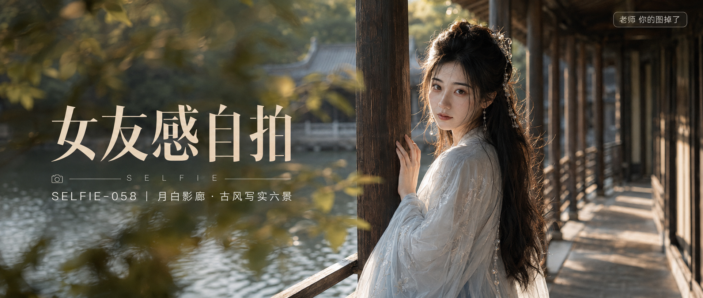

# SELFIE-058-月白影廊·古风写实六景 封面

## 封面提示词

视觉概念「月白影廊」：一位 24—28 岁成年东亚女性身着月白与琉璃浅青叠穿汉服，站在临水古典回廊转角，正脸微偏 3/4 面向镜头，面部占画面三分之一以上，五官精致自然、面部立体清晰、皮肤光泽细腻、眼神有神灵动、轮廓清晰上镜；一只手轻扶深木廊柱，暖金侧逆光打亮颧骨、发丝和轻纱衣袖，远处水面反光与深木棕阴影形成冷暖层次，前景有虚化枝叶，人物衣摆与回廊引导线构成视觉张力，明亮月白、浅青、暖金三色层次分明，电影感光影、高清锐利、色彩层次丰富、视觉冲击力强、构图黄金比例、画面有张力，2.35:1 电影横构图，人物与文字区域彼此不遮挡，无现代物件，无文字无水印，避免 AI 美女脸、网红感、过度精修、塑料皮肤、暗沉肤色、明显痘印、明显皱纹、斑点、面部变形。

【文字排版-必须完整保留，不得省略或简化任何一项】画面左侧垂直居中偏下叠加文字排版：超大号衬线字体米白色主文案「女友感自拍」，主文案正下方一条细横线左端带📷横线中央有透明英文水印 SELFIE，横线下方等宽白色字体副文案「SELFIE-058 ｜ 月白影廊·古风写实六景」；右上角浅色半透明圆角底衬配小号文字「老师 你的图掉了」（署名文字，必须出现，不可省略）；无整体蒙层，文字直接压图。【文字排版结束】

## 封面图片

