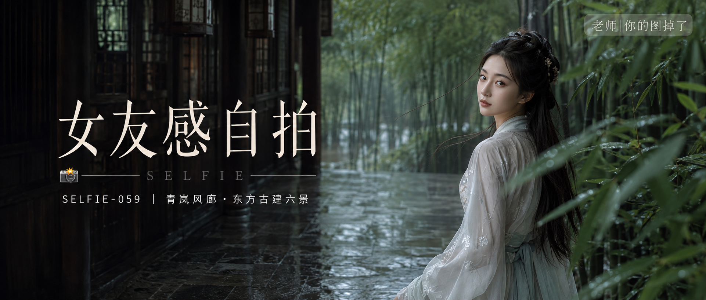

# SELFIE-059-青岚风廊·东方古建六景 封面

## 封面提示词

青岚风廊主题的东方古典人像商业封面：一位25岁成年东亚女性以清晰的3/4侧脸站在雨后江南古建的深棕木廊中，人物置于画面右侧，面部占视觉中心约三分之一，月白与浅青层叠汉服完整得体，黑色长发被微风带起，清透眼神直视镜头，左侧保留深色竹廊和湿润青石的干净文字留白；雨后竹叶作为近景虚化，远处透出明亮青绿色竹林，冷青环境与柔暖肤色形成克制冷暖对比，五官精致自然、面部立体清晰、皮肤光泽细腻、眼神有神灵动、妆感干净清透、轮廓清晰上镜，电影感光影、高清锐利、色彩层次丰富、视觉冲击力强、构图黄金比例、前景虚化背景、色调统一精致、画面有张力，真实摄影，2.35:1电影横构图。不要文字乱码、现代物品、夸张首饰、仙侠CG、错误手指和肢体、建筑畸变；避免AI美女脸、网红感、过度精修、塑料皮肤、暗沉肤色、明显痘印、明显皱纹、斑点、面部变形。

【文字排版-必须完整保留，不得省略或简化任何一项】画面左侧垂直居中偏下叠加文字排版：超大号衬线字体米白色主文案「女友感自拍」，主文案正下方一条细横线左端带📷横线中央有透明英文水印 SELFIE，横线下方等宽白色字体副文案「SELFIE-059 ｜ 青岚风廊·东方古建六景」；右上角浅色半透明圆角底衬配小号文字「老师 你的图掉了」（署名文字，必须出现，不可省略）；无整体蒙层，文字直接压图。【文字排版结束】

## 封面图片

