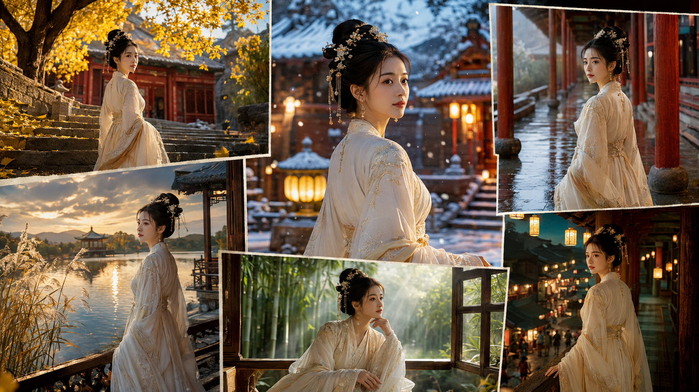
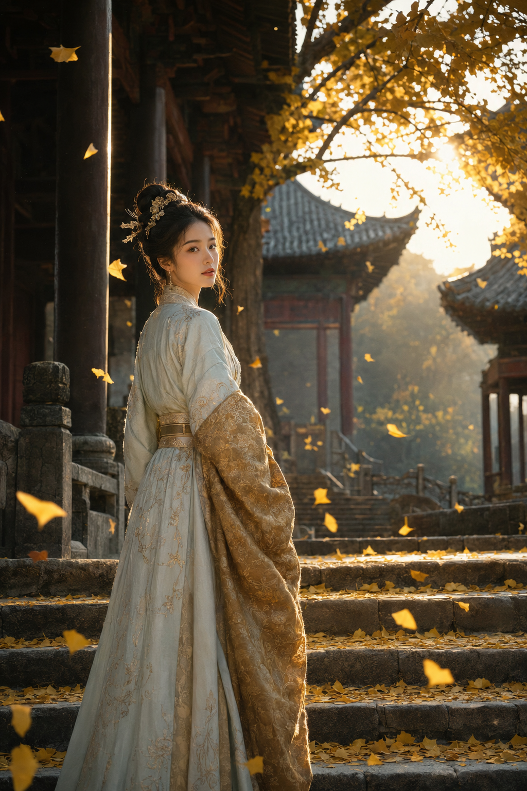
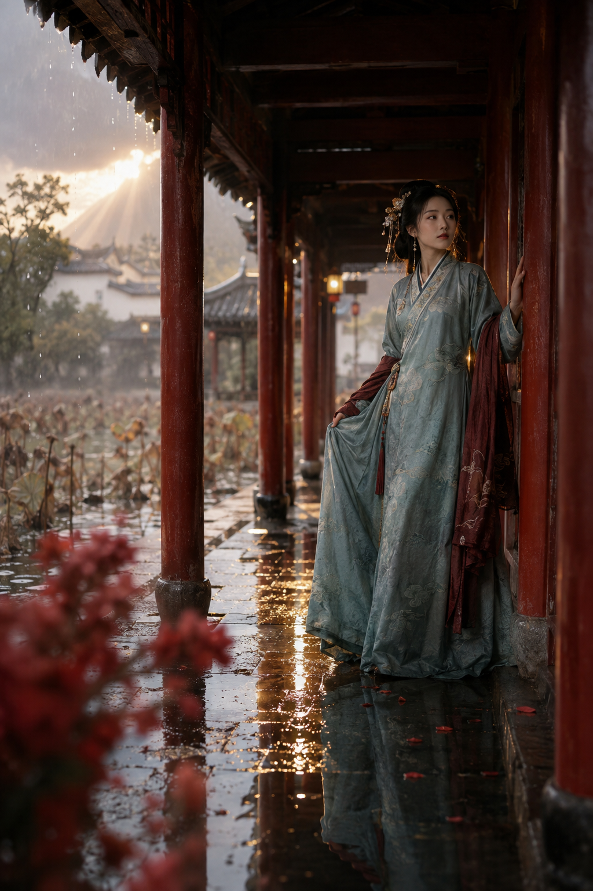
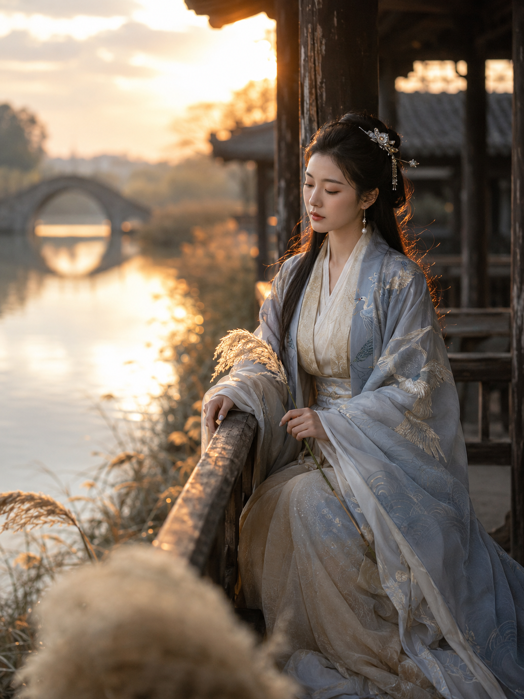
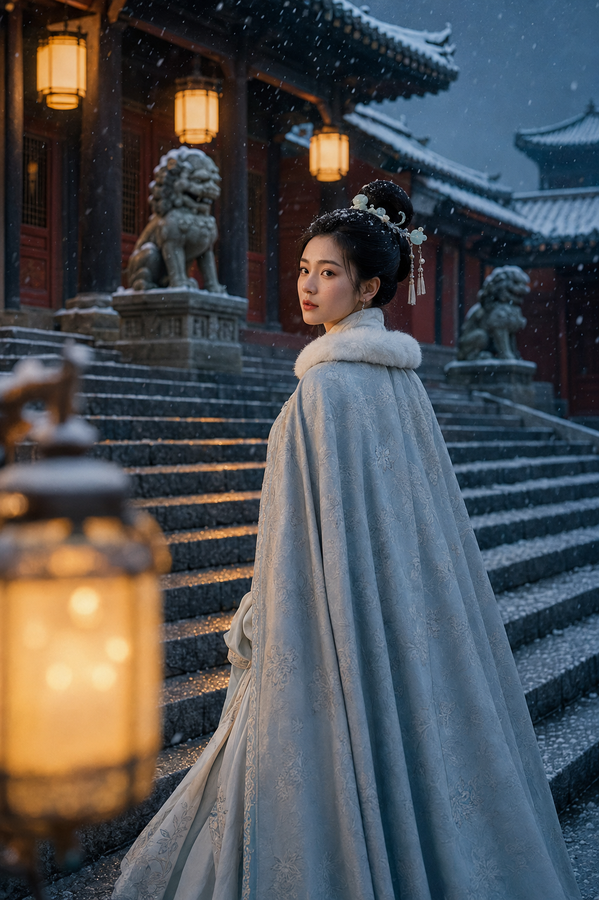
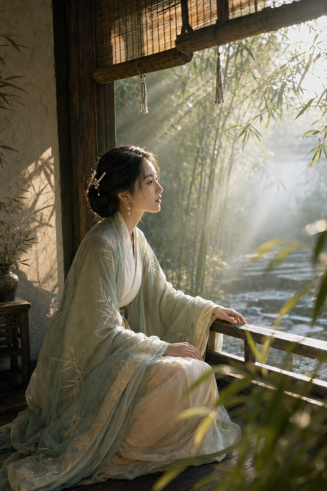
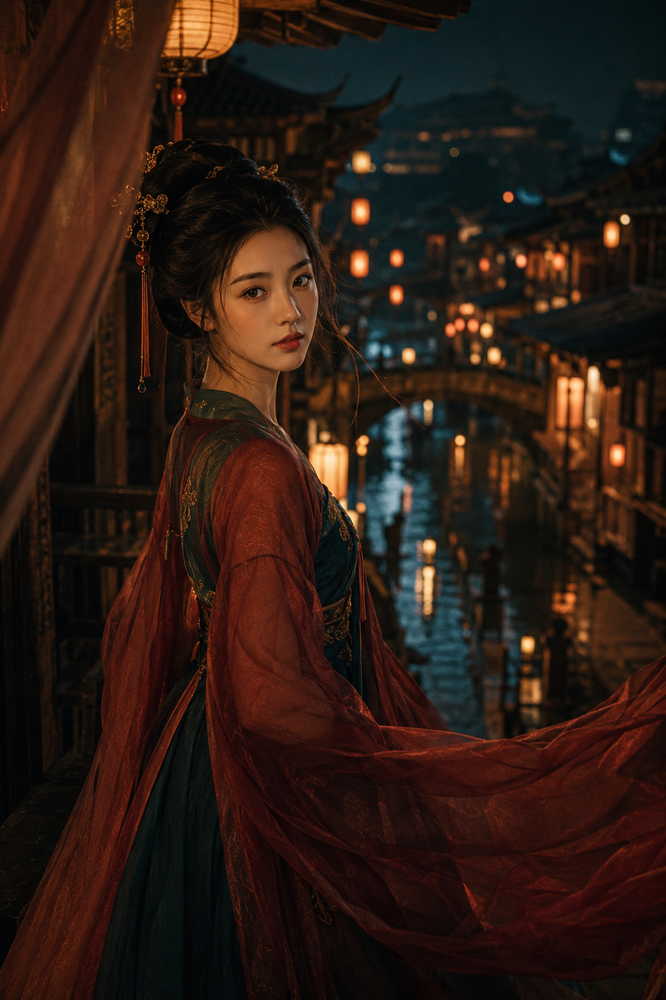

# 同样是古风人像，6个场景怎样拍出电影层次？

古建人像会显得悬浮，往往不是人物不够好看，而是环境只剩下背景。把风、倒影、雪、雾和灯火放进前中后景，人物就自然有了停留的理由。

先搭空间，再放人物。 这组六景都用自然元素参与构图，而不是只堆古风道具。

### 01｜银杏古寺

侧逆光决定了人物与古寺能否分开。 对 AI 要明确说明光从屋檐后穿过枝叶，并把飘叶留给前景。

竖版2:3，写实东方古典电影人像。深秋黄昏，成年东亚女性立于古寺石阶，三分之二侧身回望。黑发高髻配金簪和银杏发簪；五官自然清秀，面部干净，真实皮肤纹理，眼神平静。月白茶金古典长裙与暗金宽袖。青灰石阶、深木廊柱、青瓦飞檐、百年银杏和金黄落叶，夕阳穿枝叶形成暖金侧逆光，发丝和衣袖有金边。人物偏左，石阶斜向延伸，前景飘叶、中景人物、薄雾寺院形成三层空间；85mm f/2.0，面部清晰、远景柔化。月白、茶金、青灰和琥珀金，厚重暗部、暖高光、轻胶片颗粒，真实高预算历史电影剧照，高清干净，无模糊，不要现代元素、文字、Logo、水印、仙侠特效。避免AI美女脸、网红感、过度精修、塑料皮肤、暗沉肤色、明显痘印、明显皱纹、斑点、面部变形

---

### 02｜雨后朱廊

倒影不是复制人物，而是把湿石板当作第二层空间；朱红和烟青的冷暖关系会比堆灯笼更稳定。

---

### 03｜湖心水榭

大面积湖面留白，人物只占右侧三分之一。芦花靠近镜头，才能留下安静又有纵深的空气感。

---

### 04｜冬宫初雪

雪景最怕画面发灰。让暖灯只轻扫面部，背景保留蓝调，冷暖才会干净且有故事性。

---

### 05｜竹院晨雾

门框和竹帘是天然画框。跟 AI 沟通时先锁定“窗边斜光穿过雾气”。 人物自然会被光影托住。

---

### 06｜古城灯市

把人物放在左侧，让灯笼与古街向右延伸；近处纱帘只做柔焦前景，夜色就有了电影里的呼吸感。

---

这组六景共用的判断是：人物必须被光线、材质和空间同时托住。

---

## 往期回顾

- 试了6个高机位回眸场景，东方古建人像终于不再悬浮
- 6个古风自然光场景，避开网红感拍出清冷写实人像
- 高明度彩绘少女不显脏，6个画室镜头拆开讲清楚

#GPTImage2 #千问 #豆包 #生图提示词 #Prompt #女友感自拍系列 #东方古建人像
