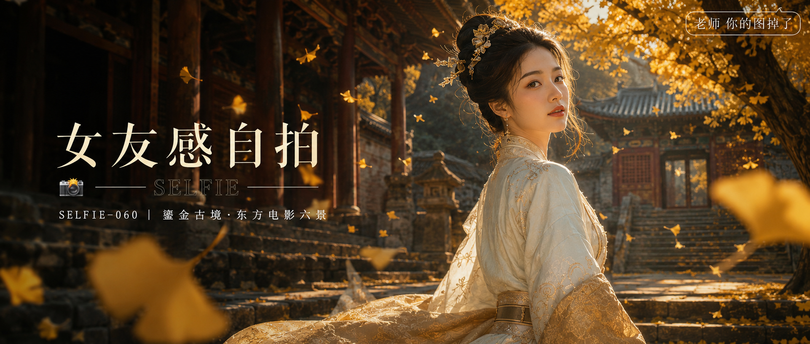

# SELFIE-060-鎏金古境·东方电影六景 封面

## 封面提示词

2.35:1 电影横构图，视觉概念“鎏金古境”，深秋古寺石阶前，一位24至28岁成年东亚女性以清晰的三分之四正脸立于画面右侧，面部占画面三分之一以上，五官精致自然、面部立体清晰、皮肤光泽细腻、眼神有神灵动、妆感干净清透、轮廓清晰上镜；黑发古典高髻配银杏叶发簪，月白与淡茶金古典长裙的肩线和宽袖自然随风，姿态优雅克制。巨大的金黄银杏树与深朱古寺飞檐在后，近景有一片柔焦银杏叶，金色侧逆光打亮颧骨与发丝，暗部为深木与青灰，远处石阶和廊柱制造纵深。画面有暖金与冷青灰的鲜明层次、前景虚化背景、构图黄金比例、电影感光影、高清锐利、色彩层次丰富、视觉冲击力强，真实高预算东方历史电影海报，人物和背景干净清晰。避免AI美女脸、网红感、过度精修、塑料皮肤、暗沉肤色、明显痘印、明显皱纹、斑点、面部变形、文字乱码、裁切人脸、现代元素、水印。【文字排版-必须完整保留，不得省略或简化任何一项】画面左侧垂直居中偏下叠加文字排版：超大号衬线字体米白色主文案「女友感自拍」，主文案正下方一条细横线左端带📷横线中央有透明英文水印 SELFIE，横线下方等宽白色字体副文案「SELFIE-060 ｜ 鎏金古境·东方电影六景」；右上角浅色半透明圆角底衬配小号文字「老师 你的图掉了」（署名文字，必须出现，不可省略）；无整体蒙层，文字直接压图。【文字排版结束】

## 封面图片

