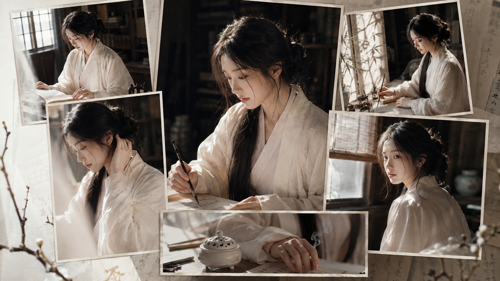
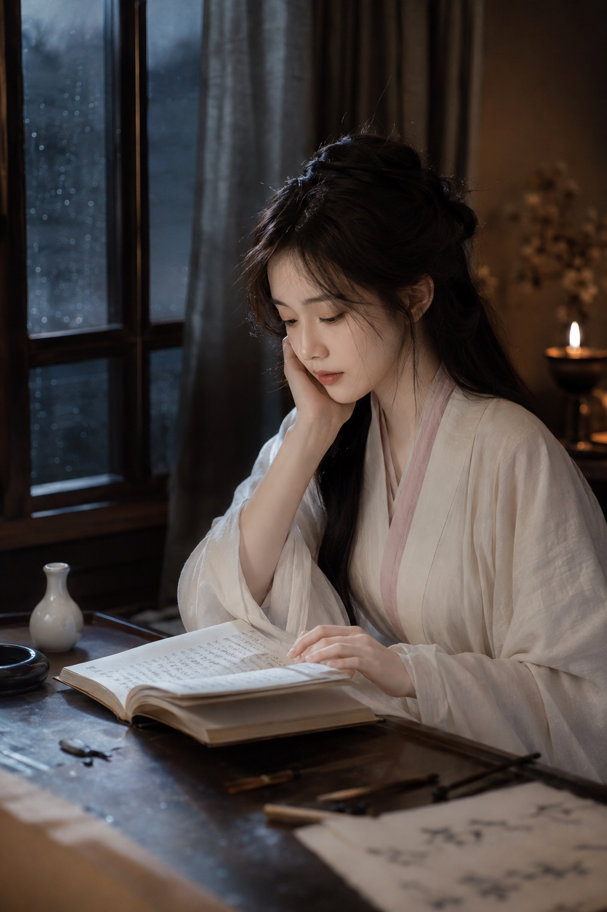
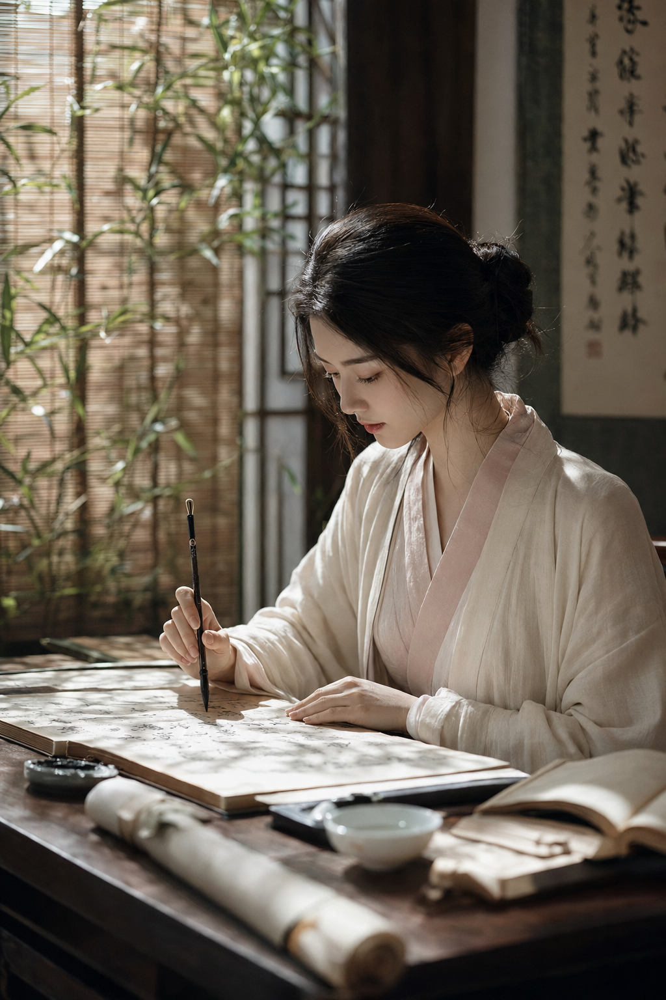
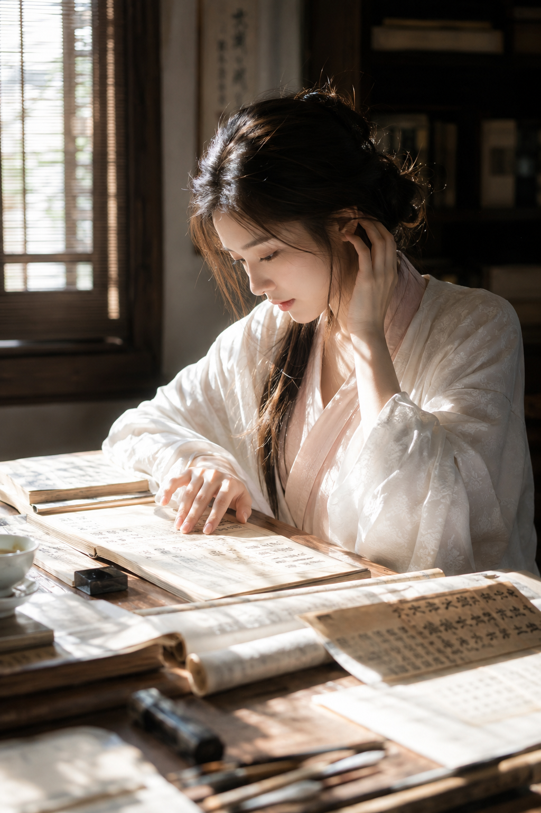
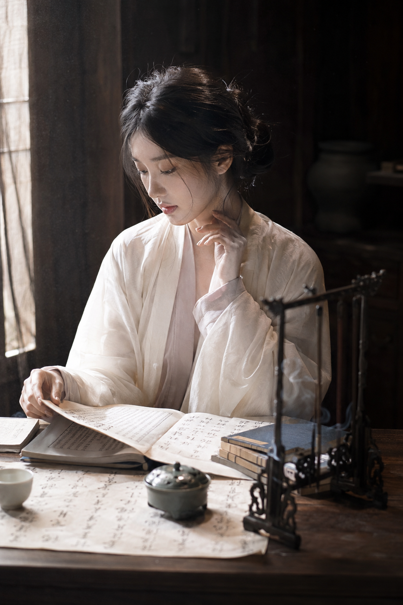
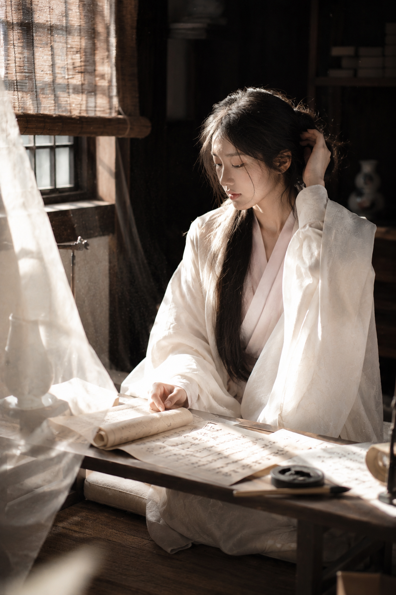

# 古典书房人像怎么不显影楼感：6种透窗光写实出片方法

白衣、宣纸和透窗自然光本来就很容易出“影楼古风”。这组六景只固定一件象牙白交领衫，用明亮冷白窗光把人物、纸面和深木背景分开，画面才会轻，也更像真实生活里的书房瞬间。

---

### 01｜窗下抄经

这是唯一保留的完整原版。重点不是堆很多“仙气”词，而是明确光从哪里进来、手在做什么、焦点落在哪里。

生成一张东方古典书房人像写真，竖版2:3，真实写实，高级清透，安静克制的电影感氛围。一位24岁成年东亚女生坐在旧木书案前，黑棕色长发松散低挽，额前垂落几缕碎发，穿象牙白宽松交领古风长衫与浅粉白内搭，衣料柔软轻薄，带细腻暗纹。她微微低头，侧脸朝向画面左侧，一只手握毛笔在宣纸上抄写，另一只手轻扶鬓边发丝，神情专注、安静、若有所思。五官自然清秀，面部干净，冷白皮肤光泽自然，眼神真实，轮廓清晰。桌面铺满摊开的宣纸、线装古籍、墨迹字帖与一方砚台，局部可见笔架和卷轴。左上方明亮午后窗光斜射进来，重点照亮脸颊、鼻梁、手指和白色衣袖，头发边缘带细碎轮廓光，白衣与宣纸形成大片干净高光留白，背景压暗为深黑与深棕色，只隐约看到书法挂轴和木质家具。构图为近景半身，人物位于右侧偏中位置，桌面纸张从前景向画面深处延展，形成前景、人物、暗背景的层次。色调以象牙白、奶油白、暖肤粉、墨黑、旧木深褐为主，低饱和、中高对比，细腻胶片颗粒，50mm或85mm镜头，大光圈浅景深，焦点清晰落在人物眼睫与手部，整体气质文雅、静谧、东方审美高级。避免网红脸、避免浓妆、避免夸张汉服舞台感、避免多余艳色、避免手部畸形、避免文字水印、避免AI美女脸、过度精修、塑料皮肤、暗沉肤色、明显痘印、明显皱纹、斑点、面部变形。

---

### 02｜夜雨读卷

**避开点：** 不把雨夜写成特效场。用室内暖灯和窗外灰蓝天光做冷暖双层光，人物皮肤会透亮，暗背景也仍然有呼吸感。

---

### 03｜竹影题字

跟 AI 沟通时，竹影要落在肩、脸侧和纸面三处，而不是只写“有竹子”。影子的位置决定了画面是否像自然窗光，而非布景。

---

### 04｜晨光临帖

这张用纸页做前景，引导视线落到低头整理字帖的动作。人物置于偏右位置，左侧的亮光要保留留白，才能避免桌面道具挤成一团。

---

### 05｜午后焚香

香炉只负责交代空间，不该抢人物。把烟写得极淡、若有若无，再让一束侧上方日光擦过脸和手，安静感就会成立而不显脏。

---

### 06｜卷帘听风

卷帘、白纱和纸页是三层柔软前景。它们把视线推进到人物的侧身整理头发，让构图有层次；同时固定同一套衣料和发型，AI 才不会把六景生成为六个陌生人。

---

这组图的关键不是“古风”本身，而是真实人物动作 + 可定位的透窗光 + 深浅明确的空间层次。先把这些说清，白衣与冷白皮才会显得干净、轻盈，而不是塑料感。

---

## 往期回顾

- 同样是古风人像，6个场景怎样拍出电影层次？
- 试了6个高机位回眸场景，东方古建人像终于不再悬浮
- 6个古风自然光场景，避开网红感拍出清冷写实人像

#GPTImage2 #千问 #豆包 #生图提示词 #Prompt #女友感自拍系列 #古典书房人像
