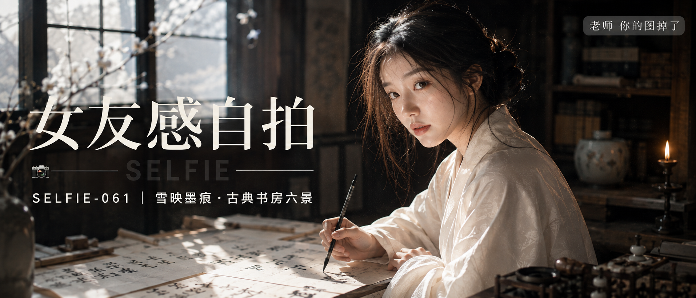

# SELFIE-061-雪映墨痕·古典书房六景 封面

## 封面提示词

以“雪映墨痕”为视觉母题，东方古典书房电影海报：一位24岁成年东亚女生以清晰3/4侧脸看向镜头，面部占画面三分之一以上，黑棕长发低挽并有自然碎发，穿象牙白暗纹交领长衫，坐在旧木书案旁，手持毛笔停在摊开的宣纸上；五官精致自然、面部立体清晰、冷白皮肤光泽细腻、眼神有神灵动、妆感干净清透、轮廓清晰上镜。左侧冷白窗光与右侧暖琥珀烛光交错，前景虚化的宣纸墨痕与后景深木书架构成前中后景，象牙白高光和墨黑阴影形成鲜明材质反差，人物与留白保持黄金比例，高清锐利，电影感光影，色彩层次丰富，视觉冲击力强，画面有张力，真实商业海报级完成度。避免AI美女脸、网红感、过度精修、塑料皮肤、暗沉肤色、明显痘印、明显皱纹、斑点、面部变形、手部畸形、文字乱码、遮挡五官。2.35:1电影横构图。

【文字排版-必须完整保留，不得省略或简化任何一项】画面左侧垂直居中偏下叠加文字排版：超大号衬线字体米白色主文案「女友感自拍」，主文案正下方一条细横线左端带📷横线中央有透明英文水印 SELFIE，横线下方等宽白色字体副文案「SELFIE-061 ｜ 雪映墨痕·古典书房六景」；右上角浅色半透明圆角底衬配小号文字「老师 你的图掉了」（署名文字，必须出现，不可省略）；无整体蒙层，文字直接压图。【文字排版结束】

## 封面图片

