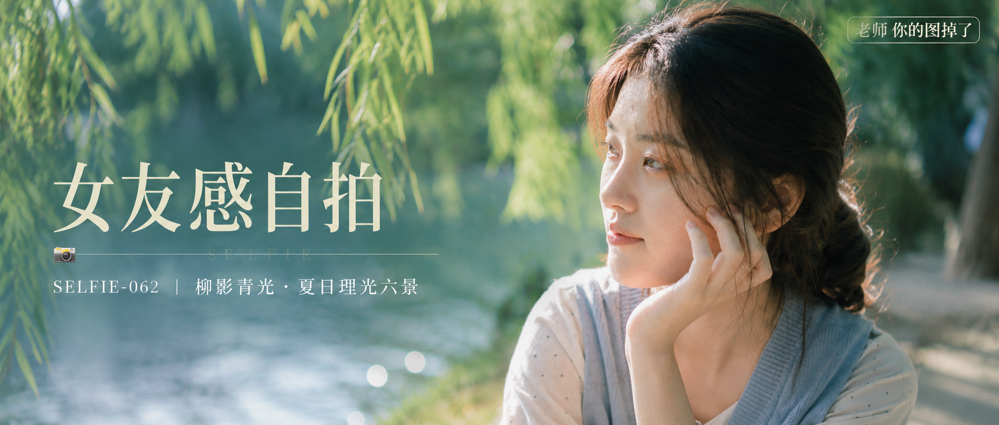

# SELFIE-062-柳影青光·夏日理光六景 封面

## 封面提示词

概念名「柳影青光」：夏日河畔柳树下的电影感人像封面，一位 25 岁成年东亚女生以清晰 3/4 侧脸置于画面右侧，面部占横幅约三分之一，黑棕色松散低扎发与细碎发丝被柳叶缝隙的光勾亮；她穿奶油白细点上衣与浅雾蓝针织背心，姿态自然优雅，五官精致自然，面部立体清晰，皮肤光泽细腻，眼神有神灵动，妆感干净清透，轮廓清晰上镜。左侧保留深浅交叠的柳叶前景与柔焦河面，中景人物被侧逆光打亮颧骨，远景是青绿色散景和奶油白泛光，冷青绿与暖肤色对比，画面具有前中后景层次、构图黄金比例、电影感光影、高清锐利、色彩层次丰富、视觉冲击力强、色调统一精致、画面有张力；真实高级夏日肖像，不要任何肢体或面部瑕疵。避免 AI 美女脸、网红感、过度精修、塑料皮肤、暗沉肤色、明显痘印、明显皱纹、斑点、面部变形。

【文字排版-必须完整保留，不得省略或简化任何一项】画面左侧垂直居中偏下叠加文字排版：超大号衬线字体米白色主文案「女友感自拍」，主文案正下方一条细横线左端带📷横线中央有透明英文水印 SELFIE，横线下方等宽白色字体副文案「SELFIE-062 ｜ 柳影青光·夏日理光六景」；右上角浅色半透明圆角底衬配小号文字「老师 你的图掉了」（署名文字，必须出现，不可省略）；无整体蒙层，文字直接压图。【文字排版结束】

## 封面图片

