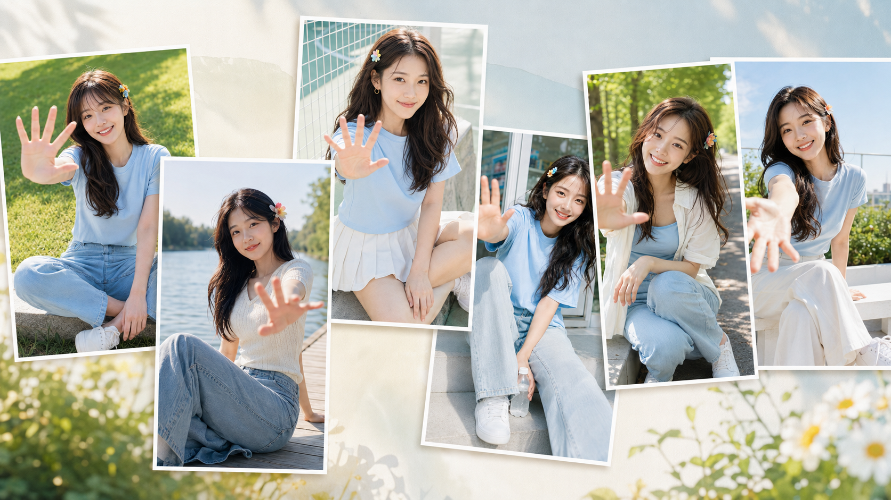
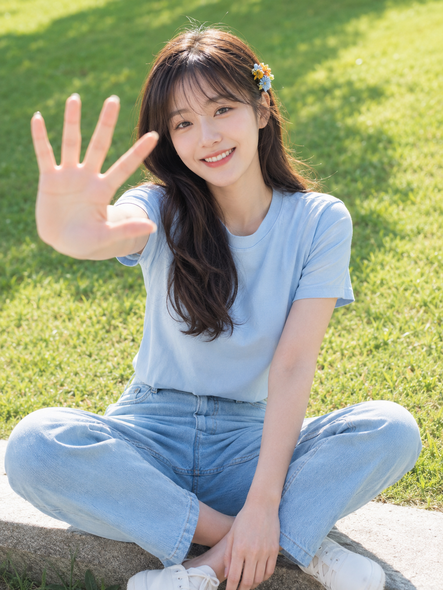
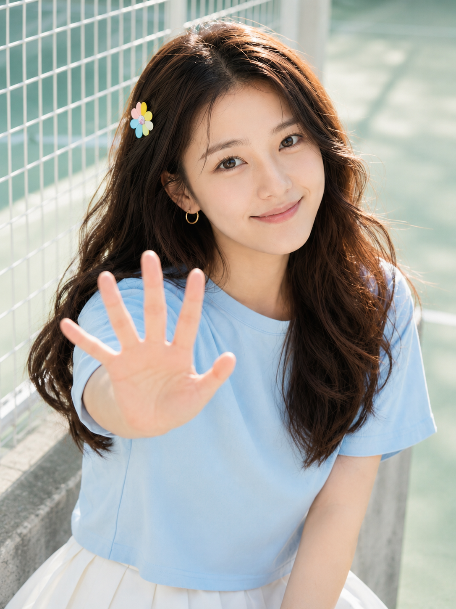
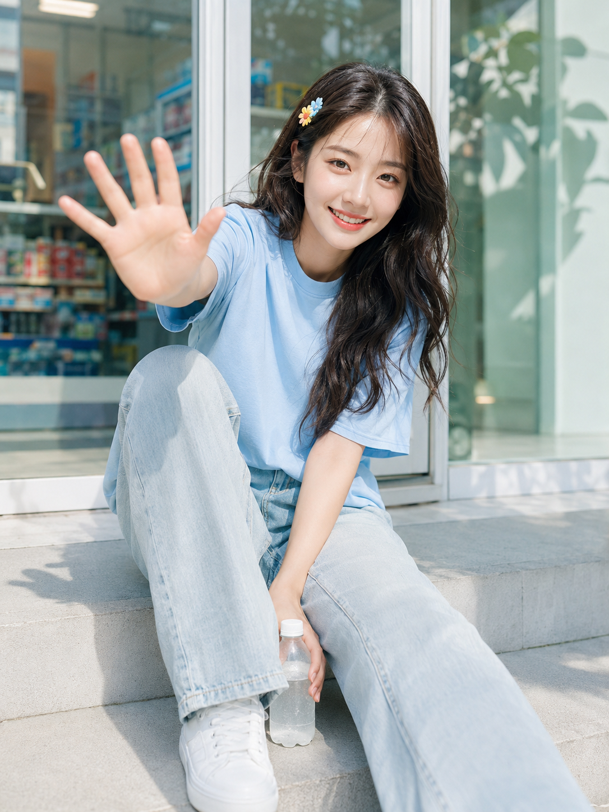
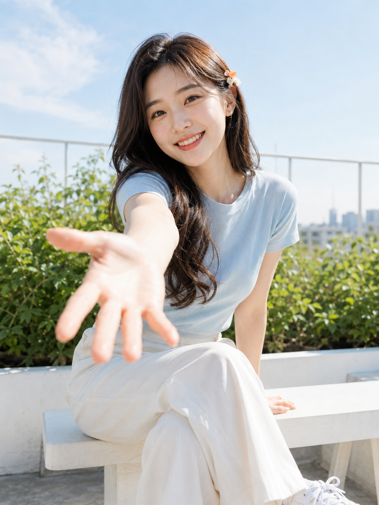

# 6个夏日场景互动人像，朋友圈看起来像真实抓拍写真

伸向镜头的一只手，很容易把画面带向夸张透视，或让人物显得像摆拍。手部、面部和背景要同时被约束，互动感才会轻盈又真实。

**本期问题：** 怎样让夏日女友感人像既有镜头交流，又不显得用力？

**核心变量：** 成年人物设定、自然手掌、35mm-50mm 近距离镜头、干净的高明度环境。先写清焦点落在面部与前景手部，再写背景虚化。

---

**#01 ｜ 校园草坡：原版写法**

这张把草坡、石阶和前景手掌分成三个层次；“自然近大远小”比单写“挥手”更容易得到可信动作。

竖版 3:4，韩系清甜夏日户外人像摄影，明亮通透、青春自然、带轻微商业写真感。盛夏午后，一位 24 岁成年东亚女生坐在校园草坡下方的浅色石阶边，背后是被阳光照亮的嫩绿色草地与少量虚化树影，环境干净简洁。她五官自然清秀，面部干净，眼神真实明亮，嘴角带自然微笑，健康自然肤色且保留真实纹理，淡裸妆，深栗棕色蓬松长卷发与自然空气刘海，耳侧夹一枚彩色小花发夹。穿浅雾蓝宽松短袖 T 恤、浅蓝直筒牛仔裤、白色低帮运动鞋。人物盘腿坐姿，一只手自然放在脚踝附近，另一只手朝镜头前方张开打招呼，掌心靠近镜头形成自然近大远小透视，表情亲切有互动感。35mm 至 50mm 人像镜头，近距离拍摄，浅景深，焦点清晰落在面部与前景手部，背景草地柔和虚化。整体色调以草绿、浅蓝、白色、自然肤粉为主，高明度、中低对比，柔和自然阳光，头发边缘带淡淡金色轮廓光，现代韩系商业摄影质感，无文字无水印无 Logo。避免第二人物、畸形手、六指、背景杂乱建筑、浓妆、塑料皮肤、过度磨皮、强电影暗调、插画感、AI 美女脸、网红感、暗沉肤色、明显痘印、明显皱纹、斑点、面部变形。

---

**#02 ｜ 河岸木栈道**

侧坐时用撑地的手完成平衡，伸出的手才不会像悬空摆姿；水面散景负责留出呼吸感。

---

**#03 ｜ 白色网球场**

白网与薄荷绿地面自带轻运动秩序。和 AI 沟通时，明确“面部与前景手部同时清晰”，能压住广角手掌变形。

---

**#04 ｜ 便利店台阶**

汽水只做生活化陪衬，不给品牌和醒目文字；玻璃门、货架色块、植物虚影已经足够建立城市日常。

---

**#05 ｜ 林荫单车道**

蹲坐和微微前倾让视线更接近镜头，50mm 把树影压成奶油散景。动作越简单，手指约束越要写具体。

---

**#06 ｜ 天台花园**

白栏杆与天空把画面提亮，深棕卷发边缘的微暖轮廓光则保住人物的轻盈感；不需要复杂的城市背景。

---

**测试结论：** 六个场景共用的不是同一套姿势，而是“可读的面部表情 + 合理的前景手掌 + 简洁的高亮背景”这组关系。把场景替换掉，互动感仍然成立。

---

## 往期回顾

- 这套深夜直闪女友感写法，6个居家场景一次讲透
- 夏日女友感肖像的高级光感，6个场景拍出通透呼吸感
- 古典书房人像怎么不显影楼感：6种透窗光写实出片方法

#GPTImage2 #千问 #豆包 #生图提示词 #Prompt #女友感自拍 #夏日互动人像
