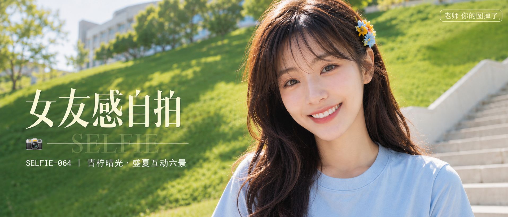

# SELFIE-064-青柠晴光·盛夏互动六景 封面

## 封面提示词

视觉概念「青柠晴光」：一位 24 岁成年东亚女生站在盛夏校园草坡与白色石阶前，正脸偏 3/4 侧脸的胸像特写，画面只取胸口以上，双手完全不入镜；面部占画面三分之一以上，五官精致自然、面部立体清晰、皮肤光泽细腻、眼神有神灵动、妆感干净清透、轮廓清晰上镜。深栗棕色蓬松长卷发与彩色小花发夹，浅雾蓝宽松短袖，肩线自然；背景以清亮草绿、天空蓝、浅白石阶形成前中后景层次，柔光环绕面部、侧逆光打亮颧骨，色彩层次丰富、高清锐利、电影感光影、构图黄金比例、色调统一精致、视觉冲击力强，亮色系韩系商业人像海报，2.35:1 电影横构图。避免 AI 美女脸、网红感、过度精修、塑料皮肤、暗沉肤色、明显痘印、明显皱纹、斑点、面部变形、文字乱码、任何手部入镜、畸形肢体、低清模糊、杂乱背景、任何暴露或挑逗姿态。 【文字排版-必须完整保留，不得省略或简化任何一项】画面左侧垂直居中偏下叠加文字排版：超大号衬线字体米白色主文案「女友感自拍」，主文案正下方一条细横线左端带 📷 横线中央有透明英文水印 SELFIE，横线下方等宽白色字体副文案「SELFIE-064 ｜ 青柠晴光·盛夏互动六景」；右上角浅色半透明圆角底衬配小号文字「老师 你的图掉了」（署名文字，必须出现，不可省略）；无整体蒙层，文字直接压图。【文字排版结束】

## 封面图片

