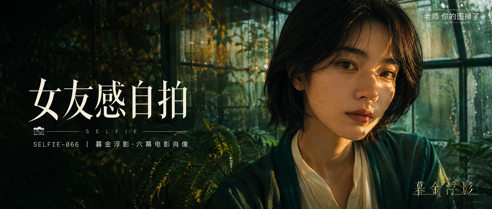

# SELFIE-066-暮金浮影·六幕电影肖像 封面

## 封面提示词

暮金浮影视觉概念，高清电影海报级横幅肖像，一位25岁成年东亚女性正面偏3/4侧脸近景，五官精致自然、面部立体清晰、皮肤光泽细腻、眼神有神灵动，穿象牙白丝质衬衫与深翡翠绿色外搭，人物面部占画面右侧三分之一以上。潮湿温室的金色窄束侧逆光穿过蕨叶，在颧骨、眼睛和鼻梁留下琥珀高光，背景是清晰而不杂乱的青绿色玻璃框架、半透明胶片底片与柔焦蕨叶，冷青与琥珀金形成前中后景和材质反差，明亮深邃、电影感光影、高清锐利、色彩层次丰富、视觉冲击力强、构图黄金比例、画面有张力，左侧预留干净深色文字空间，画面有小号半透明装饰文字「暮金浮影」。避免 AI 美女脸、网红感、过度精修、塑料皮肤、暗沉肤色、明显痘印、明显皱纹、斑点、面部变形、模糊、脏污、水印。2.35:1 电影横构图。

【文字排版-必须完整保留，不得省略或简化任何一项】画面左侧垂直居中偏下叠加文字排版：超大号衬线字体米白色主文案「女友感自拍」，主文案正下方一条细横线左端带📷横线中央有透明英文水印 SELFIE，横线下方等宽白色字体副文案「SELFIE-066 ｜ 暮金浮影·六幕电影肖像」；右上角浅色半透明圆角底衬配小号文字「老师 你的图掉了」（署名文字，必须出现，不可省略）；无整体蒙层，文字直接压图。【文字排版结束】

## 封面图片

