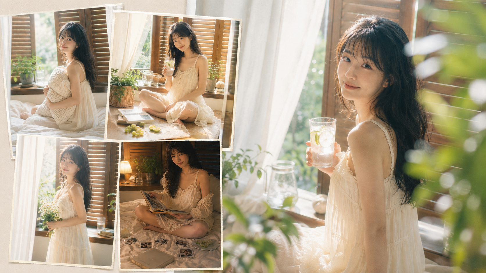
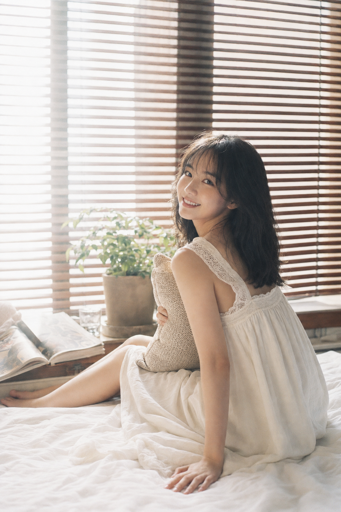
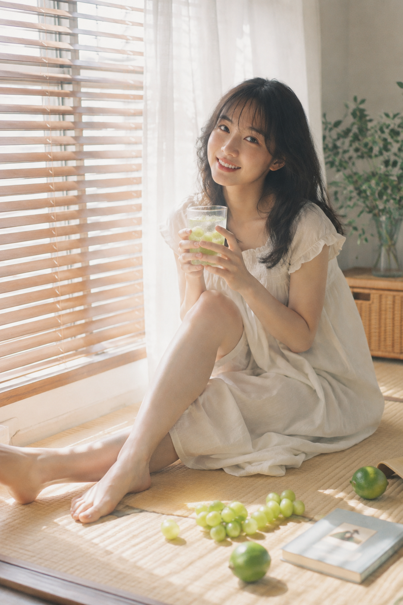
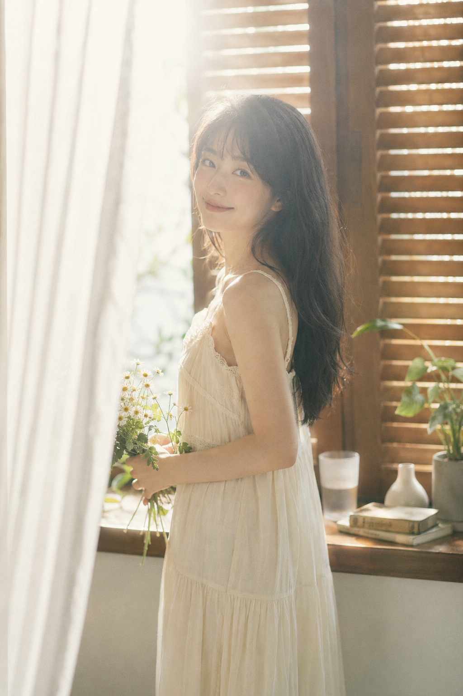
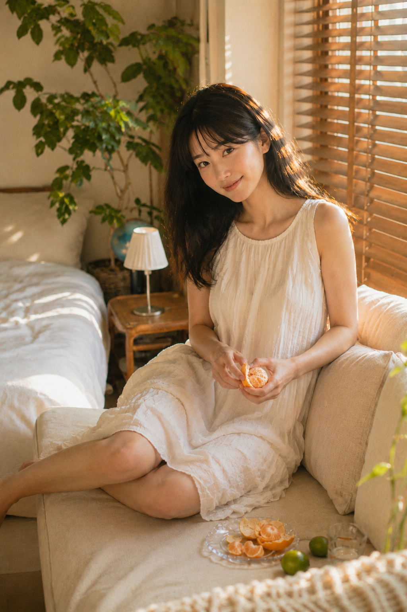
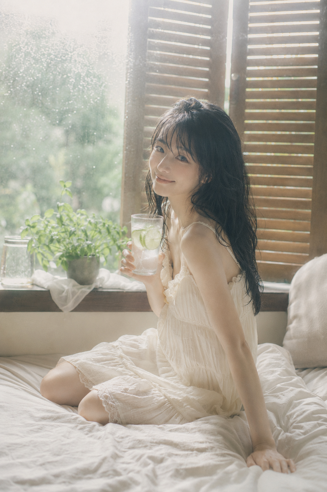
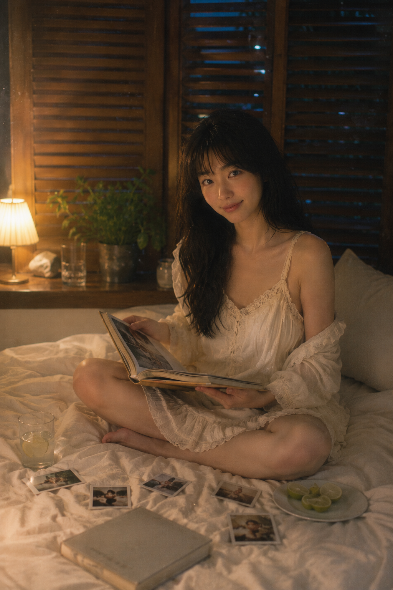

# 实测6个盛夏窗边瞬间，女友感人像的通透光线终于对了

窗边人像想有轻盈的女友感，关键不是堆滤镜，而是让动作、光线和生活道具像同一段夏日记忆。先让画面像正在发生，再让人物看镜头。

---

### 01｜清晨抱枕回望

抱枕让手有自然落点，回头把视线带回镜头；左侧留白能把窗光变得更轻。动作先于姿势，人物才不会像被摆进样片。

竖版 2:3，盛夏清晨的日系居家胶片人像摄影，真实写实、清透梦幻、温柔慵懒，带轻微复古写真集质感。一位 25 岁成年东亚女性坐在白色床铺靠窗位置，黑色中长发自然披散，轻薄刘海，五官自然清秀，面部干净，健康自然肤色，保留真实细腻皮肤纹理，不过度磨皮。她穿奶油白色带细腻蕾丝花边的轻盈家居连衣裙，完整不透明内衬，裙摆有柔软褶皱。人物侧坐在柔软的白色床品上，双腿自然交叠，一只手抱着米白针织靠枕，另一只手轻扶床单，身体微微转向镜头，回头露出松弛甜美的自然笑容。背景是一整面深棕色木质百叶窗，清晨阳光从缝隙穿透，形成柔和碎光与大面积乳白高光，窗台放一盆绿植、透明玻璃杯与一本翻开的旧杂志。与人物视线齐平的 35mm 环境人像视角，f/2.0 浅景深，焦点在面部，人物位于画面右侧偏中，左侧保留大面积明亮留白。整体色调为奶油白、暖木棕、淡青灰、低饱和橄榄绿，低对比、高明度，带轻微胶片颗粒、柔光滤镜、halation 光晕、轻微雾化与自然曝光溢出，氛围像刚睡醒的盛夏早晨，安静、朦胧、亲密。无文字，无水印，无 logo，单人画面，不出现第二人物，避免 AI 美女脸、网红感、过度精修、塑料皮肤、暗沉肤色、明显痘印、明显皱纹、斑点、面部变形、错误手指、肢体畸变、过度锐化、过饱和。

---

### 02｜午后青提汽水

透明杯和冷凝水会补足凉意，人物微微前倾即可让画面有被偶遇的感觉。道具要承担情绪，不只占画面。

---

### 03｜纱帘边整理花束

花束是手部的缓冲区，纱帘则把硬朗百叶窗变成柔软前景。和 AI 沟通时，先固定一人一套造型，再只改手部任务和光线。

---

### 04｜傍晚剥橙子

橙色不是主色，却能在奶油白里留下一个温暖记忆点；斜向夕阳负责把发丝和侧脸提亮。

---

### 05｜雨后喝冰水

把窗外雨后绿意、灰蓝阴影和冰块放在一起，画面会清凉但不发灰。高明度比高饱和更像真实夏天。

---

### 06｜夜晚翻相册

暖台灯和残留蓝调天光同时出现，夜景就不会闷；相册、拍立得和柠檬水让最后一张仍与白天的生活线索相连。

---

这组六图只换时间、道具和动作，保留同一间窗边卧室与亮色低反差底色；连续感来自稳定的光线逻辑。

---

## 往期回顾

- 日光留白：六段盛夏风景如何做出旧旅行刊海报的松弛感
- 六个城市白昼场景，拍出一组有连续叙事的杂志海报
- 六色典藏：六种配色怎样让人物海报同系列却不撞款？

#GPTImage2 #千问 #豆包 #生图提示词 #Prompt #女友感自拍 #窗边人像
