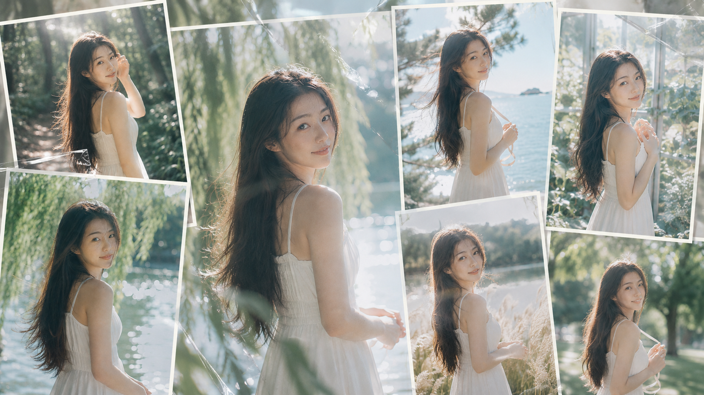
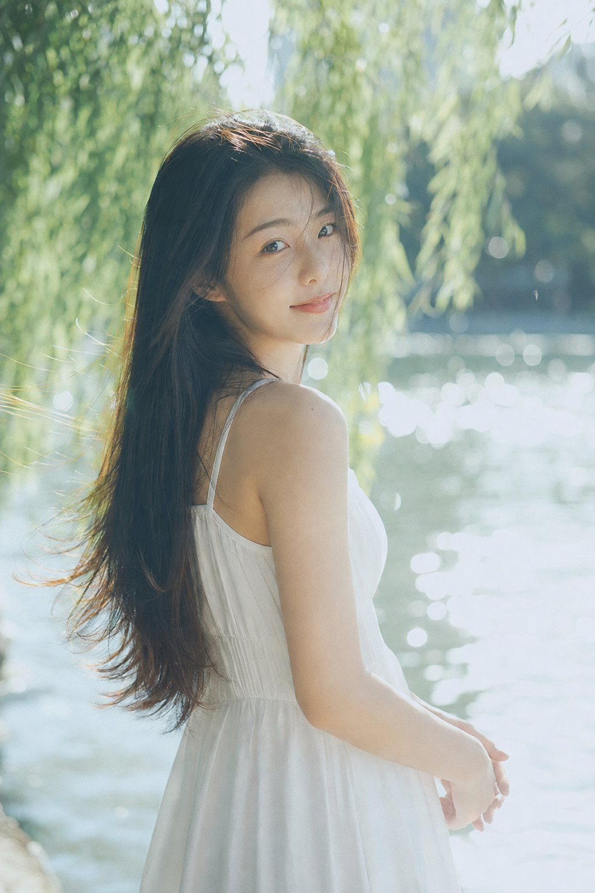
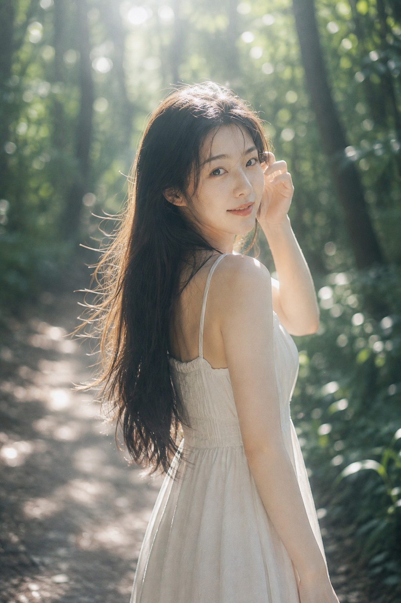
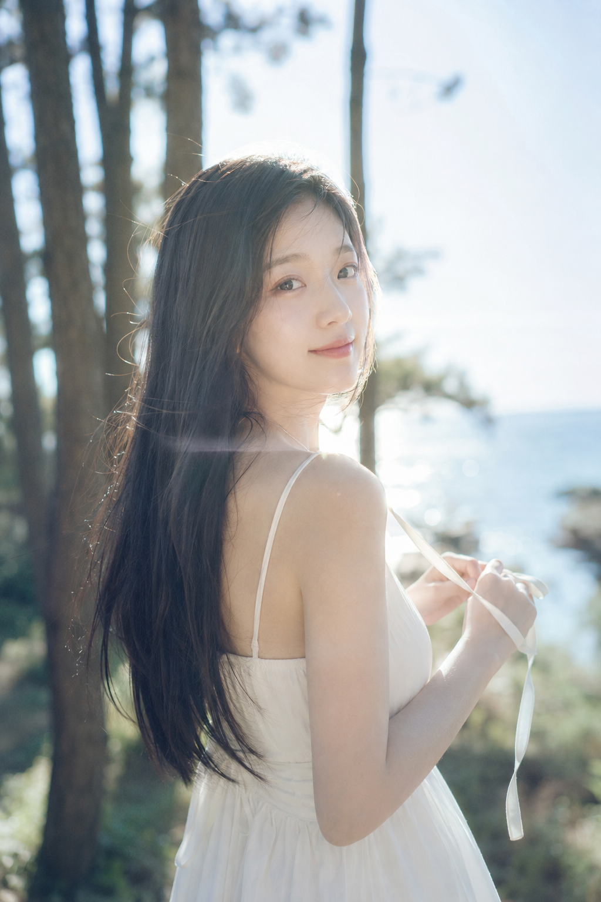
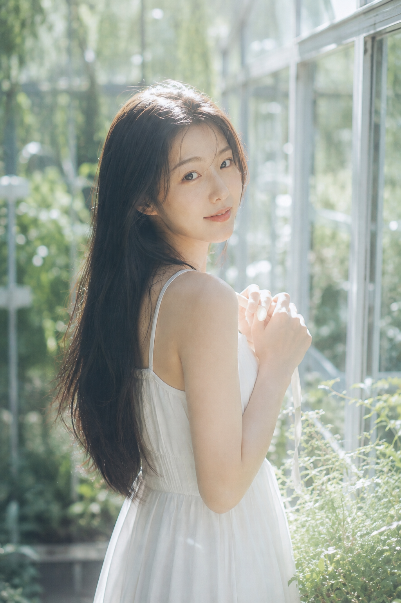
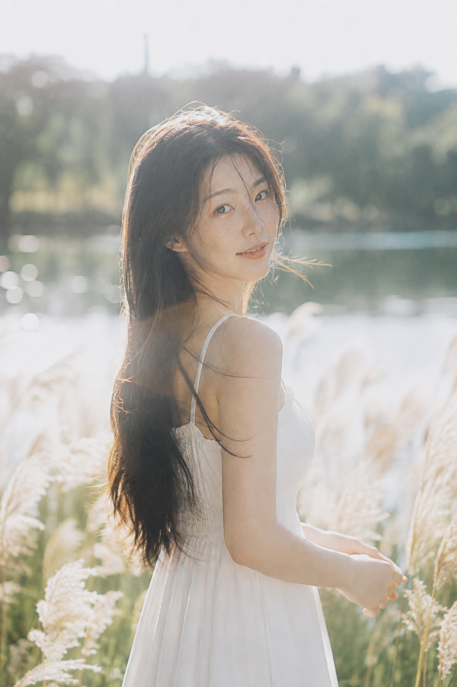
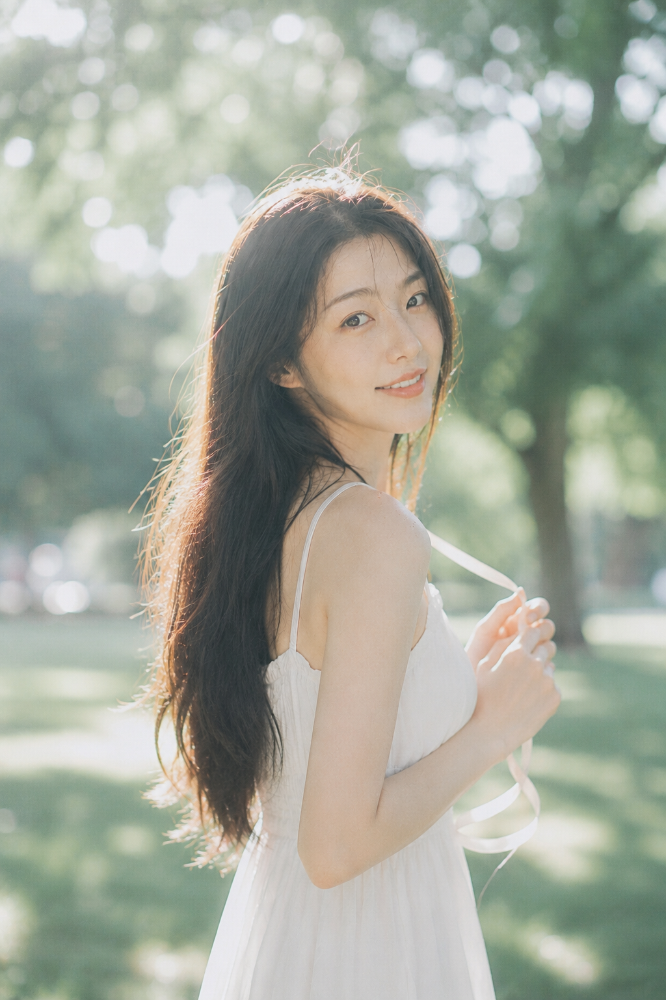

# 把盛夏逆光拍干净：6个自然场景的通透女友感方法

逆光不等于把画面推到很亮。真正有呼吸感的关键是让脸保持柔清晰，再让环境去发光：白裙负责留白，雾蓝与青绿负责降温，发丝轮廓光负责把人物从背景里提出来。

柳荫回眸是这组的原始基调。身体先背向镜头再回望，会让肩线和表情都有松弛的方向感；85mm把河面与树叶收成奶油散景，人物就不会被环境吞掉。

竖版 2:3，盛夏清晨的河岸柳荫人像写真，真实写实、清透梦幻、轻日系胶片质感。一位 24 岁成年东亚女生，五官自然清秀，面部干净，健康自然肤色，皮肤通透细腻但保留真实纹理，黑棕色超长直发自然披散，发丝被微风轻轻吹起。她穿一条纯白色轻薄无袖长裙，站在河边柳树下，身体微微背向镜头，肩膀朝前，回头看向镜头，双手自然交握在身前，神情温柔安静，嘴角带轻微笑意。背景是被阳光照亮的绿树、河面反光与大量蓝绿色圆形散景，阳光从人物后上方穿过树叶形成明显发丝轮廓光与肩部高光，画面带乳白色光雾、柔和 bloom、轻微镜头 flare、35mm 胶片颗粒。色调以雾蓝、青绿、奶白、淡金和浅粉为主，高明度、低饱和、低对比，85mm 人像镜头，f/1.8 超浅景深，平视近景半身构图，人物面部清晰、背景奶油化虚化，整体氛围像被夏风和阳光包裹。不要文字，不要水印，不要多人，不要夸张妆容，不要塑料皮肤，不要 AI 网红脸。

林间这一张不必强行提亮深绿。把人物放在树冠漏下来的光斑里，并用抬黑位而不抬脸部曝光，树林才会显得干净有空气。

海边的风是动作提示。细丝带与被吹起的发梢让画面自己产生方向，50mm至85mm的浅景深把松树、海面和天空压成明亮的三层背景。

花房适合用玻璃反射做第二层光。不要把框架拍得太实，保留一点flare和透明光纹，人物回眸才会有湿润的夏日质感。

芦苇场景的重点不是裙摆，而是“被叫住”的停顿。脸和眼睛精准对焦，湖面、芦苇和天空全部后退成柔焦，画面会更像真实抓拍。

草地这张把肩膀靠近镜头，再用白色丝带收住手部动作。跟 AI 沟通时要把人物清晰、背景极浅虚化同时写明，才能避免树影抢走主体。

---

## 往期回顾

- 实测6个盛夏窗边瞬间，女友感人像的通透光线终于对了
- 日光留白：六段盛夏风景如何做出旧旅行刊海报的松弛感
- 六个城市白昼场景，拍出一组有连续叙事的杂志海报

#GPTImage2 #千问 #豆包 #生图提示词 #Prompt #女友感自拍 #盛夏逆光人像
