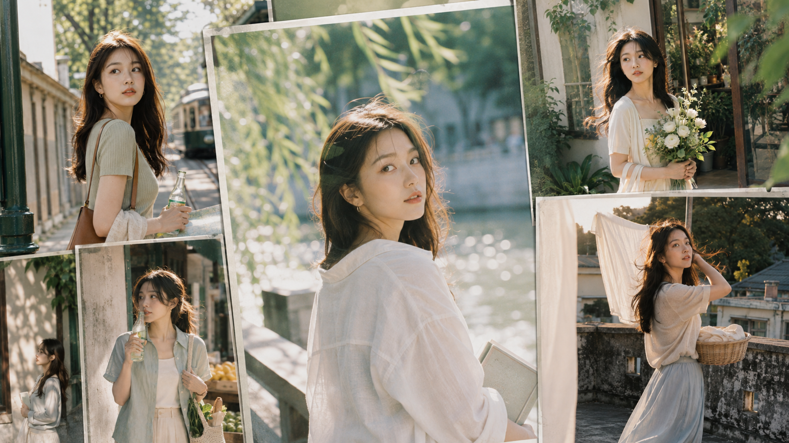
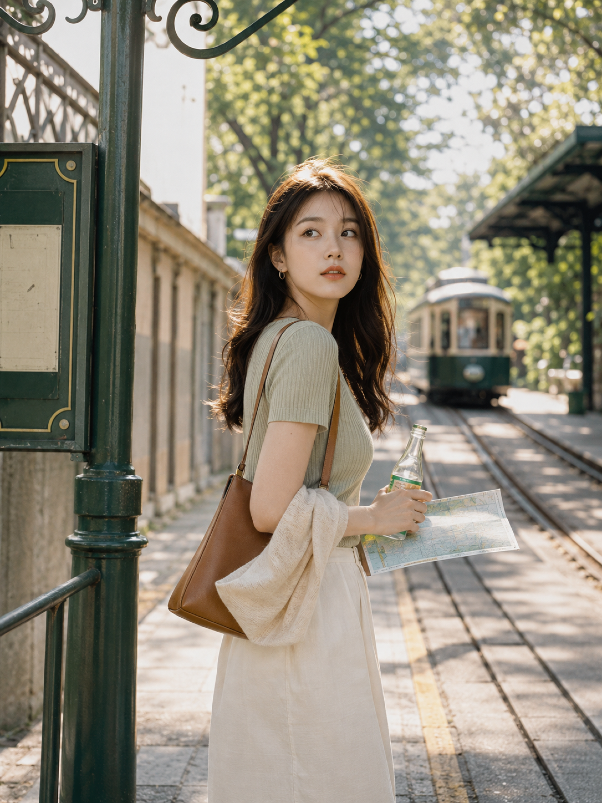
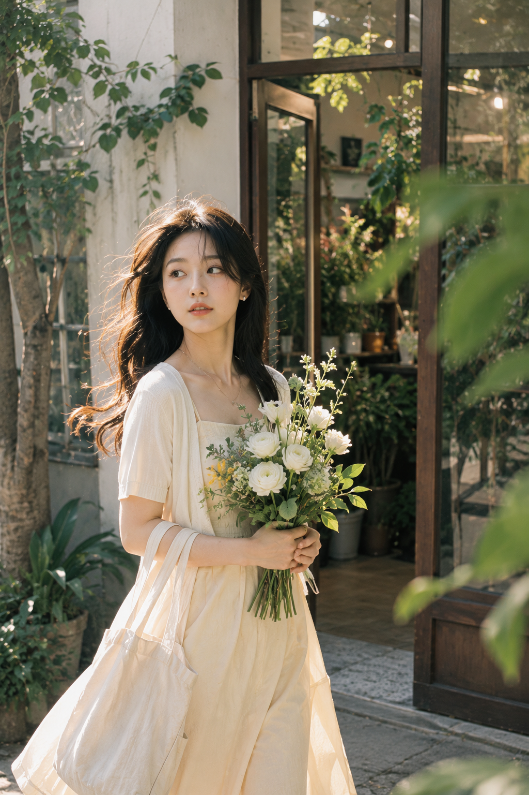
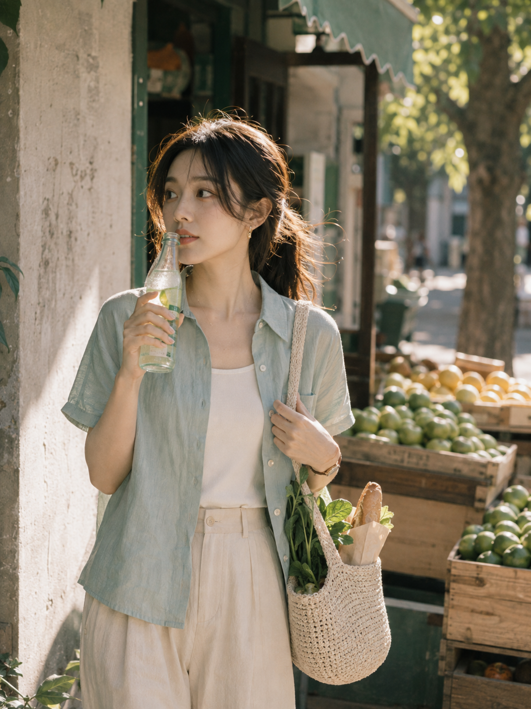

# 6个盛夏城市场景，AI拍出像真实偶遇的自然光女友感

同一套盛夏视觉语言，换六个日常地点就有连续但不重复的女友感。关键不在滤镜，而在树影、侧逆光和真实动作同时成立。

---

**#01 ｜ 河岸长椅**

这是本期完整原版。让 AI 明确人物坐在长椅边缘、视线越过镜头，画面会比正面摆拍更松弛。

竖版2:3，超高清4K真实生活方式人像摄影，4096x6144像素。盛夏城市河岸，下午四点自然光，一位24至28岁成年东亚女性，五官自然清秀，面部干净，健康自然肤色，皮肤保留细腻真实纹理与自然光泽，清透裸妆、浅杏粉唇，黑棕色长发带柔软波浪，几缕碎发被夏风吹起。她穿宽松象牙白棉质衬衫、浅雾蓝圆领针织背心和奶油白高腰长裙，细小金色耳圈，身材比例自然优越、姿态优雅；坐在树荫下旧木长椅边缘，一条腿自然向前伸出，一手轻扶长椅，另一手拿合上的浅色旧书，身体微侧，视线越过镜头望向河面，表情安静松弛。背景有浅灰石栏、缓慢河水、浓密柳树、低矮旧建筑和少量自行车，无人群。阳光从后侧穿过树叶，形成金色发丝轮廓光，侧脸与肩部暖白高光，天空散射光柔和补亮面部，地面有不规则树影。雾蓝、象牙白、奶油色、青绿色与浅灰，高明度低饱和低对比，50mm全画幅f/2，平视中景，人物在左侧三分之一，右侧河面留出呼吸空间，圆形散景，轻微35mm胶片颗粒、柔和halation、高光微泛白、逆光轻雾化；画面清晰干净、细节锐利、无噪点脏污。不要HDR、过度锐化、第二人物、文字、水印、Logo，避免AI美女脸、网红感、过度精修、塑料皮肤、暗沉肤色、明显痘印、明显皱纹、斑点、面部变形、手指肢体异常。

> 测试结论：侧逆光必须搭配天空散射光补脸，人物才会亮而不假。

---

**#02 ｜ 老电车站**

把“准备回身看电车”说成进行中的动作，再留出站牌与轨道，画面自然有了故事。

---

**#03 ｜ 花房抱花回身**

花束只做前景亮点；玻璃反射、虚化叶片和回头动作一起托住人物的轻盈感。

---

**#04 ｜ 图书馆树影**

别把树影写成背景。让光斑落在石墙与肩后，环境会保留人文感而不显杂乱。

---

**#05 ｜ 天台夏风**

白床单是天然柔光板。与 AI 交代“只让布料和发梢轻微动态模糊”，脸和眼睛保持清晰。

---

**#06 ｜ 水果店冰汽水**

人物站在明暗交界处，汽水冷凝水与薄荷绿遮阳棚提供生活细节，避免把画面写成商业广告。

---

这组图可以直接套用的判断是：环境负责色彩层次，动作负责偶遇感，面部始终用柔和反射光保留真实肤质。

---

## 往期回顾

- 青荫蜜果：6个树荫水果场景，一套写法拍出清透女友感
- 把盛夏逆光拍干净：6个自然场景的通透女友感方法
- 实测6个盛夏窗边瞬间，女友感人像的通透光线终于对了

#GPTImage2 #千问 #豆包 #生图提示词 #Prompt #女友感自拍 #盛夏自然光
