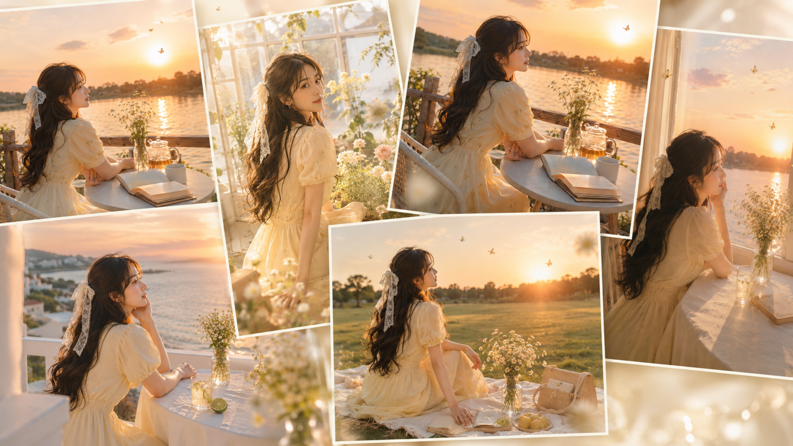
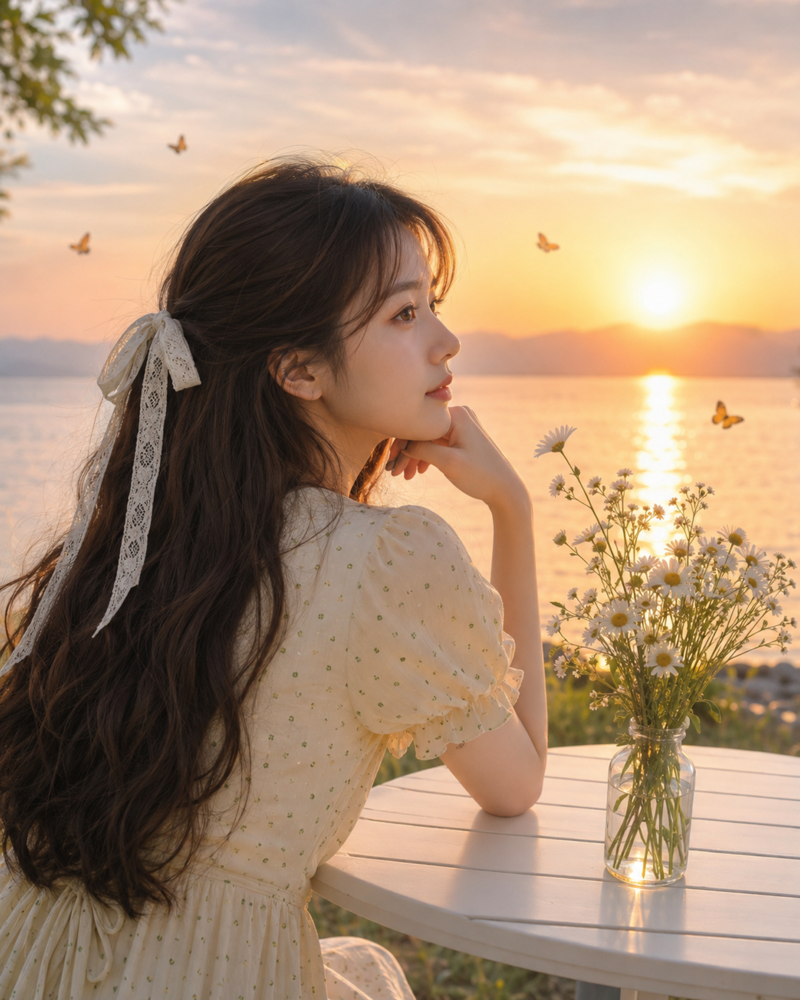
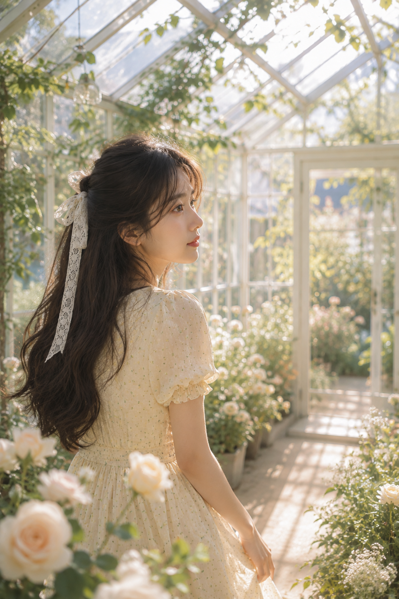
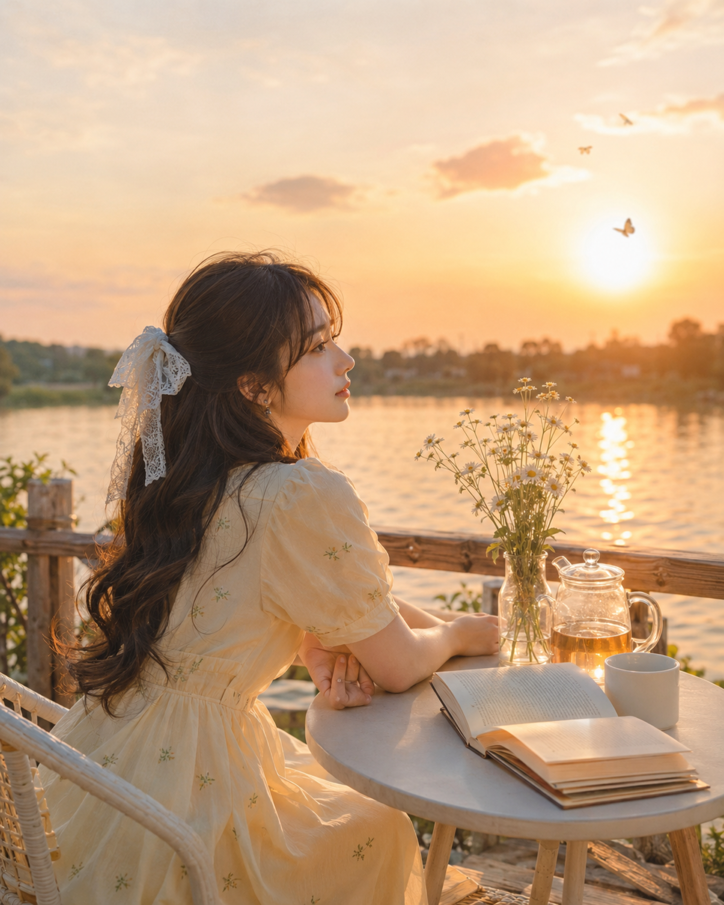
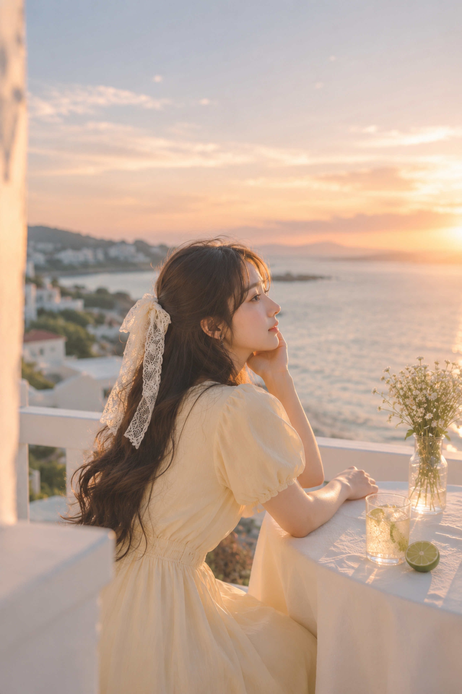
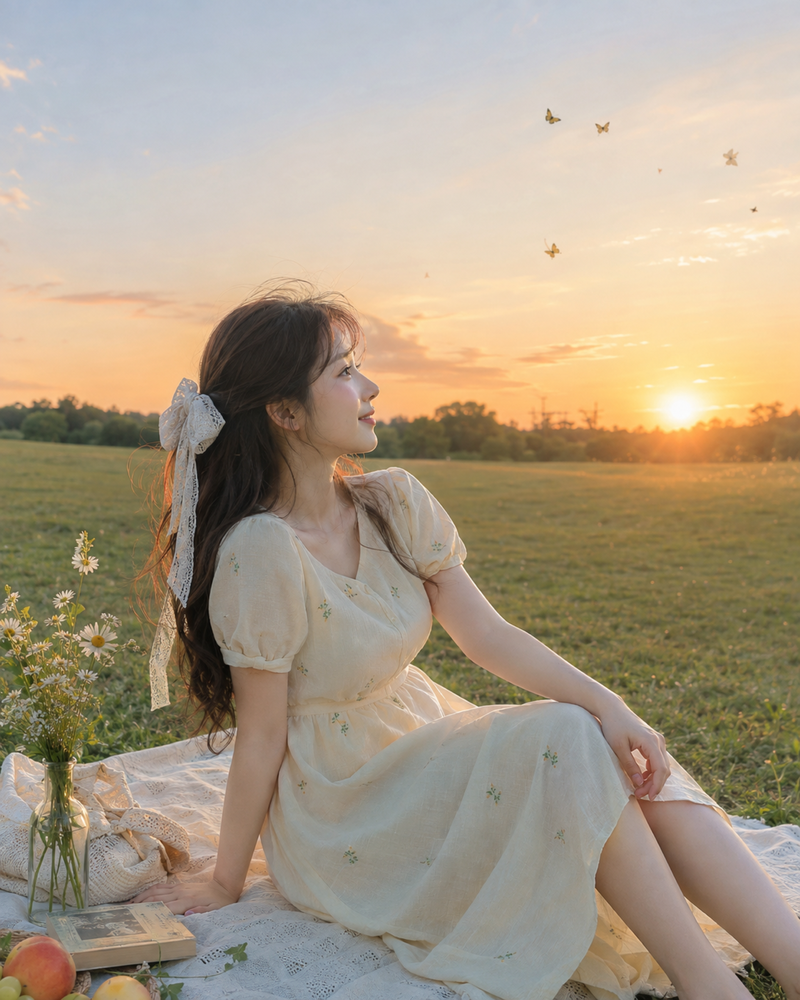
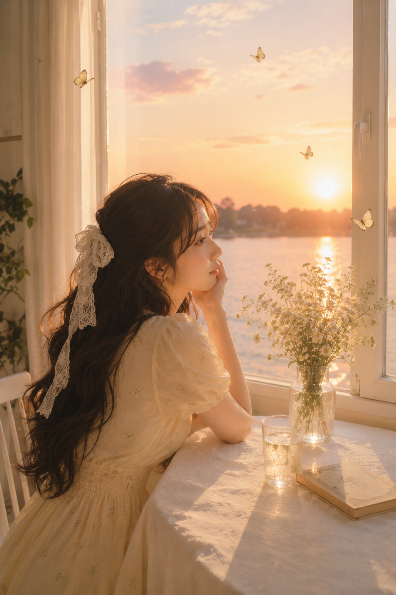

# 浮光绮境六幕：6个夏日场景拍出真实仙气女友感自拍

同一位女生换六个夏日场景，保持真实、明亮、仙气。正文只放一份原版提示词。明亮侧逆光是统一底色。

**原版｜湖边日落花桌**

竖版4:5，4K超高清，夏日傍晚的浪漫日系少女写真，真实写实，高明度，柔和通透，轻微梦幻感。一位24岁成年东亚女生坐在湖边白色小桌旁，侧后三分之二入镜，微微托腮，安静望向远处落日，不看镜头。她有深棕色及腰长卷发，发丝柔软蓬松，后脑扎一只象牙白蕾丝蝴蝶结，长飘带自然垂落；穿淡奶油黄色泡泡袖连衣裙，裙身点缀少量低饱和绿色小圆点，收腰设计但不过分强调身材，气质温柔清新。五官自然清秀，面部干净，健康自然肤色，眼神真实，气质清爽亲和。桌上摆放透明玻璃瓶，插自然松散的白色洋甘菊与小雏菊，花枝高低错落。背景是安静平缓的湖面与金色落日，太阳位于画面右侧，水面形成细长闪烁的金色倒影，天空为蜜桃橙、杏黄色、浅粉与淡雾蓝渐变，远处有2—4只零散飞舞的蝴蝶点景。平视中近景构图，人物位于左侧，落日与花瓶平衡右侧画面，50mm人像镜头，f/2.8，浅景深，主体清晰，背景轻柔虚化。暖金色侧逆光，发丝、脸颊、手臂与裙袖边缘带柔和轮廓光，轻微bloom、高光扩散、细腻空气感、极淡胶片颗粒。整体色彩以奶油黄、象牙白、柔金色、浅桃粉、雾蓝、浅草绿为主，氛围安静治愈、温柔少女、夏日晚风感。避免AI美女脸、网红感、过度精修、塑料皮肤、暗沉肤色、明显痘印、明显皱纹、斑点、面部变形。

**其余五幕｜设计拆解**

玻璃花房：斜光、前景花、人物偏左留白。

河岸露台：旧书花瓶配50mm；道具只做一条线索。

白色阳台：海平线与青柠做冷暖对比，侧脸保留旅行感。

草地野餐：扶地、收腿、偏头，天空留白更轻盈。

窗边静坐：窗框、玻璃和水面形成三层空间；先锁光线，再写情绪。

共同方法：锁定人物，再改场景、动作、焦段。

收藏后替换地点；你最想改哪一幕？评论区告诉我。

## 往期回顾

- 6个盛夏城市场景，AI拍出像真实偶遇的自然光女友感
- 青荫蜜果：6个树荫水果场景，一套写法拍出清透女友感
- 把盛夏逆光拍干净：6个自然场景的通透女友感方法

#GPTImage2 #千问 #豆包 #生图提示词 #Prompt #女友感自拍 #夏日写真
