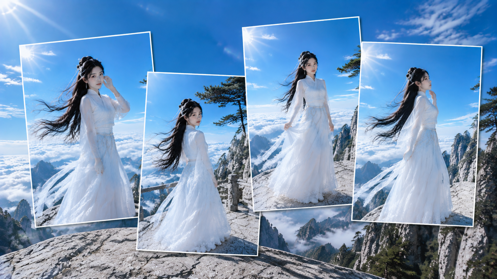
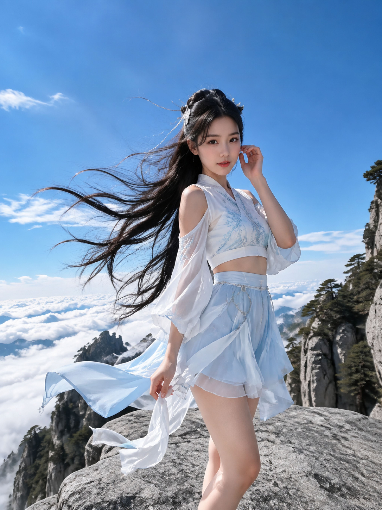
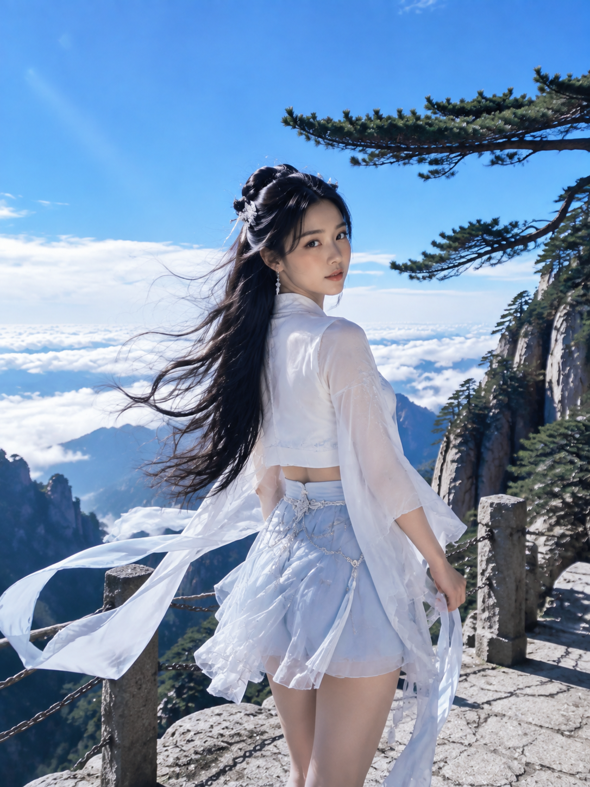
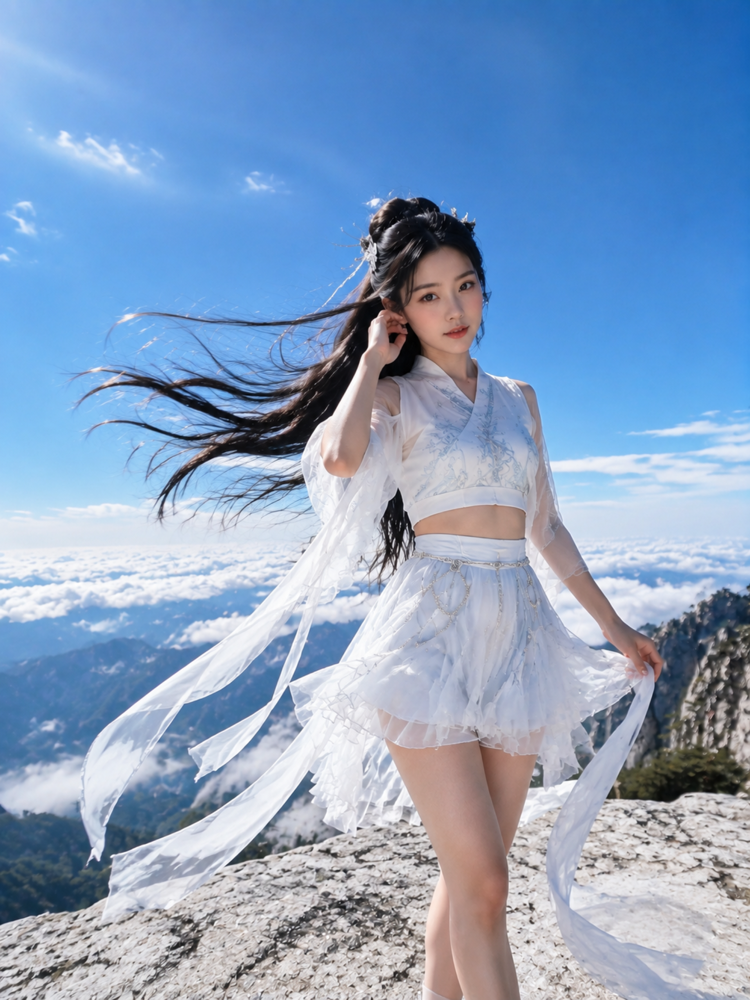
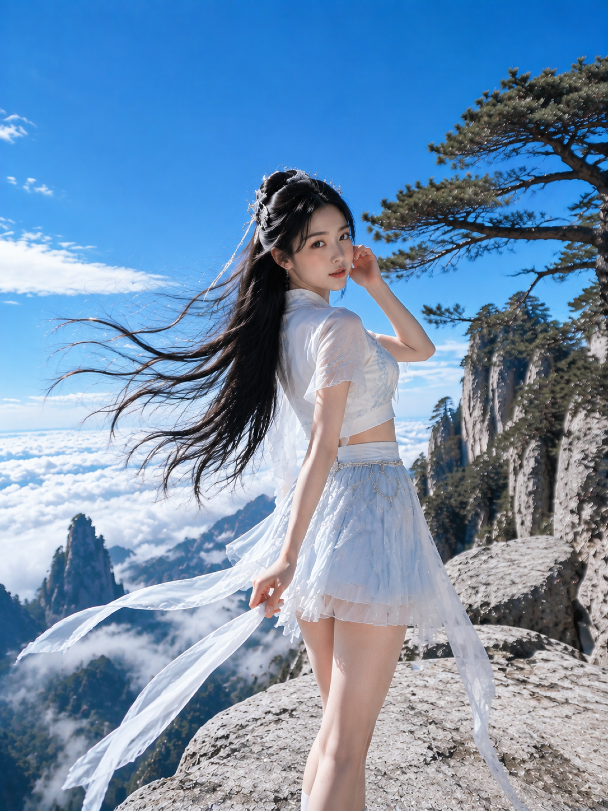
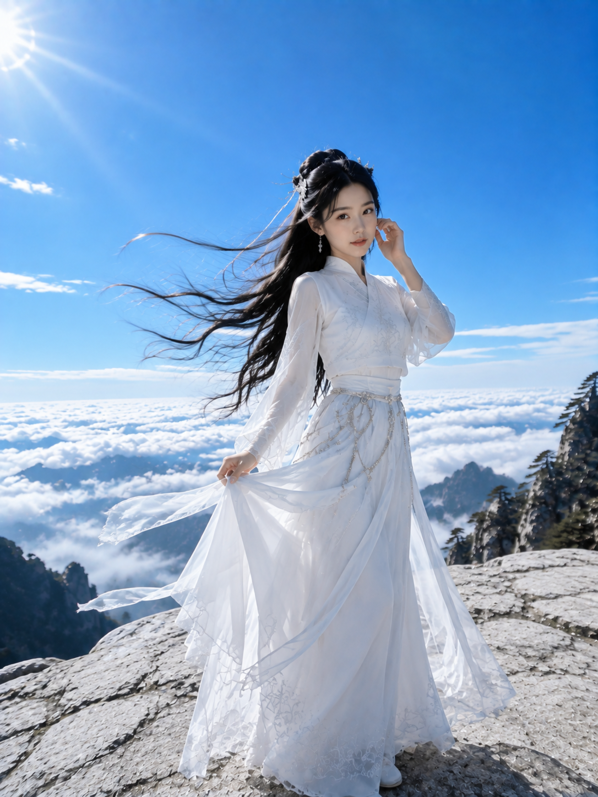
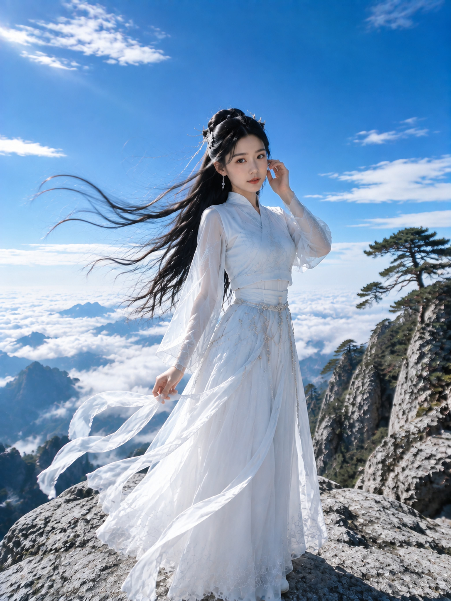

# 云崖听风：高山云海女友感自拍，一套写法拍出清透仙气

高山云海很容易只剩风景。这组用长发、白纱、蓝天和岩面串起动线，六个瞬间保持同一人物与服装，像连续的真实自拍。

### 01｜云崖迎风·白纱回眸

**核心变量：** 人物偏右、头顶留白、发丝向左，让风成为视线引导。下面是可复制的安全优化原版：

3:4竖版，超写实真人摄影，盛夏高山云海人像，一位24岁成年东亚女性站在陡峭山崖边缘的浅灰色花岗岩平台上，身后是翻涌白色云海、湛蓝高空、远处石峰与稀疏古松。人物清冷安静，乌黑及腰长发半盘发，银白小发饰点缀，强劲山风把发丝持续吹向画面左侧，根根分明。穿月白与雪白配色的改良仙侠风高领长款上衣与轻纱长裙，内层完整不透明，肩部与腰腹由衣料连续覆盖，裙摆垂至小腿，腰间冷银细链和玉环，裙摆与飘带被风扬起；服装端庄得体，以舒展肩颈、自然衣褶、修长身姿和优雅站姿体现女性美，不刻意强调身体局部。五官自然清秀，面部干净，健康自然肤色，眼神真实，气质清爽亲和。身体微侧，右手轻抚耳侧发丝，左手自然下垂轻提一缕白色飘带，低头安静看向镜头。摄影采用宽幅人像视角，镜头接近视线高度并略向上取景，28mm-35mm广角人像镜头，人物位于画面中央偏右，头顶保留大量蓝天负空间，左侧飞扬长发形成流动构图。阳光从左上方斜射，形成清晰轮廓光，照亮发丝、肩颈和白纱边缘；画面高明度、高通透、蓝白冷调，真实皮肤纹理，云海细节丰富，岩石纹理清晰，电影级超高清质感。4K成片，至少4096像素长边，增加光线采样数与阴影采样，提升全局光照收敛，收敛噪点，减少随机颗粒、亮点和暗部噪声，最大程度保留发丝、薄纱、刺绣、岩石与云海细节，适用于提升照片清晰度。避免AI美女脸、网红感、过度精修、塑料皮肤、暗沉肤色、明显痘印、明显皱纹、斑点、面部变形、手指错误、文字、水印、logo。

---

### 02｜松巅栈道·侧身凝望

栈道用古松做前景框，回头动作连接人物与远山。**跟 AI 先锁定白衣，再只改动作和背景。**

---

### 03｜云岭白石台·拈纱立风中

白石的粗粝感压住薄纱的轻，手部只做“提纱”和“整理碎发”，更不易失真。

---

### 04｜悬峰古松·回首临风

背身回首形成转折，古松负责框景，硬光加反射让白衣不发灰。

---

### 05｜云顶断崖·轻提裙摆

太阳耀光、蓝天留白和岩面形成纵深，明亮却不空；<strong>稳定站姿优先于复杂动作</strong>。

---

### 06｜峰顶云境·静立听风

最后收回动作，只保留整理发丝和握飘带，给六境安静结尾；高光不压脸，暗部不死黑。

---

**设计结论：** 先固定人物、服装和蓝白色温，再用动作、景别、前景变化，最容易得到连贯女友感。你想把这套风感换到海边还是城市天台？

---

## 往期回顾

- 银雾花房：6张逆光人像拍出清透高级女友感的一套写法
- 同一台旋转木马，我拍出了 8 种不一样的甜
- 为什么花束能撑住女友感？6个盛夏场景给出答案

#GPTImage2 #千问 #豆包 #生图提示词 #Prompt #女友感自拍 #高山云海
