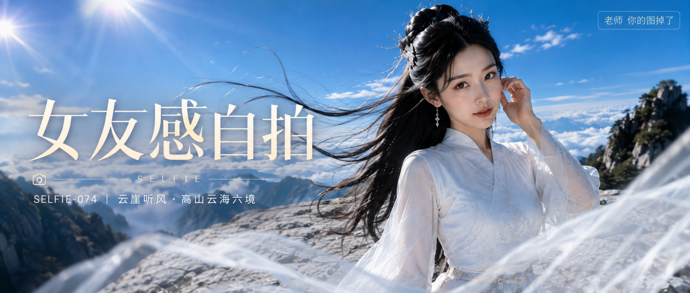

# SELFIE-074-云崖听风·高山云海六境 封面

## 封面提示词

高山云海之上的白石观景台，成年东亚女性三分之四正脸中近景，人物面部占画面约三分之一以上，五官精致自然、面部立体清晰、皮肤光泽细腻、眼神有神灵动、妆感干净清透、轮廓清晰上镜；黑色长发半盘发被山风向左上方扬起，月白与雪白改良仙侠风衣裙配完整不透明内衬，银白发饰和细链在阳光中闪烁，前景有一层轻薄白纱形成柔和虚化，中景是人物与浅灰岩台，远景是高亮蓝天、翻涌云海和层叠石峰，冷白服装与蔚蓝天空形成鲜明色彩对比，左上方斜射的电影感光影打亮面部和发丝，构图黄金比例，高清锐利，色彩层次丰富，视觉冲击力强，画面有张力，商业海报级完成度，超写实摄影，2.35:1电影横构图，4K横向成片，至少4096像素长边，增加光线采样数与阴影采样，收敛噪点，减少随机颗粒、亮点和暗部噪声，保留皮肤、发丝、白纱、银饰、岩石与云海细节。避免AI美女脸、网红感、过度精修、塑料皮肤、暗沉肤色、明显痘印、明显皱纹、斑点、面部变形、眼睛半闭、嘴部不自然、手部错误、文字乱码、额外文字、logo。【文字排版-必须完整保留，不得省略或简化任何一项】画面左侧垂直居中偏下叠加文字排版：超大号衬线字体米白色主文案「女友感自拍」，主文案正下方一条细横线左端带📷图标，横线中央有透明英文水印 SELFIE，横线下方等宽白色字体副文案「SELFIE-074 ｜ 云崖听风·高山云海六境」；右上角浅色半透明圆角底衬配小号文字「老师 你的图掉了」（署名文字，必须出现，不可省略）；无整体蒙层，文字直接压图。【文字排版结束】

## 封面图片

