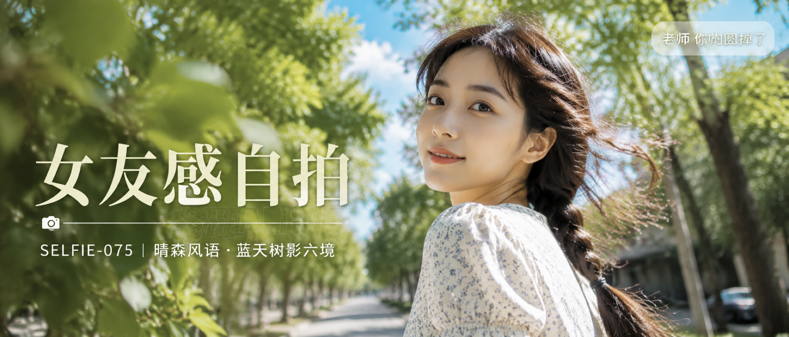

# SELFIE-075-晴森风语·蓝天树影六境 封面

## 封面提示词

晴森风语视觉概念，盛夏蓝天与梧桐树冠交叠的城市公园步道，一位24岁成年东亚女生以清晰正脸偏三分之四侧脸占据画面右侧，黑棕色长发被自然风吹起，奶油白浅蓝小花连衣裙形成明亮主体，五官精致自然、面部立体清晰、皮肤光泽细腻、眼神有神灵动、妆感干净清透、身材比例自然优越、姿态松弛；左前景有半透明绿叶和细小高光，中景是粗壮树干与层叠嫩叶，后景是高明度浅钴蓝天空和白云，冷蓝天空与奶油白服装、暖肤色形成鲜明但柔和的冷暖对比，侧逆光打亮颧骨与发丝，柔光环绕面部，构图黄金比例，前景虚化背景，电影感光影，高清锐利，色彩层次丰富，视觉冲击力强，画面有张力，2.35:1电影横构图，2K超高清输出，增加光线采样数，收敛噪点，减少随机颗粒、亮点和暗部噪声，最大程度保留面部、发丝、叶片和布料细节，清晰明亮不糊不脏。避免AI美女脸、网红感、过度精修、塑料皮肤、暗沉肤色、明显痘印、明显皱纹、斑点、面部变形、眼睛半闭、嘴巴微张、错误手部、身体畸变、过曝、灰暗画面、橙黄夕阳、文字乱码、无关Logo。

【文字排版-必须完整保留，不得省略或简化任何一项】画面左侧垂直居中偏下叠加文字排版：超大号衬线字体米白色主文案「女友感自拍」，主文案正下方一条细横线左端带📷横线中央有透明英文水印 SELFIE，横线下方等宽白色字体副文案「SELFIE-075 ｜ 晴森风语·蓝天树影六境」；右上角浅色半透明圆角底衬配小号文字「老师 你的图掉了」（署名文字，必须出现，不可省略）；无整体蒙层，文字直接压图。【文字排版结束】

## 封面图片

