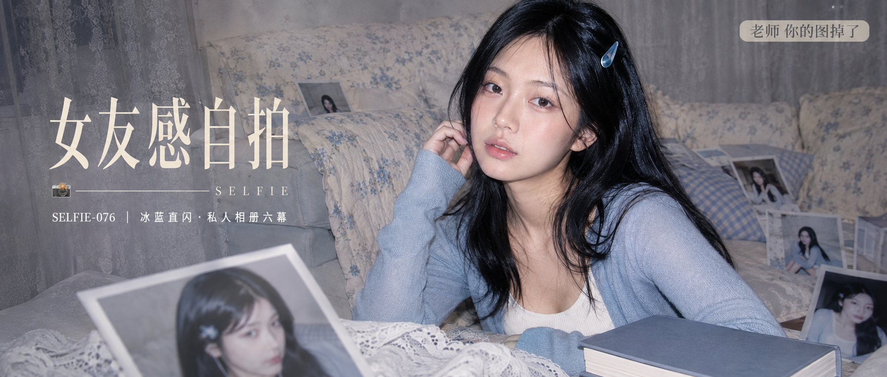

# SELFIE-076-冰蓝直闪·私人相册六幕 封面

## 封面提示词

成年东亚女性正脸或3/4侧脸的高质感居家肖像，人物面部占画面三分之一以上，黑色长发、雾蓝针织开衫、完整奶白内搭，坐在米白碎花布艺沙发前，手边放一本无文字旧相册；前景有一张轻微虚焦的竖幅照片和白色蕾丝，背景错落叠放几张淡蓝私人相册照片，形成前景、中景、背景的层次。视觉概念名为“霜蓝私相”，淡蓝、奶白、灰粉与黑发形成明亮冷暖对比，CCD卡片机顶部直闪照亮面部、发丝和织物，眼神清晰真实，五官自然清秀，皮肤光泽自然，身材比例协调，姿态自然优雅。电影感光影、高清锐利、色彩层次丰富、视觉冲击力强、构图黄金比例、前景虚化背景、色调统一精致、画面有张力，2K超高清，采用高光线采样数与充分收敛的多步采样，减少随机颗粒、亮部噪点与暗部色噪；最大程度保留面部、发丝、肤质、相纸边缘和织物细节，适度降噪拟合提升照片清晰度，画面明亮通透。避免AI美女脸、网红感、过度精修、塑料皮肤、暗沉肤色、明显痘印、明显皱纹、斑点、面部变形、闭眼、嘴部变形、错误手指、多余肢体、文字乱码、额外Logo、整体蒙层。2.35:1电影横构图。

【文字排版-必须完整保留，不得省略或简化任何一项】画面左侧垂直居中偏下叠加文字排版：超大号衬线字体米白色主文案「女友感自拍」，主文案正下方一条细横线左端带📷横线中央有透明英文水印 SELFIE，横线下方等宽白色字体副文案「SELFIE-076 ｜ 冰蓝直闪·私人相册六幕」；右上角浅色半透明圆角底衬配小号文字「老师 你的图掉了」（署名文字，必须出现，不可省略）；无整体蒙层，文字直接压图。【文字排版结束】

## 封面图片

