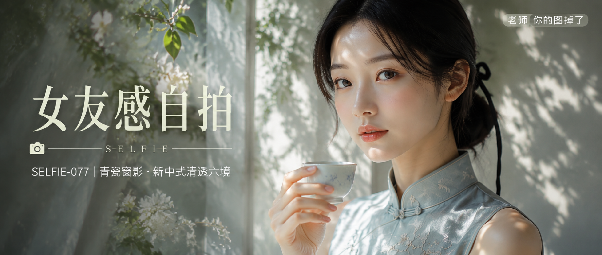

# SELFIE-077-青瓷窗影·新中式清透六境 封面

## 封面提示词

横向2.35:1电影构图，视觉概念名「青瓷光谱」，明亮的窗边新中式清透人像封面。一位24岁成年东亚女性占画面主体三分之一以上，正脸与自然四分之三侧脸之间，五官精致自然、面部立体清晰、皮肤光泽细腻、眼神有神灵动、妆感干净清透、轮廓清晰上镜；黑色低位半挽长发，穿雾蓝色改良旗袍，手持白瓷茶盏，肩颈和衣料被植物投影切出清晰层次。前景有半透明纱帘和一枝白花虚化，中景为人物与茶盏，后景为青瓷灰绿墙面、明亮窗框和斑驳叶影，冷青瓷色与暖肤色形成鲜明对比，电影感光影，高清锐利，色彩层次丰富，视觉冲击力强，构图黄金比例，前景虚化背景，色调统一精致，画面有张力。2K超高清输出，光线采样数提高并充分收敛噪点，减少随机颗粒、异常亮点和暗部噪声，最大程度保留面部、发丝、瓷器、织物与植物影子细节，进行高质量去噪拟合和清晰度提升。避免AI美女脸、网红感、过度精修、塑料皮肤、暗沉肤色、明显痘印、明显皱纹、斑点、面部变形、眼睛半闭、嘴巴微张、手部错误、杂乱背景、文字乱码。 【文字排版-必须完整保留，不得省略或简化任何一项】画面左侧垂直居中偏下叠加文字排版：超大号衬线字体米白色主文案「女友感自拍」，主文案正下方一条细横线左端带📷横线中央有透明英文水印 SELFIE，横线下方等宽白色字体副文案「SELFIE-077 ｜ 青瓷窗影·新中式清透六境」；右上角浅色半透明圆角底衬配小号文字「老师 你的图掉了」（署名文字，必须出现，不可省略）；无整体蒙层，文字直接压图。【文字排版结束】

## 封面图片

