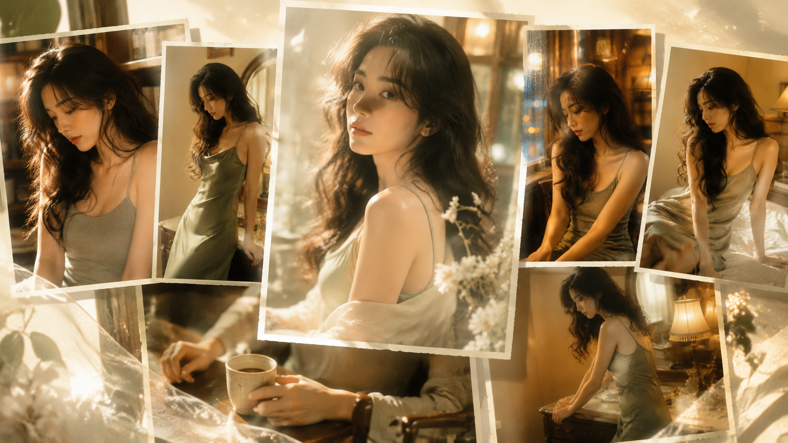
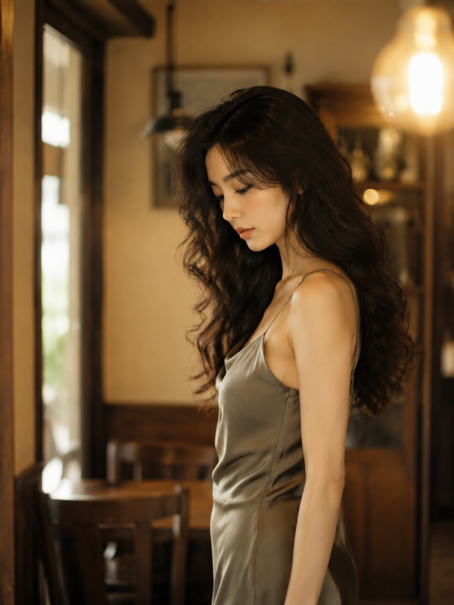
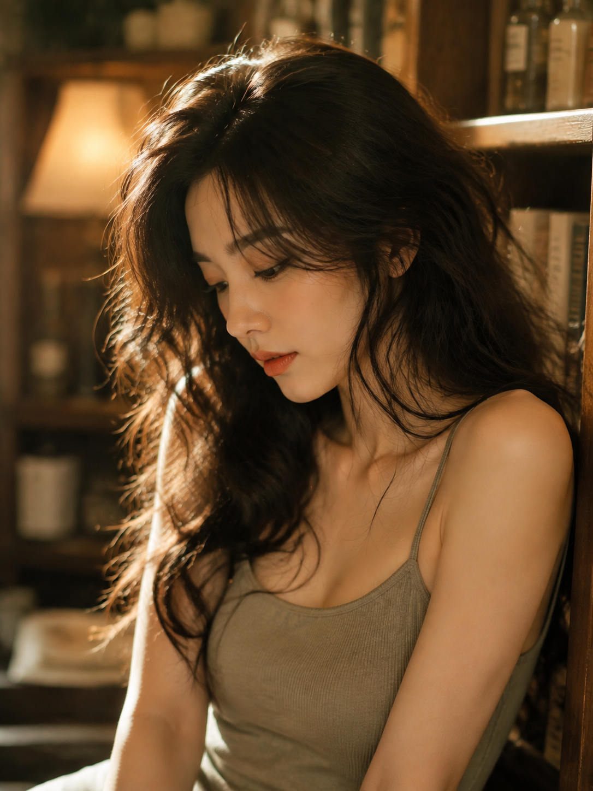
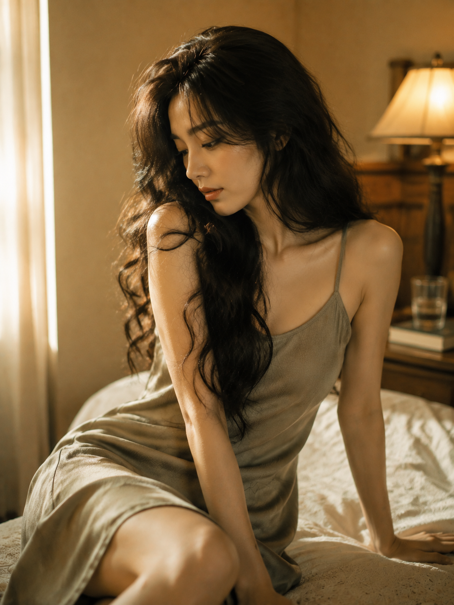
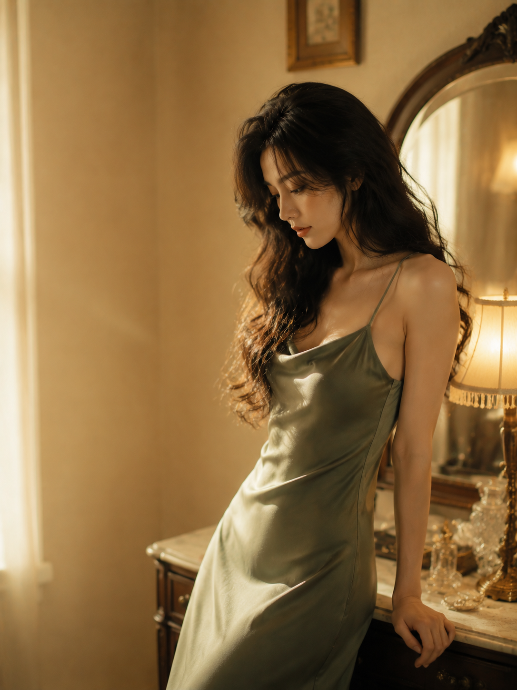
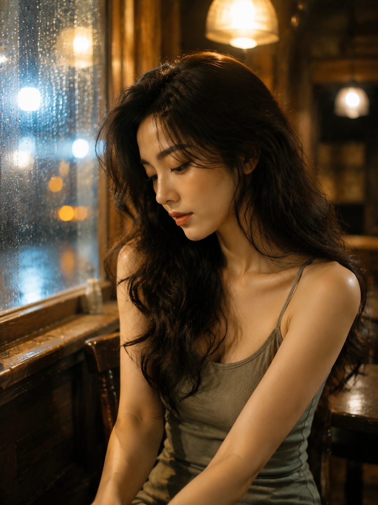

# 琥珀私语：复古光影里的女友感自拍六幕

“女友感”不是把人拍得用力，而是让她像刚好被你看见：有一点低头，有一点留白，光线落在真实的皮肤和发丝上。**这组的核心是“明亮复古”**——保留胶片的情绪，却把曝光、肤色和空气感往清透处推。

## 先问：怎样让性感保持高级？

把性感交给肩颈、锁骨、发丝和姿态，不交给暴露。先锁定成年人物、自然五官和真实皮肤，再用侧脸、低头、靠墙等动作制造亲近感；浅鼠尾草绿、奶咖和蜂蜜黄负责仙气与亮度。

## 一份原版提示词

<strong>原版 Prompt：</strong> 竖版 3:4，2K 超高清，高质感写实人像摄影，复古亚洲电影剧照风格，暖琥珀色室内氛围，一位 24—28 岁成年东亚女性坐在复古咖啡馆靠墙木桌旁，胸像至半身近景，人物位于画面右侧，清晰 3/4 侧脸，微微低头看向桌面，不看镜头，神情安静柔软、若有所思。她有浓密蓬松的黑棕色长卷发，带自然凌乱感和空气感碎发，发丝垂落肩头与胸前；穿低饱和浅鼠尾草绿细肩带吊带上衣，露出自然肩颈、锁骨与手臂线条，女性气质温柔性感但克制高级。背景是奶咖色墙面、木质置物架、暖黄色吊灯和虚化杯具，形成柔和散景。50mm—85mm 人像镜头，f1.4—f2.0，大光圈浅景深，焦点落在眼睛和鼻梁，背景奶油般虚化。整体低对比、低饱和、轻微柔焦、细腻胶片颗粒、轻微 halation、高光柔和不过曝，色调以蜂蜜黄、焦糖棕、奶咖色、暗橄榄绿为主，保留真实皮肤纹理和头发细节，真实摄影，电影感，高清锐利但不过度磨皮。增加光线采样数，收敛噪点，减少随机颗粒、亮部噪声与暗部噪声，最大程度保留面部、发丝、肩颈和织物细节，同时去除噪点拟合，提升整体清晰度。无文字，无水印，无 logo，避免 AI 美女脸、网红感、塑料皮肤、过度精修、背景过清晰、肢体错误。

## 六幕，六种“被看见”

### 01｜咖啡馆低头

右侧留白让视线先落到侧脸，再落到桌面。大光圈只保留眼睛和鼻梁，背景越软，情绪越近。

### 02｜走道尽头

把机位放平，身体和脸分开转，画面会有旧电影的停顿感。明亮窗光能让深木色不显沉重。

### 03｜书架前

书架只做色块，不抢人物。浅卡其绿针织与肉桂唇色形成柔和反差，适合近距离的松弛感。

### 04｜床边空白

略高机位配低头动作，能自然拉出肩颈线条。窗缝补光把居家感提亮，性感因此更克制。

### 05｜梳妆台留白

人物偏右、左侧留白，像一张还没写完的明信片。镜面只保留模糊反射，避免信息过满。

### 06｜窗边雨光

雨夜不等于阴暗。用蜂蜜灯、窗边反光和灰绿衣服做冷暖平衡，忧郁里仍有干净的亮点。

## 跟 AI 交互时，记住这三句

先说清“成年、真实摄影、自然皮肤”，再补动作、焦段和背景；最后用**增加光线采样数、收敛噪点、保留发丝与织物细节**收尾。出现塑料皮肤时，不要只说“更真实”，要指出肤质、毛流和高光的位置。

<strong>设计结论：复古负责情绪，亮色负责点击，留白负责高级。</strong>

往期回顾：晴野流光：白衬衫少女的户外直拍美学与仙气构图；绮光入梦：盛唐逆光轻纱六景；青瓷窗影六境：新中式清透女友感自拍。
