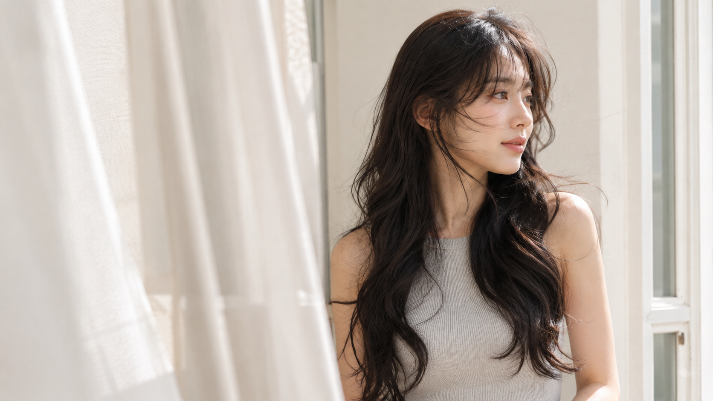
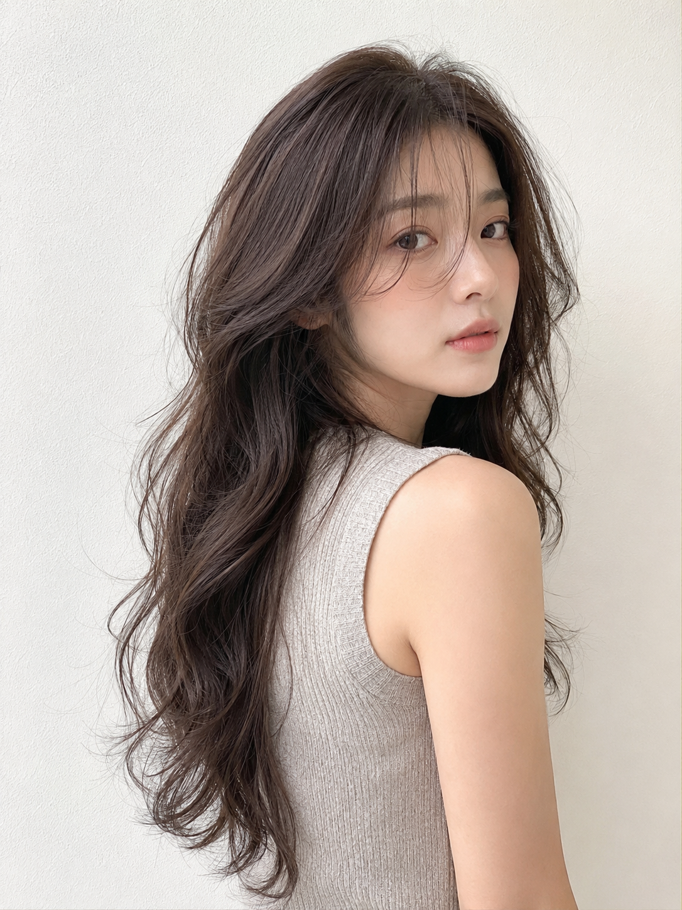
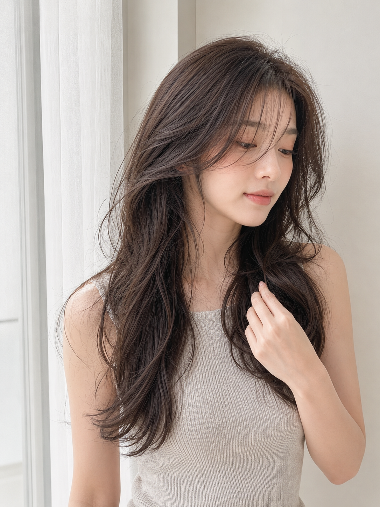
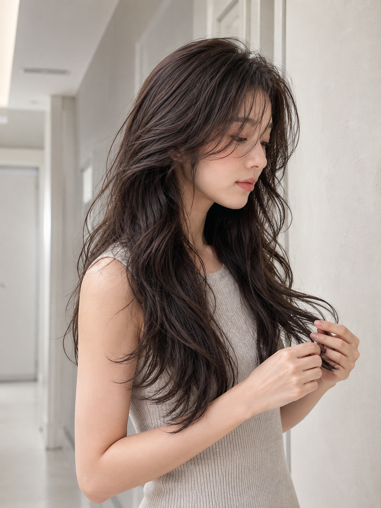
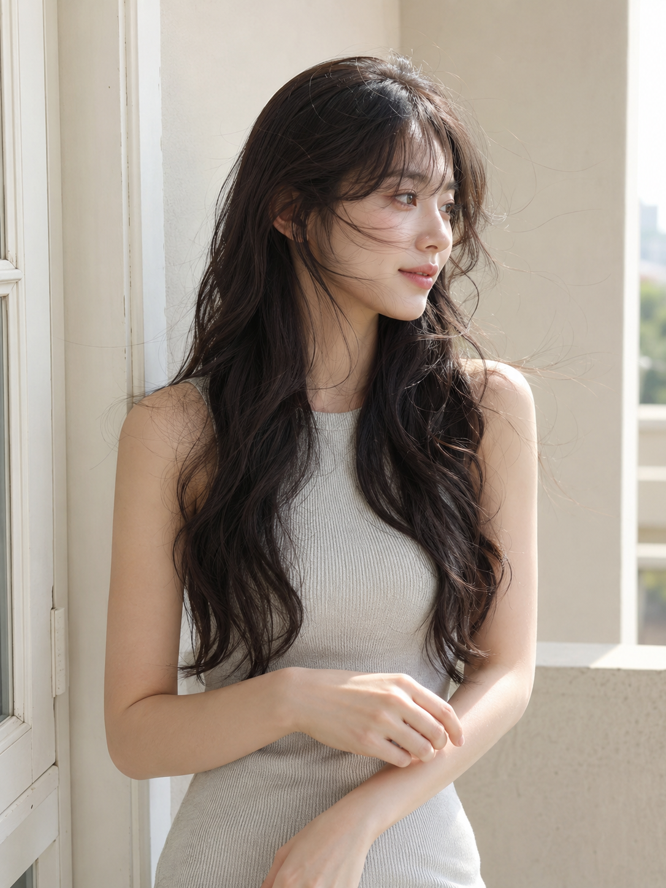
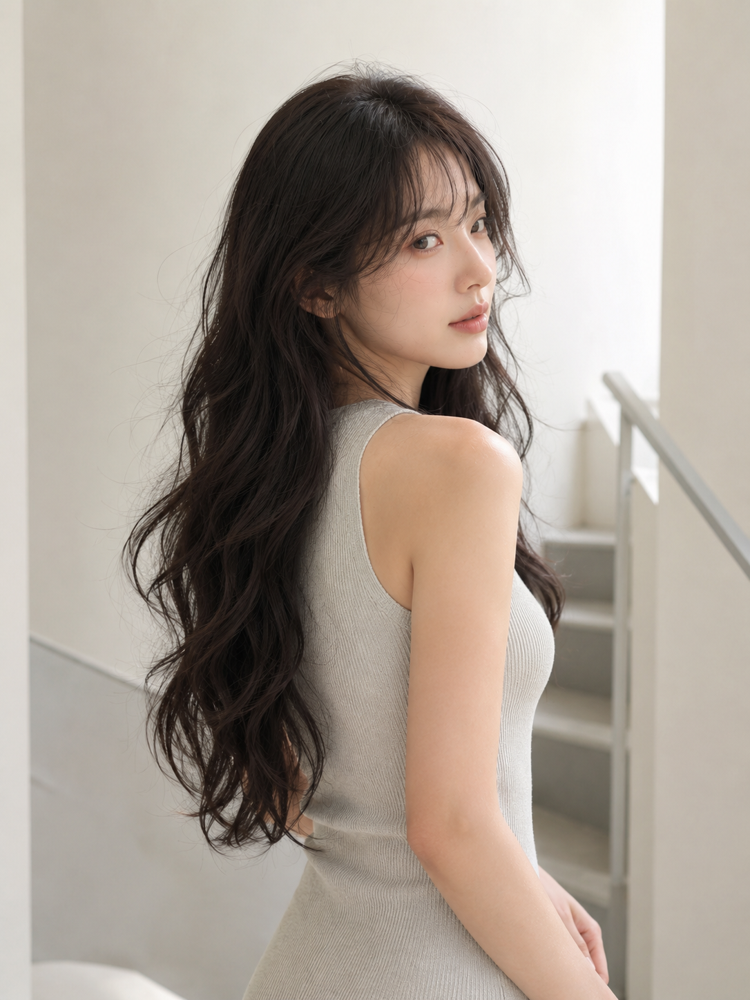
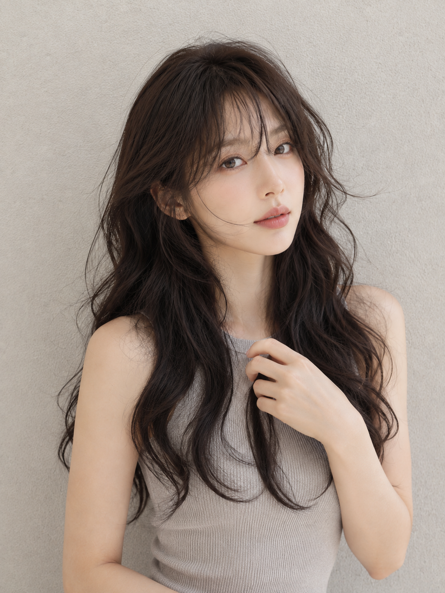

黑茶大卷不是把卷度做得更密，而是让发根、刘海、脸周和发尾各自留出呼吸。这组六帧放进奶油、灰白与暖米色的极简空间，用明亮自然光托住丰盈轮廓，也把人物的样貌、气质与动作留得更自然。

<strong>设计核心：以高明度留白承接深发色，让脸部线条与蓬松发量同时成为视觉焦点。</strong>

## 01｜奶油白墙边的回眸

身体微侧和回眸形成一条轻柔斜线，卷发从背部自然落到肩前。背景越克制，黑茶色的大 S 卷越能成为第一重点。

<strong>原版提示词</strong> 
竖版 3:4，韩系高明度清透发型写真，极简美容沙龙 Lookbook 风格，一位 24 岁成年东亚女生，五官自然清秀，脸型柔和，皮肤白皙通透但保留真实肤质，淡淡蜜桃腮红，柔和珊瑚粉唇色，黑茶色超长蓬松大波浪卷发，发量很多，发根自然抬高，空气刘海搭配脸周层次碎发，卷度为松散自然的大 S 卷，发丝柔软轻盈、有空气感。她穿浅燕麦灰无袖针织上衣，身体微微侧向镜头，回头看向镜头，表情安静温柔。背景是一面奶油白细颗粒墙，干净纯粹，无其他杂物。柔和阴天自然光，低对比，高明度，头发质感清晰细腻，画面重点突出丰盈卷发和脸周线条。50mm—85mm 人像镜头，半身近景，高清真实摄影，无文字、无水印、无 logo。避免 AI 美女脸、网红感、过度磨皮、塑料皮肤、假发质感、复杂背景、错误手部。2K 超高清真实摄影，增加光线采样数，充分收敛噪点，减少随机颗粒，压低亮部噪声与暗部噪声；最大程度保留真实皮肤、发丝、针织面料和墙面材质细节与质感，去除噪点与错误平滑拟合，提升照片清晰度和自然锐度。

<strong>和 AI 的交互关键不在重复说“长卷发”，而在依次锁定发根、刘海、脸周和发尾的层次。</strong>

## 02｜白纱窗光里的整理动作

薄纱把窗边光线打散，低头捻起一缕头发的动作保持克制。重点落在胸前发丝的深棕光泽与柔软纹理，而不是刻意表情。

## 03｜灰白廊道的侧脸弧度

廊道只保留一点纵深，让清晰侧脸与发尾整理把视线带向头发中段。长度、弧度和层次因此更容易被看见。

## 04｜米白门边的轻风感

只让少量发丝微微浮起，就足够带来空气流动感。暖米色留白与深色头发形成柔和反差，侧视神态也让画面更松弛。

## 05｜楼梯转角的安静回望

略微背身再回头，可以同时展示后背铺开的发量和 3/4 面部轮廓。楼梯扶手只作为低调结构线，不抢走头发焦点。

## 06｜暖灰墙前的近景收束

最后收近到胸像，让空气刘海、脸周碎发和大 S 卷的丝缎反光清楚出现。真实发丝细节，比过度精修更能留住这组写真的温柔与松弛。

六个镜头从留白、窗光、空间、微风、回望到近景，逐步把同一款黑茶长卷拍出不同情绪。真正耐看的女友感，不是夸张摆拍，而是让人物、光线和头发都看起来刚好自在。
