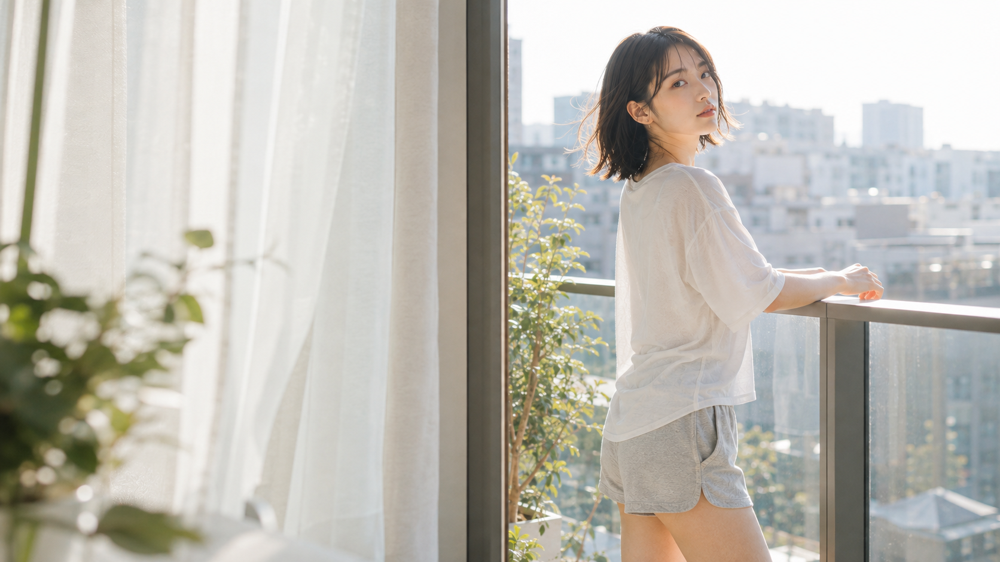
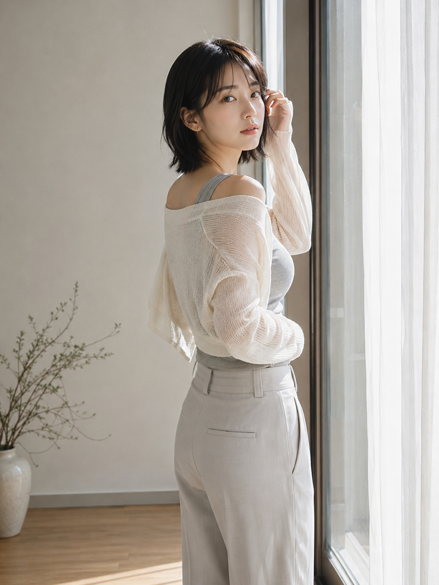
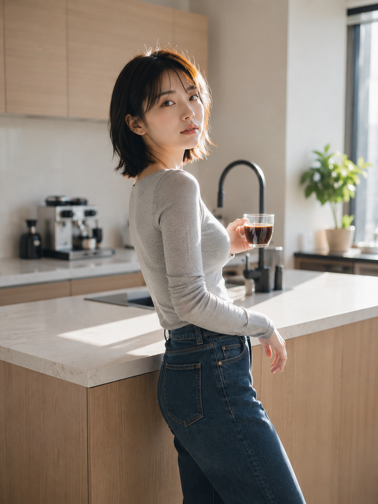
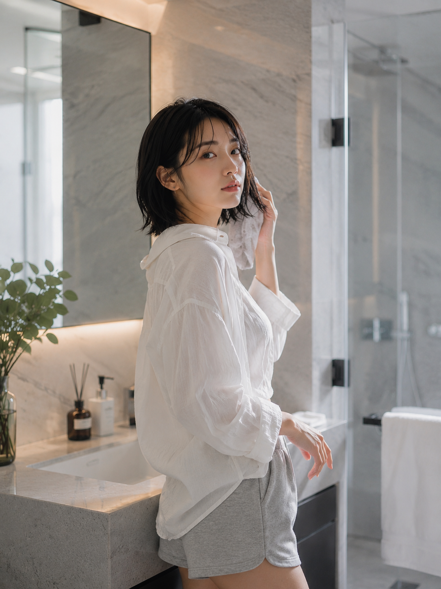
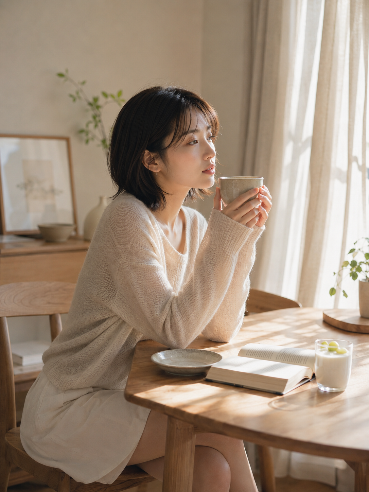
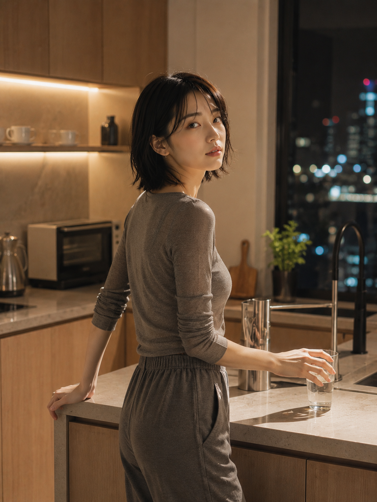
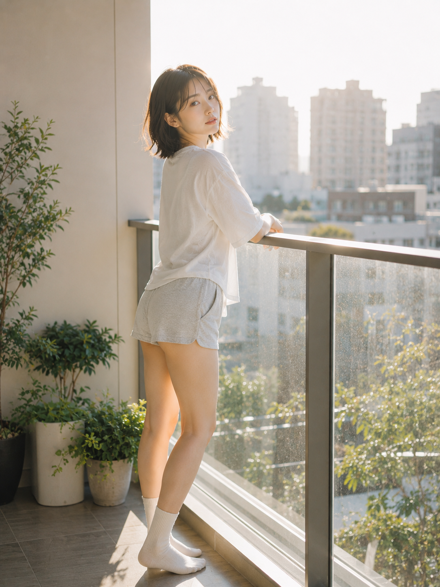

同一位模特、同一套自然光逻辑，六个极简居所换六套居家穿搭。真正拉开高级感的不是滤镜，而是面料明度与光位的配比。

<strong>设计核心：先定光位与留白，再让穿搭去接光——面料越轻薄通透，气质就越干净。</strong>

## 01｜落地窗边 · 米白开衫 × 顺光纱帘

轻薄开衫接住穿过纱帘的漫射光，锁骨与肩颈线条被大面积留白托住。回眸加挑发，让身体自然形成一条舒展斜线。

光位：顺光漫射｜焦段：50mm｜主色：奶油白

<strong>原版提示词</strong> 
竖版 3:4 超写实生活方式人像摄影，一位 24 岁成年东亚女性站在现代公寓落地窗旁，身体微侧向窗外，单手轻挑耳边短发并回头看向镜头，肩颈与腰线舒展，神情安静带一点刚醒的慵懒。黑色柔顺短发、发尾自然内扣，淡妆，五官自然清秀，面部干净，健康自然肤色，眼神真实，皮肤光泽自然。她穿米白色轻薄针织开衫搭配浅灰修身背心与高腰长裤，露出锁骨与肩颈线条，面料柔软有自然褶皱与织物纹理。场景为极简公寓客厅：浅灰墙面、白色纱帘、浅木地板、陶瓷花瓶。清晨阳光穿过半透明纱帘形成通透光晕与轻微丁达尔尘埃感，整体明亮高调、不压暗。50mm 镜头，人眼视角，浅景深，人物居中偏左，大面积留白，窗框与墙面线条构成几何构图。奶油白、浅灰、木色低饱和柔光，日系高级生活摄影风格，轻微胶片颗粒，真实抓拍感。2K 超高清真实摄影，增加光线采样数，充分收敛噪点，减少随机颗粒，压低亮部噪声与暗部噪声；最大程度保留真实皮肤、发丝、织物与场景材质的细节与质感，去除噪点与错误平滑拟合，提升照片清晰度与自然锐度，画面干净通透、不糊不脏，无文字、无水印、无 logo。成年女性，自然健康审美，无性化暗示。避免 AI 美女脸、网红感、过度精修、塑料皮肤、暗沉肤色、明显痘印、明显皱纹、斑点、面部变形、错误手部。

<strong>和 AI 的交互关键：把「光位—面料—动作」分三句依次锁定，比堆一串形容词有效得多。</strong>

## 02｜厨房岛台 · 浅灰修身 × 侧逆光

修身长袖收住腰线，35mm 让台面与人物同框。侧后方来光在轮廓上压出一道暖边，是「随手被拍」的关键。

光位：侧逆光｜焦段：35mm｜主色：灰白

## 03｜浴室镜前 · 白衬衫 × 冷暖混光

顶灯的冷与窗光的暖各占一半。领口自然敞开、擦拭发尾的动作，比任何摆姿都更接近私密感。

光位：顶光＋侧窗光｜焦段：50mm f/2.8｜主色：冷灰

## 04｜木餐桌午后 · 杏色针织 × 大片光斑

坐姿把重心压低，双手捧杯给手部一个交代。纱帘打散的光斑落在脸颊与指节，暖米色自然成立。

光位：窗帘散射光斑｜焦段：35mm｜主色：暖米

## 05｜夜厨房暖灯 · 深灰针织 × 明亮暖光

夜景不等于压暗。把隐藏灯带调到高明度、让暗部保持通透，出来的才是电影感，而不是噪点。

光位：暖白灯带＋窗外冷光｜焦段：35mm｜主色：暖灰

## 06｜阳台晨光 · 白 T × 逆光光晕

晨风、轮廓光与轻微光晕合成那点「仙气」。玻璃栏杆的横线与人物竖线交叉，收住整组的呼吸感。

光位：侧逆光｜焦段：50mm｜主色：白绿

六幕走完，从顺光、侧光、混光、光斑、暖灯到逆光，穿搭只是接光的介质。想复刻，把这张光位表照着换空间就够了。
