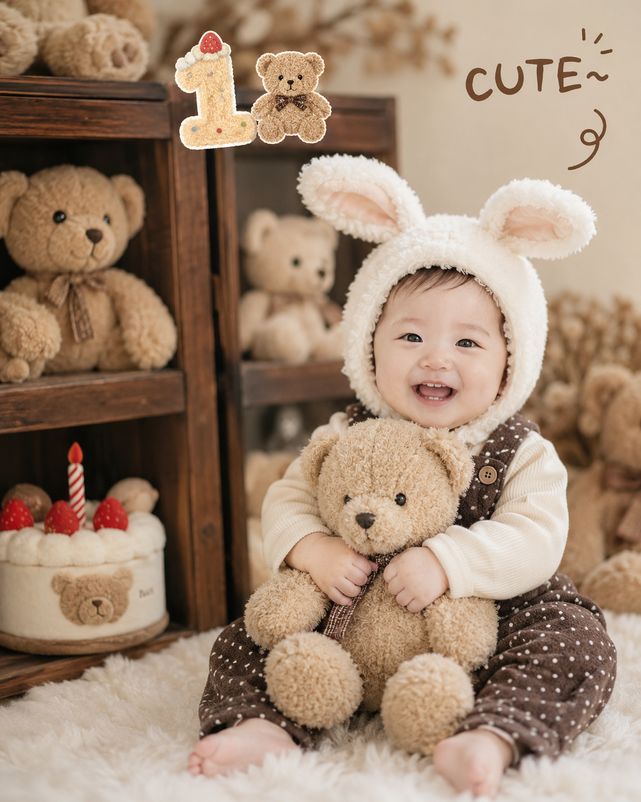
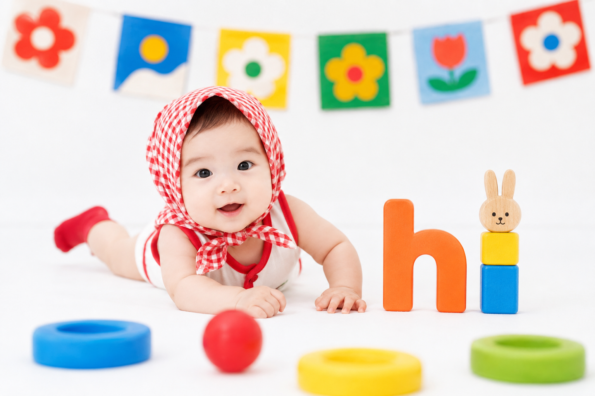
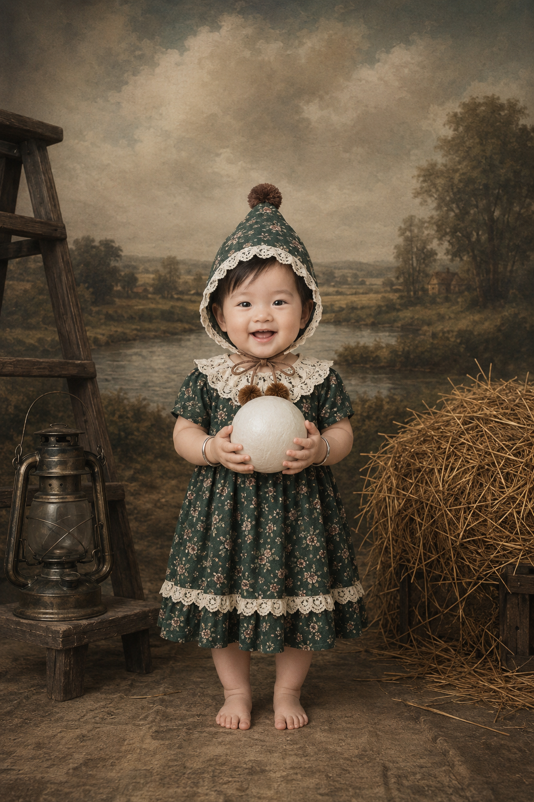
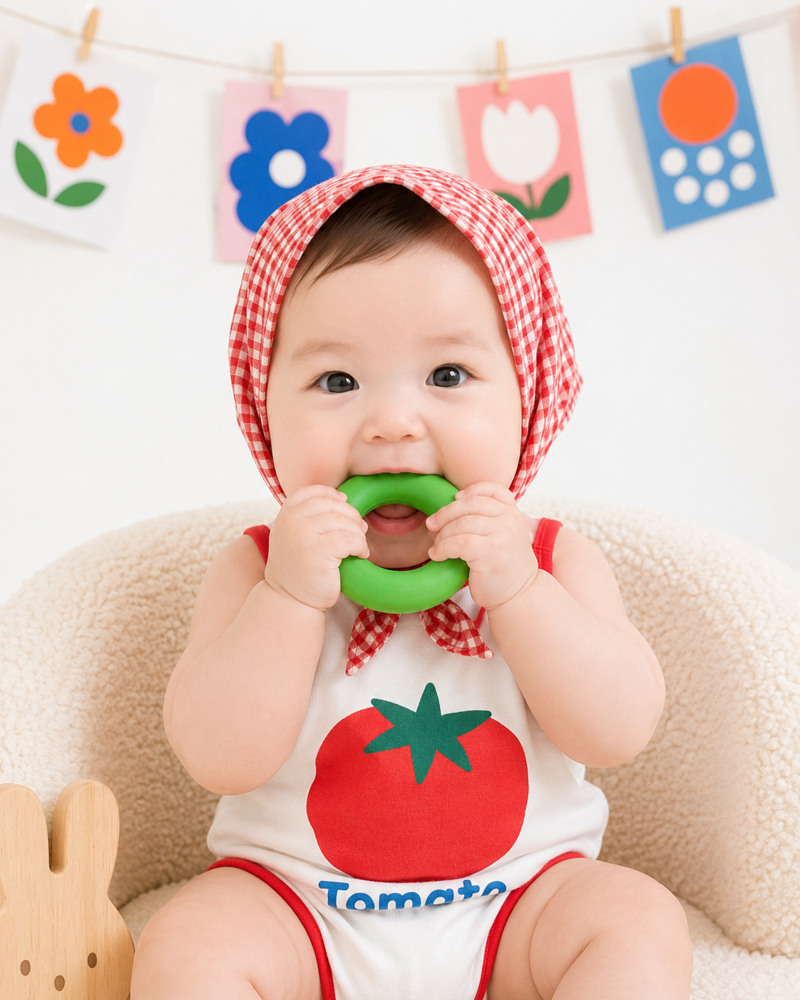
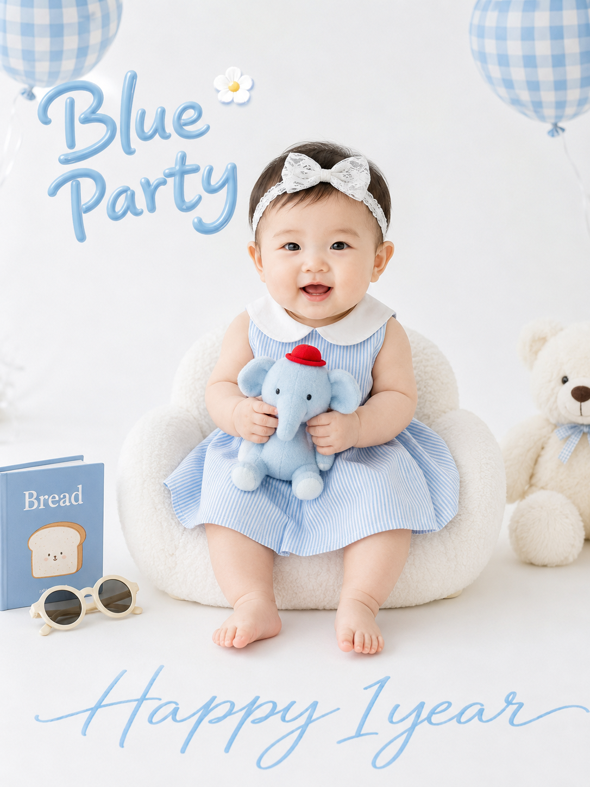
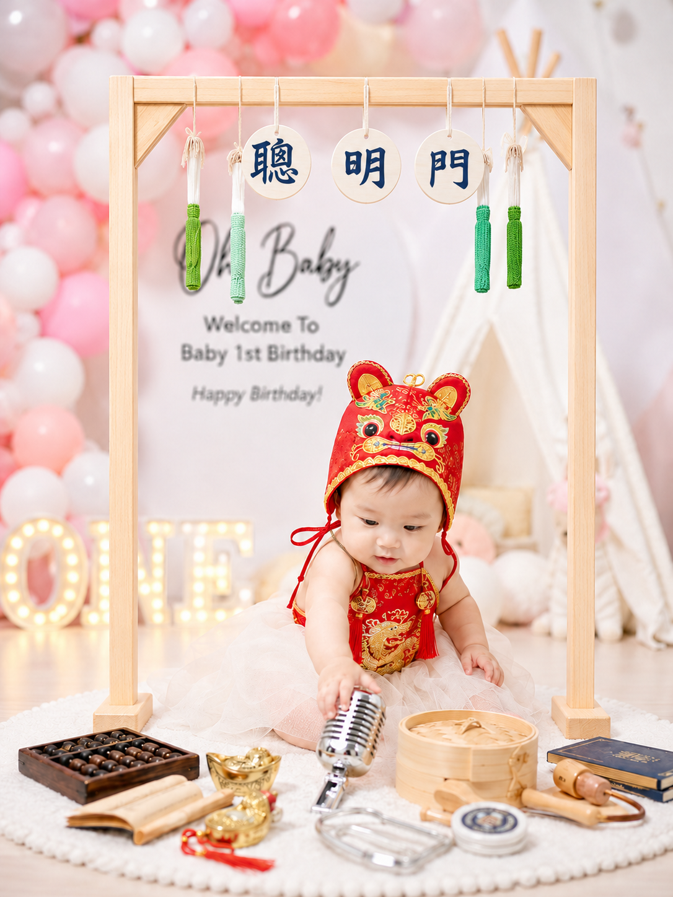
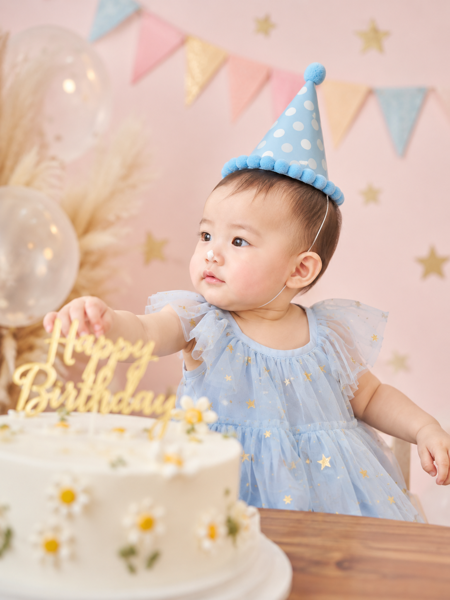
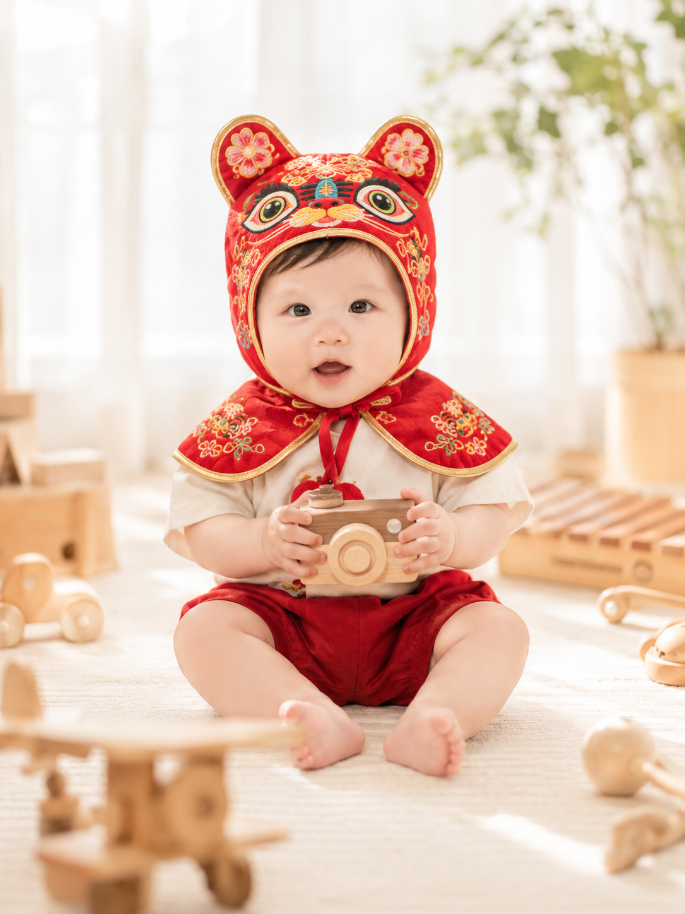
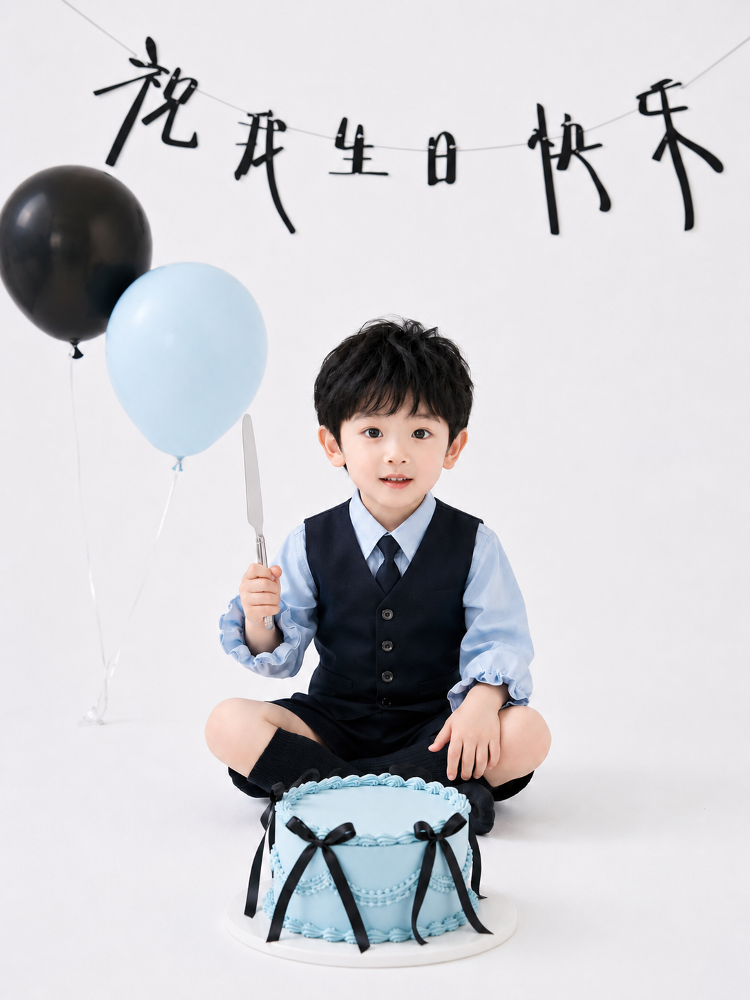

今天这组是「宝宝周岁百天写真艺术照」。不用去摄影棚，宝妈也可以先用宝宝照片做参考，再结合这组 Prompt 生成兔耳泰迪、百天趴趴照、抓周仪式、生日蛋糕、国风虎头帽和复古艺术照。

提示词：
主体特征：快乐微笑的婴儿，头戴白色毛绒兔耳帽，身穿浅色打底衫与深色波点背带裤，双手抱着一只浅棕色毛绒泰迪熊。

建议收藏这组 Prompt。核心结构是「宝宝真实参考照 + 主题服装道具 + 影棚布景 + 柔和光影」，这个框架可以延伸出很多同类型周岁照、百天照和生日写真。
这个系列会持续更新，下一期继续补同类型宝宝艺术照。

#GPTImage2 #豆包 #千问 #生图提示词 #Prompt #宝宝艺术照系列 #宝宝周岁写真 #百天照

