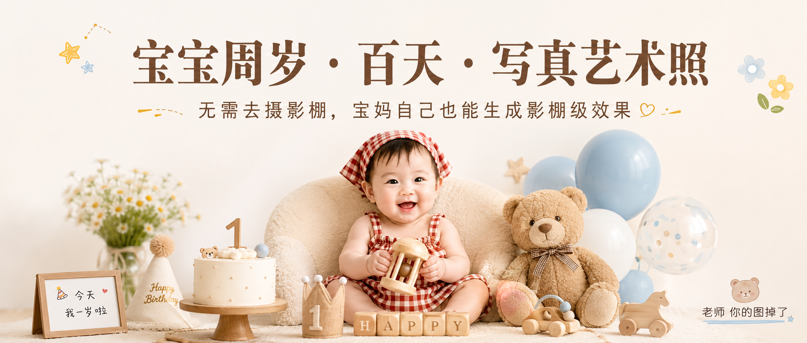

# BABY-001-宝宝周岁百天写真艺术照 封面

## 封面提示词

微信公众号封面图，主题名必须清晰写出“宝宝周岁 · 百天 · 写真艺术照”，副标题写“无需去摄影棚，宝妈自己也能生成影棚级效果”，角落署名写“老师 你的图掉了”。画面主体是一位自然可爱的宝宝坐在柔软米白色毛绒座椅上，面前有小蛋糕、泰迪熊、浅蓝色气球、红白格头巾、木质抓周玩具和生日派对小道具，整体呈现温暖明亮的宝宝艺术写真封面氛围。构图适合公众号首图，宝宝占画面下半部分中心，标题文字位于上方干净留白区域，文字排版清楚、有点击欲、不要拥挤。画面风格为高级儿童影棚写真，暖白背景，柔和自然漫反射光，浅景深，人像摄影质感，宝宝表情自然可爱，面部干净健康，肤色自然，可加入少量星星、小花、小熊贴纸和柔和手绘装饰，突出“在家生成、周岁照、百天照、艺术写真”的主题。避免杂乱、廉价海报感、过度精修、塑料皮肤、畸形手指、错误文字、文字拼写错误、署名缺失。

## 封面图片

