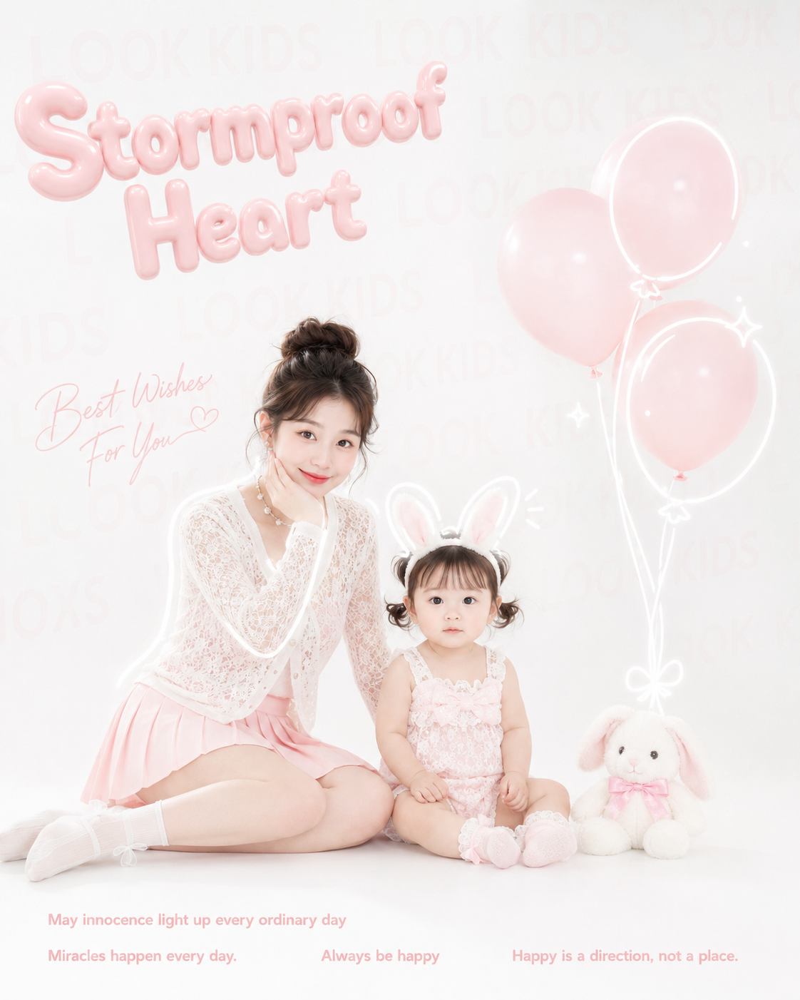
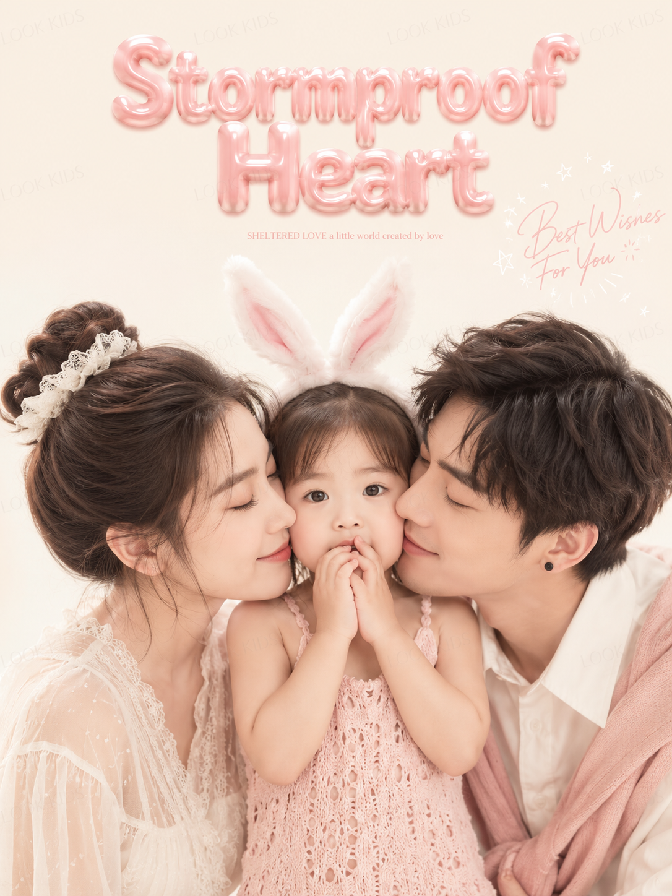
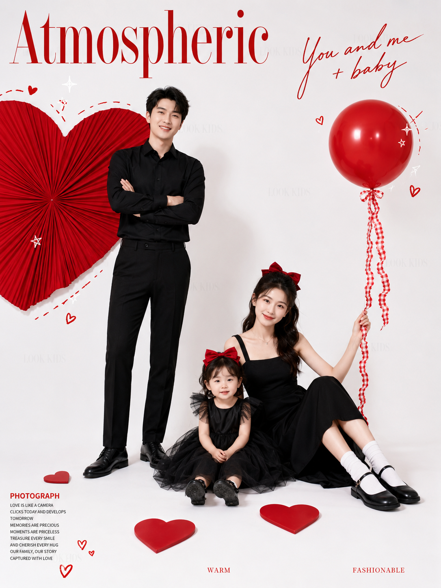
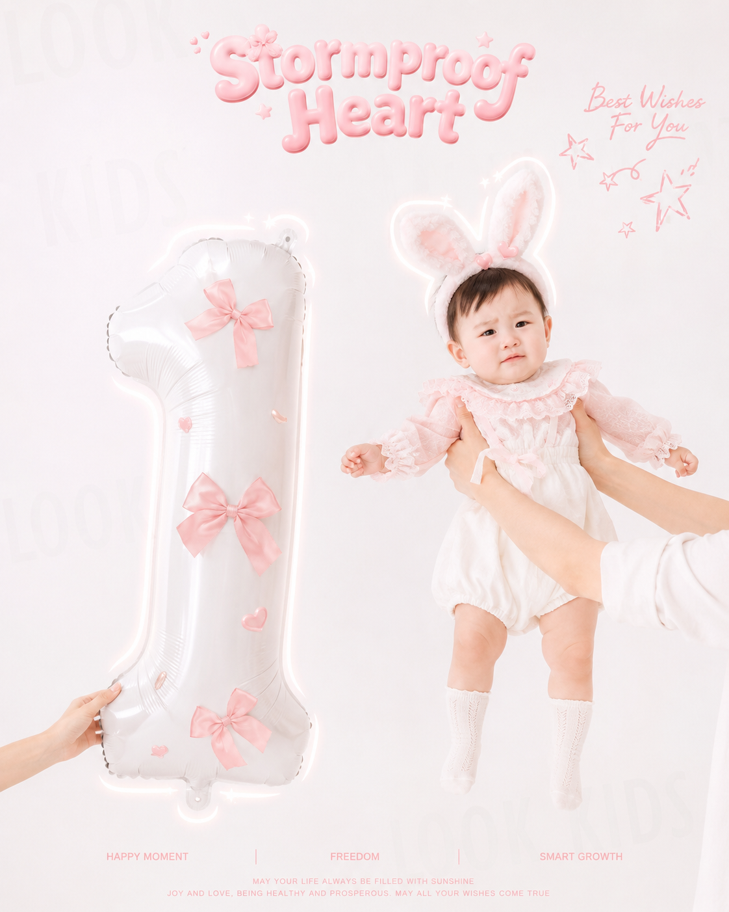

今天这组是「宝宝艺术照-亲子」。不用去摄影棚，先上传宝宝照片或亲子合照做参考，再复制对应 Prompt，就能把普通宝宝照往影棚艺术照方向推。

这期包含粉白兔耳、亲子贴脸特写、红黑白杂志感、原木居家和一周岁气球主题。适合周岁照、百天照、亲子头像、小红书晒娃首图。

提示词：
建议先选一张宝宝正脸照，再搭配这组 Prompt 生成。核心结构是「宝宝参考照 + 亲子关系 + 影棚/居家布景 + 色彩风格 + 光影构图」，这个框架后续可以延伸出很多同类型宝宝艺术照。

#GPTImage2 #豆包 #千问 #生图提示词 #Prompt #宝宝艺术照系列 #宝宝艺术照 #亲子写真

