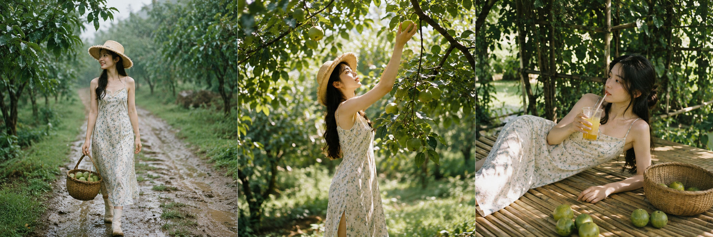
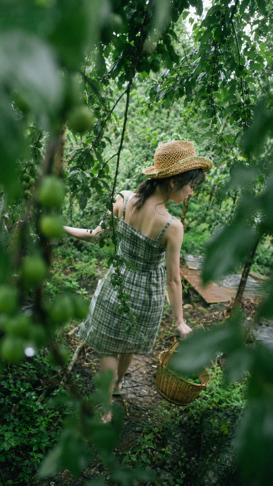
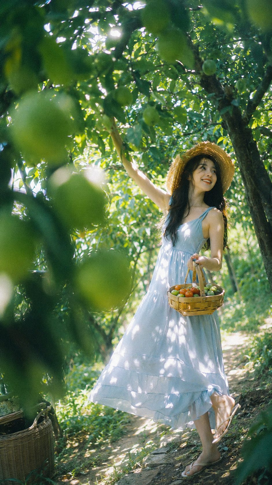
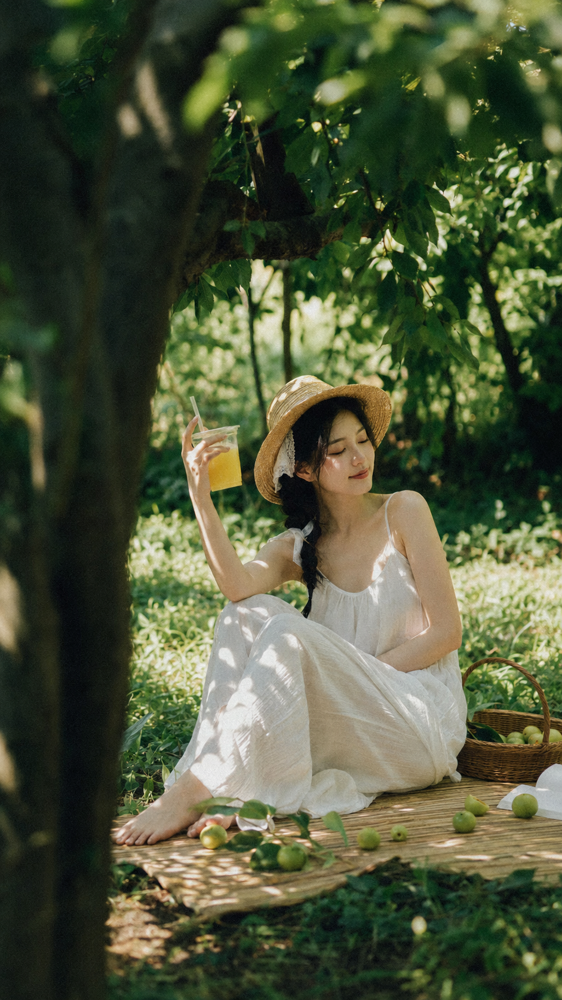

# 夏日果园竟能拍出这感觉？3 组胶片抓拍提示词直接存

图友们大家好，今天这一期是「夏日果园胶片抓拍」。

这组提示词围绕夏日果园场景，还原 35mm 胶片抓拍的真实质感——茂密植被遮挡的窥拍视角、斑驳阳光和叶影、竹席上的悠闲午后，三种不同氛围各有侧重，既有动态活力感，也有静谧生活感。

这是户外直拍系列的第一期，后续会持续更新户外场景，建议收藏备用。

> 💡 **小技巧**：主流 AI 生图工具都支持上传参考图。你可以把自己的一张日常照片上传作为人物参考，再结合本期提示词，生成的照片会更贴合你自己的气质和面貌，效果比纯文字提示词更自然。

---

## 清新·果园漫步

适合场景：雨后果园漫步，想要清透森系感、透过植被"偷拍"的自然抓拍视角。

提示词：

9:16竖向画幅，真实35mm胶片抓拍感，广角镜头全身构图，画面略微倾斜大胆裁切，轻微胶片颗粒和柔焦效果。年轻女性，自然的深色微乱头发，刘海带有轻微湿润感，随意扎起的松散低马尾，部分被编织草帽遮挡。白皙皮肤，自然皮肤纹理，五官自然清秀，清透氧气感妆容，柔和桃粉色腮红，微水光唇。轻薄棉麻材质，绿色格纹吊带裙。雨后夏日果园，茂密绿色植被，挂着青色未熟果实的葡萄藤和李子树，泥土小路和长满青苔的地面，果园深处可见木制平台。前景被潮湿树叶、枝条和青色小果实大面积遮挡并虚化，透过茂密植被"偷拍"视角。人物在画面深处，提着果篮在小路上漫步，侧身背对镜头，一手伸出拨开树枝，表情自然不看向镜头。柔和漫反射夏日自然光透过雨后浓密树冠，皮肤和衣服上有斑驳树叶阴影，潮湿植物反射幽绿光晕，高光处有轻微胶片光晕溢出。避免AI美女脸、网红感、过度精修、塑料皮肤、暗沉肤色、明显痘印、明显皱纹、面部变形。

---

## 阳光·活力采摘

适合场景：阳光斑驳的果园，想要动态抓拍感、逆光光晕和活泼人物状态。

提示词：

9:16竖向画幅，充满活力的35mm胶片抓拍，广角镜头全身展示，画面略微倾斜大胆裁切，强烈胶片颗粒感和柔焦高光溢出。年轻女性，深色自然散发被微风吹拂，随意的空气刘海，戴着草帽。白皙且有真实肌理的肌肤，鼻梁和脸颊上有淡淡装饰性雀斑，面部干净自然好看，充满光泽感的水润妆容，浅粉珊瑚色调，微水光唇。浅蓝色夏日长裙，轻盈透气。阳光斑驳的夏日果园，茂密树林和挂满青涩果实的枝干，自然草地，一个旧竹篮，穿过茂密植被的蜿蜒自然小路。镜头藏在阳光照射的树叶和青果之间，近处叶片大面积虚化，画面有明显层次感和空间纵深。人物在画面深处，动作活泼，轻快地踮脚摘果，俏皮微笑着看向别处，手里提着装满青色水果和彩色小番茄的竹篮。强烈逆光和阳光穿过树叶形成光斑，皮肤和衣服上有复杂光影，阳光营造柔和朦胧光晕照亮头发边缘，局部高光轻微过曝，环境反射绿色光芒。避免AI美女脸、网红感、过度精修、塑料皮肤、暗沉肤色、明显痘印、明显皱纹、面部变形。

---

## 宁静·悠闲午后

适合场景：果园野餐或庭院角落，想要极浅景深、温暖树荫光和私人悠闲氛围。

提示词：

9:16竖向画幅，氛围感极强的35mm胶片抓拍，广角镜头全身视角，略微倾斜的构图和大胆裁切增加纪录片般真实感，明显胶片颗粒、景深极浅。年轻女性，深色自然头发松散的麻花辫，几缕发丝自然凌乱，隐约可见白色蕾丝发饰，部分被草帽压住。瓷白肌，自然皮肤纹理和细微雀斑，面部干净自然清秀，清透氧气自然妆，杏眼，棕色细眼线，自然光泽唇部。飘逸的白色棉麻吊带裙，整体清爽舒适。夏日果园僻静角落，藤蔓植物和浓密植被背景，草地上铺着竹席，上面放着编织篮、一杯插着吸管的黄色果汁以及散落的青色水果。前景浓密的树干枝叶营造亲密窥视感，人物坐在竹席上，画面有强烈纵深感。她优雅地坐着举起那杯黄色果汁，表情可爱放松，不强求看向镜头，强调私人悠闲瞬间。夏日自然光，温暖斑驳的树荫光洒下，光斑和错综复杂的树叶阴影交错在脸部和周遭事物上，画面焦点柔和，美丽的背景高亮虚化，柔焦高光，柔和自然的绿色调。避免AI美女脸、网红感、过度精修、塑料皮肤、暗沉肤色、明显痘印、明显皱纹、面部变形。

---

## 使用建议

1. **加入真实感控制词**：提示词中的"35mm胶片颗粒感""轻微柔焦""高光轻微过曝"是控制照片质感的核心词，可以根据工具风格适当增减颗粒程度。
2. **上传参考照效果更好**：上传一张你的日常生活照作为人物参考，AI 会在保留你面部特征的基础上生成效果，比纯提示词更自然贴合。
3. **场景和工具都可以替换**：这组提示词的框架（窥拍视角 + 前景虚化 + 自然光）可以迁移到其他户外场景，GPT Image、千问、Gemini 等主流工具均可使用，建议在不同平台对比效果。

觉得有用就收藏这期，关注账号持续更新户外场景新提示词，评论区留言你最想要哪种户外场景。

---

## 往期回顾

- STREET-001 夜间闪光灯抓拍四场景

#GPTImage2 #千问 #生图提示词 #Prompt #户外直拍 #夏日果园 #胶片抓拍
