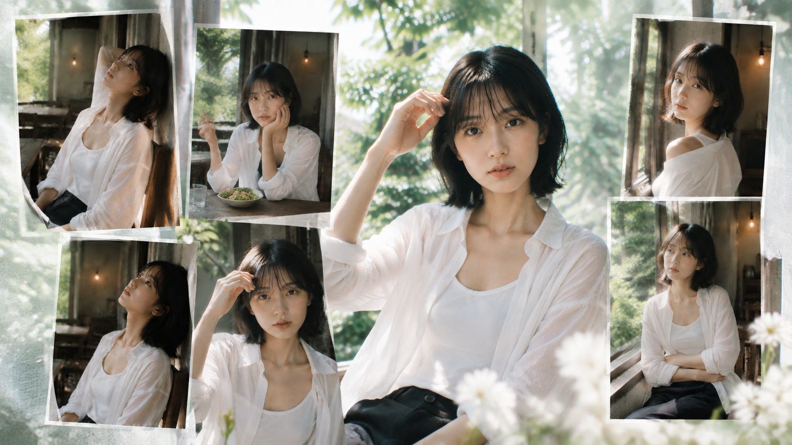
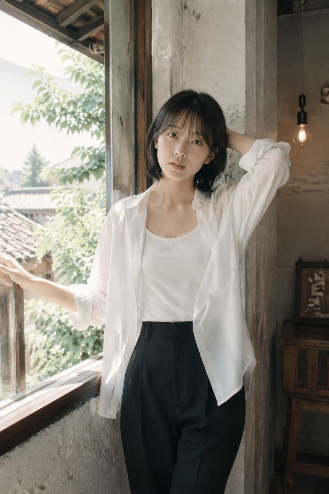
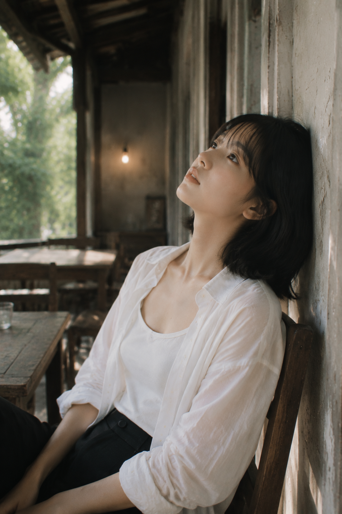
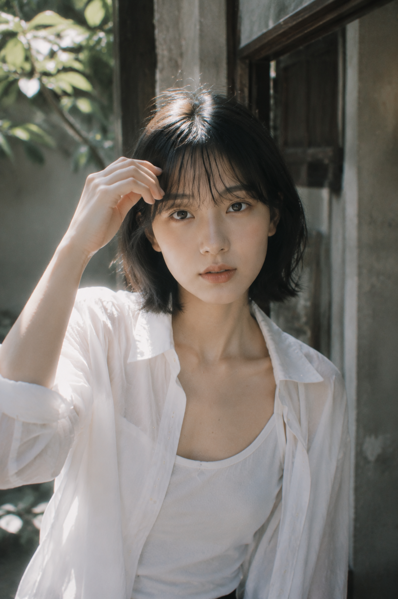
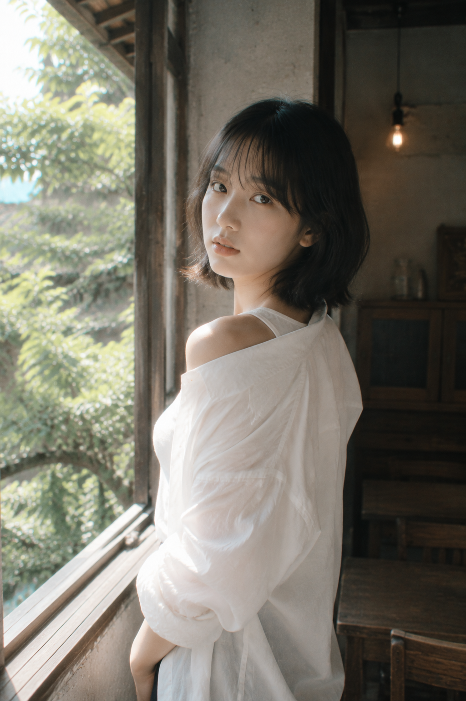
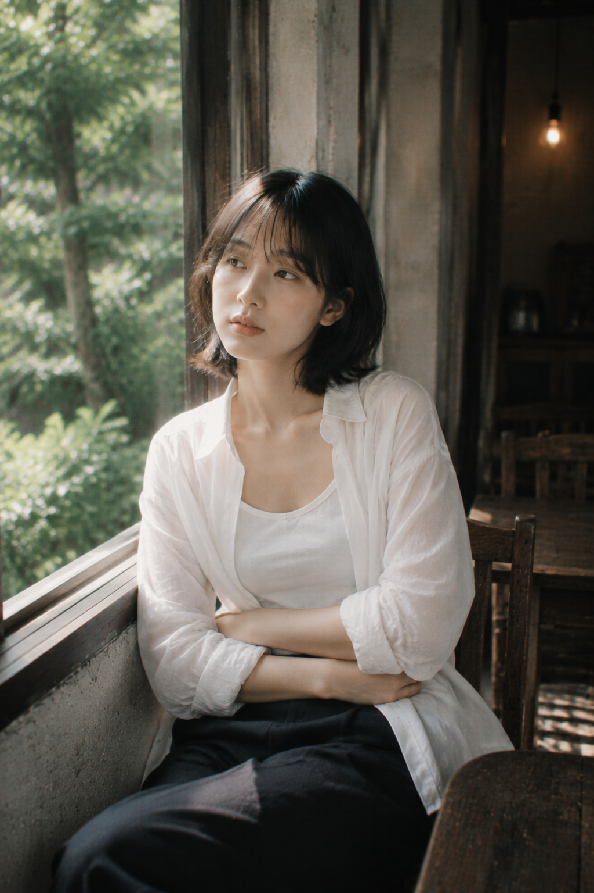

# 晴野流光：白衬衫少女的户外直拍美学与仙气构图

白衬衫并不只是穿搭，它更像一块会接住光的柔软画布。把人物放进旧木窗、庭院绿意和夏日风里，直拍也能同时拥有真实感与仙气。关键不是堆滤镜，而是先安排光线、动作和前后景，再让镜头留下呼吸感。

## 先把自然光拍干净

第一张从窗边抬手开始：一侧是青绿色天光，一侧是暖灯，冷暖交界会让白衬衫有层次。人物不要站得笔直，手臂、肩颈和身体形成轻微弧线，画面才像偶然被记录。

竖版 2:3，真实写实的日系胶片生活人像摄影，盛夏午后，旧宅木窗与半开放廊檐相连的明亮空间，一位24岁成年东亚女性站在斑驳灰墙与木窗之间，黑色齐肩短发，轻薄空气刘海，五官自然清秀，面部干净，健康自然肤色，眼神真实安静，淡妆裸感。她穿宽松柔软的白色长袖衬衫，袖口随意卷起，内搭白色背心，下穿深色长裤，衬衫自然微敞，露出克制的锁骨与肩颈线条，清爽而带一点轻微性感。她一只手扶住窗框，另一只手绕到脑后，身体轻轻倚墙，姿态松弛柔软。窗外是被阳光照亮的青绿色植物、旧院落和远处天空，室内有暖黄色裸露钨丝灯，形成青绿自然光与琥珀暖光的冷暖混合。整体明亮、低饱和、低对比，柔和高光 bloom，轻微怀旧雾感，背景保留旧木框、粗糙墙面、深色家具和真实生活痕迹。35mm胶片摄影质感，50mm镜头，中近景，浅景深，人物清晰、背景柔化，2K超高清真实摄影。提高光线采样数，精细收敛噪点，减少随机颗粒、亮部噪声、暗部噪声和彩色噪声，最大程度保留发丝、皮肤、白衬衫褶皱、窗框、植物和墙面纹理细节，提升照片清晰度并保持自然质感。内容安全，人物为成年女性，不低俗、不暴露、不挑逗。避免网红脸、AI感、过度磨皮、塑料皮肤、过饱和、HDR、手部错误、文字水印、logo；避免 AI 美女脸、网红感、过度精修、塑料皮肤、暗沉肤色、明显痘印、明显皱纹、斑点、面部变形。

## 六个动作，六种呼吸

托脸凝视把视线收回到镜头，木桌、餐盘和一盏虚化暖灯负责交代生活。让手边有一个小物件，人物就不会像在背姿势。

靠墙仰头适合表现侧颜。机位略低、光从后侧进入，颈部和下颌线会更轻；不要把仰头做成夸张摆拍，留一点停顿就够了。

整理刘海是近景的“微动作”。树影切过肩膀，亮部自然集中到眼睛和手臂，清晰度要服务于皮肤和布料的真实纹理，而不是把脸磨成塑料。

回眸让身体方向和眼神方向错开，旧窗框便成了画面里的第二条线。冷绿窗光配一点琥珀灯色，能把白衬衫从背景里轻轻托出来。

最后的抱臂坐姿更松弛。和 AI 沟通时，我会先说清楚人物是成年、动作自然、光线明亮、保留真实纹理，再补镜头、色调和负向约束；比一句“拍得高级一点”更容易得到稳定结果。

这组图的共同方法，是用自然光做主角，用动作制造差异，用干净的高采样与降噪保住细节。性感只停留在肩颈、姿态和气质里，画面因此明亮、真实，也更耐看。

#户外直拍 #日系胶片 #白衬衫写真 #生图提示词 #Prompt #晴野流光
