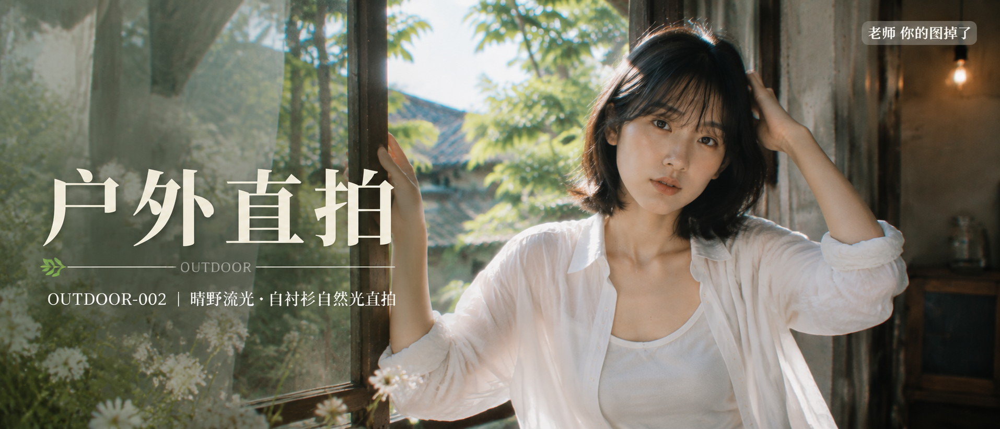

# OUTDOOR-002-晴野流光·白衬衫自然光直拍 封面

## 封面提示词

视觉概念名「晴野流光」，一位24岁成年东亚女性站在旧宅木窗与盛夏庭院交界处，采用足够大的半身主体和清晰正脸或3/4侧脸，黑色齐肩短发、空气刘海、五官自然清秀、面部干净、健康自然肤色、眼神真实、皮肤光泽自然，穿轻薄白色长袖衬衫与白色背心，衣襟自然层叠，露出克制的锁骨与肩颈线条，姿态松弛优雅，一只手轻触窗框，另一只手拂过发梢，轻微性感但端庄安全。画面右侧为人物主要视觉焦点，左侧留出干净明亮的文字空间；前景有白色野花和透明纱帘的轻微叠影，中景是旧木窗与金色光斑，远景是高亮青绿色庭院和浅蓝夏日天空，形成前中后景、大小层次、冷暖对比与黄金比例构图。真实户外自然光摄影与高级日系胶片大片融合，电影感光影，高清锐利，色彩层次丰富，亮色清透、仙气飘逸、视觉吸引力强，商业杂志封面级完成度，2.35:1电影横构图，2K超高清真实摄影。提高光线采样数，精细收敛噪点，减少随机颗粒、亮部噪声、暗部噪声和彩色噪声，最大程度保留眼睛、发丝、皮肤、白衬衫褶皱、野花、木窗纹理和光斑细节。内容安全，人物明确为成年女性，不低俗、不暴露、不挑逗。避免人物变形、手指错误、脸部被文字遮挡、过暗、脏灰、模糊、AI感；避免 AI 美女脸、网红感、过度精修、塑料皮肤、暗沉肤色、明显痘印、明显皱纹、斑点、面部变形。

【文字排版-必须完整保留，不得省略或简化任何一项】画面左侧垂直居中偏下叠加文字排版：超大号衬线字体米白色主文案「户外直拍」，主文案正下方一条细横线左端带🌿，横线中央有透明英文水印 OUTDOOR，横线下方等宽白色字体副文案「OUTDOOR-002 ｜ 晴野流光·白衬衫自然光直拍」；右上角浅色半透明圆角底衬配小号文字「老师 你的图掉了」（署名文字，必须出现，不可省略）；无整体蒙层，文字直接压图。【文字排版结束】

## 封面图片

