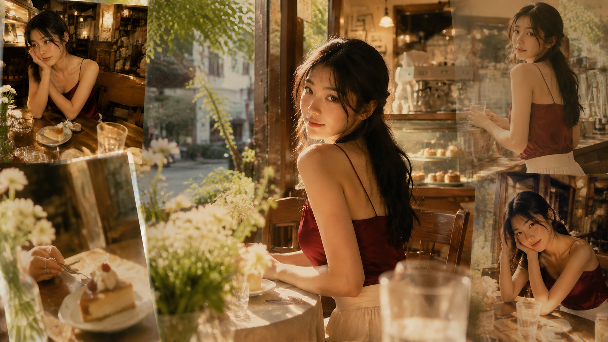
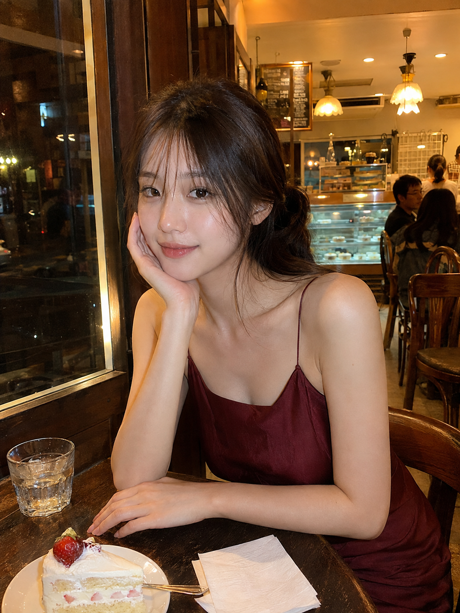
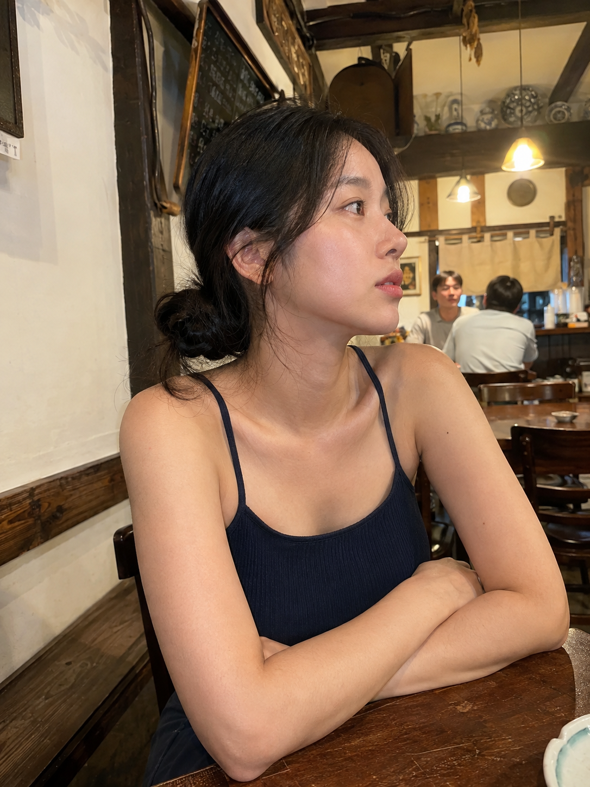
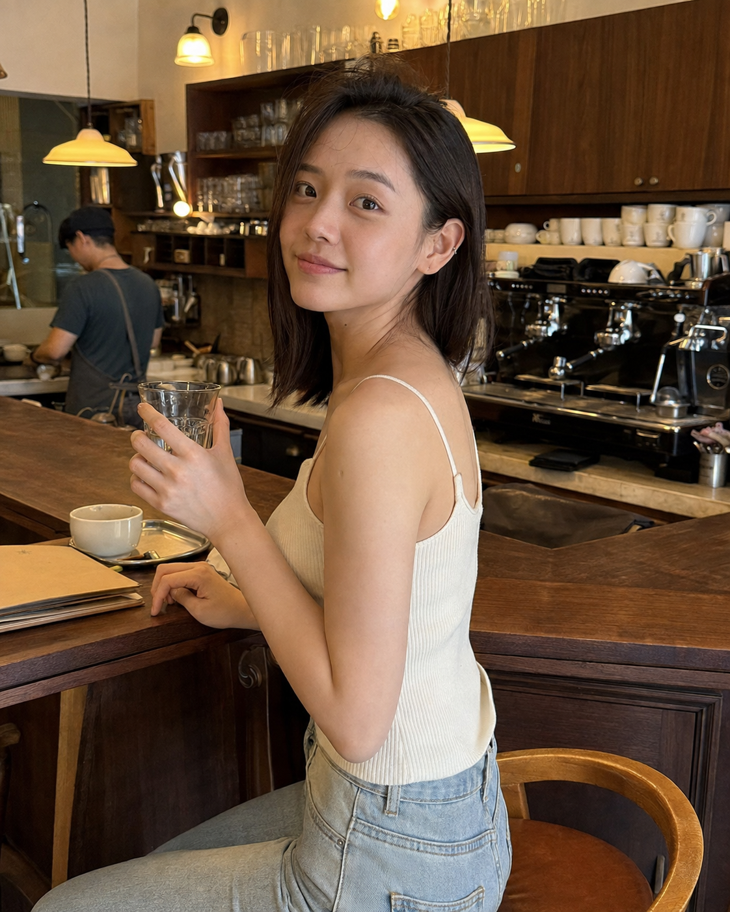
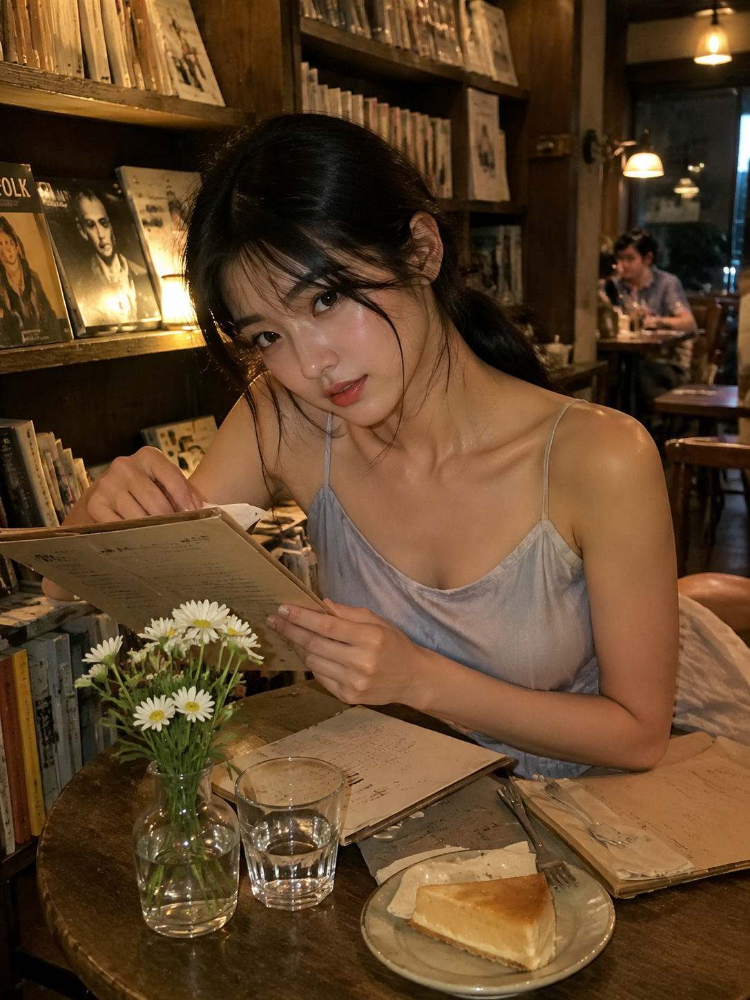
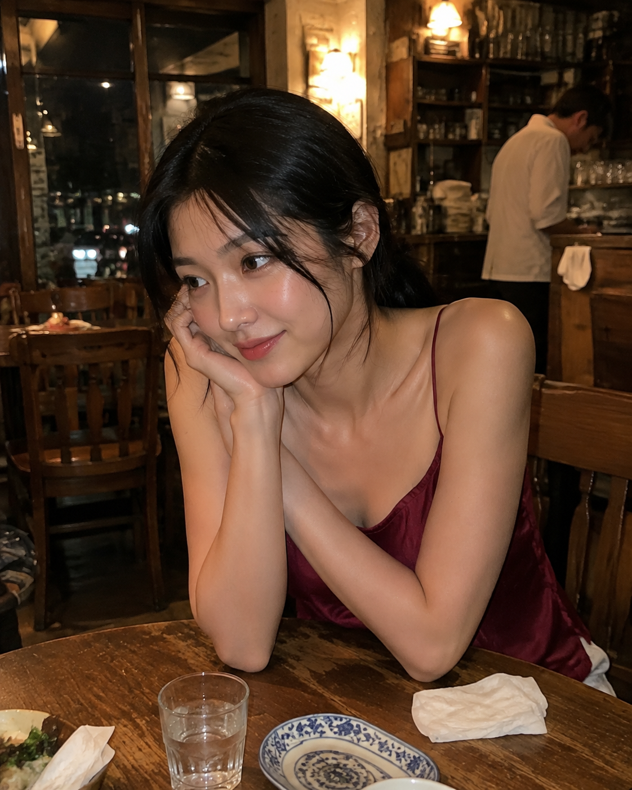
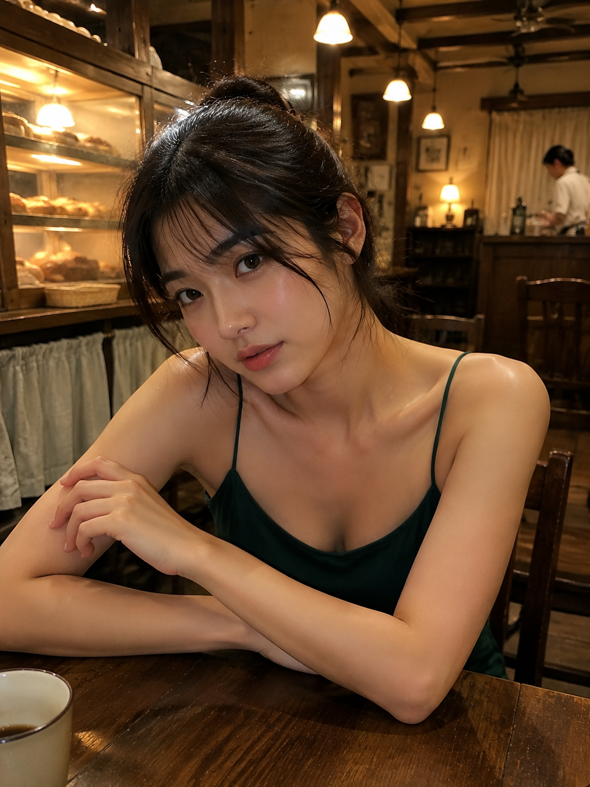

# 暖店流光里的六幕直拍：把随手一瞬拍出仙气与高级质感

耐看的直拍不靠夸张姿势，而是让人物和环境共同完成一秒叙事。「暖店流光」把镜头放回朋友坐在对面的位置：甜品店、餐馆、吧台、书店、小酒馆和面包店都保留生活痕迹。

核心是 **亲近距离 + 可辨认背景 + 明亮暖光**。女性美不等于暴露，肩颈比例、衣料质感、眼神和动作完成度才真正吸睛。

## 01｜先把“朋友视角”写清楚

下面是一份可复用的原版提示词：先锁定成年人物与得体服装，再补充镜头、灯光、道具和降噪要求。

<strong>原版提示词｜窗边甜品店·托腮回望</strong> 
竖版 3:4，2K 超高清真实摄影，2000 年代亚洲消费级 CCD 数码相机审美，一间营业到晚上的复古甜品咖啡店，窗边暖光与蜂蜜色吊灯让画面明亮清透。一位 24 岁成年东亚女性坐在深棕木桌旁，朋友自然记录的近距离生活瞬间；黑棕长发松散低马尾，空气感碎刘海和几缕发丝贴着脸颊，五官自然清秀，面部干净，眼神真实，健康自然肤色，皮肤细腻并保留真实毛孔。她穿酒红色丝缎细肩带上衣，完整不透明内衬，露出自然肩颈、锁骨和纤细手臂线条，成熟女性化、含蓄性感而不低俗。身体稍侧坐，一只手托住脸侧，另一只手放在桌面，头微微倾斜直视镜头，嘴角带放松的似笑非笑。桌面有透明水杯、奶油蛋糕、小叉和纸巾，背景保留老木椅、玻璃甜品柜、暖色吊灯、菜单牌与少量客人，不要棚拍感。约 40mm 等效焦段，胸像至半身，人物略偏一侧，景深自然，面部柔和受光，眼睛有小面积高光，额头和鼻梁有轻微真实反光。整体蜂蜜黄、琥珀棕、奶油白、酒红色，高明度、干净、有生活层次。增加光线采样至 96 次以上，高质量光照计算，收敛渲染噪声，减少随机颗粒、彩色噪点、亮部噪声、暗部噪声、孤立亮点和 JPEG 斑块，最大程度保留皮肤纹理、睫毛、发丝、衣料、玻璃反射、蛋糕与木材细节，提升照片清晰度但不过度锐化。人物为成年女性，真实自然审美，内容安全；无文字、无水印、无 logo；避免 AI 美女脸、网红感、过度精修、塑料皮肤、暗沉肤色、明显痘印、明显皱纹、斑点、面部变形。

## 02｜让每个空间拥有自己的动作

托腮是停顿，酒红色与木色稳住暖调，甜点、玻璃和吊灯带来生活感。

侧脸发呆不必笑。双臂交叠、下巴略抬，墨蓝与米白让情绪安静，肩颈线条更自然。

回身比正面站立更像“被叫到”的瞬间。吧台、咖啡机和玻璃杯提供纵深，奶油白提亮主体。

翻菜单时抬眼，是克制的互动。书架、纸张和小花保留约会现场，灰蓝衣料压住暖灯甜腻。

撑桌轻笑让镜头更近，但动作仍要松弛。莓红只提一点饱和度，视线落在镜头旁，更像朋友记录。

面包店近距离收束整组。森林青绿与蜂蜜黄清爽对比，展示柜和木梁保留空间信息。

## 03｜把“清晰”写成光线逻辑

**2K 不是把皮肤磨平。** 采样、噪点收敛和细节保留要同时出现：眼睛、发丝、织物和玻璃反光清楚，暗部干净，高光不过曝，旧 CCD 才能与现代清晰度共存。

六个案例只改变场景、色彩、机位和动作，人物设定保持统一。和 AI 交互时，先给可执行的朋友视角，再用镜头与光线限定气质，最后用负向约束守住真实与安全。

把摆拍感拿掉，生活就是最好的布景。
