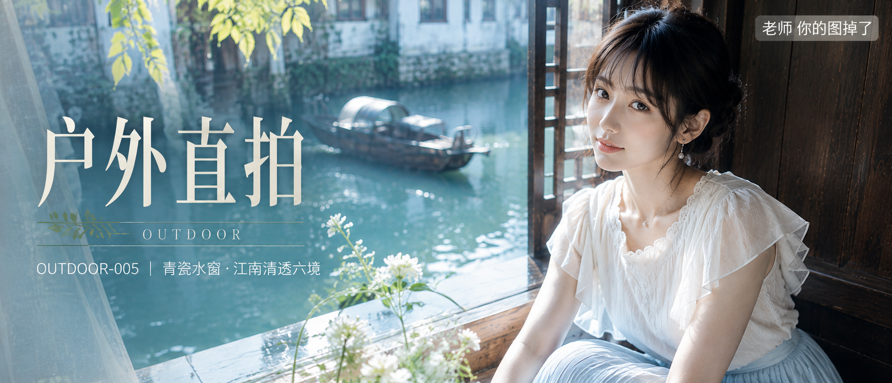

# OUTDOOR-005-青瓷水窗·江南清透六境 封面

## 封面提示词

青瓷水窗流光，高端明亮写实人像概念海报。一位约 24 岁的成年东亚女性以正脸或三分之四侧脸近景出现，主体足够大，面部占画面三分之一以上，位于画面右侧，黑棕色低盘发、空气刘海、珍珠垂坠耳饰与细项链，五官自然清秀、面部干净、健康自然肤色、眼神真实。她穿象牙白荷叶边上衣与浅冰蓝高腰百褶长裙，服装完整得体，肩颈和手臂线条自然，气质清冷仙气而不失亲和。前景以青瓷蓝水面碎光、半透明木窗纱和一枝浅色水生花形成层次，中景人物，远景为江南灰白石墙、乌篷小船和明亮天空；冷白自然光从左侧照亮面部、发丝与裙面，冰蓝、奶油白、青绿和少量金色高光形成鲜明色彩层次。电影感光影、高清锐利、色彩层次丰富、黄金比例构图、商业海报级完成度、视觉冲击力强、空气透视清晰、真实摄影质感，2.35:1 电影横构图，2K 超高清，至少 2048 像素长边。增加光线采样数，光线采样 64 次，充分收敛噪点，减少随机颗粒、亮部噪声、暗部噪声和彩噪，最大程度保留皮肤纹理、发丝、蕾丝、百褶裙、水波和木纹细节，同时去除噪点拟合，提升清晰度。内容安全、成年人物、无整体暗色蒙版。避免 AI 美女脸、网红感、过度精修、塑料皮肤、暗沉肤色、明显痘印、明显皱纹、斑点、面部变形、低龄化、服装透视、文字乱码、文字裁切、文字遮挡面部、脏背景、水印错位、logo。

【文字排版-必须完整保留，不得省略或简化任何一项】画面左侧垂直居中偏下叠加文字排版：超大号衬线字体米白色主文案「户外直拍」，主文案正下方一条细横线左端带🌿，横线中央有透明英文水印 OUTDOOR，横线下方等宽白色字体副文案「OUTDOOR-005 ｜ 青瓷水窗·江南清透六境」；右上角浅色半透明圆角底衬配小号文字「老师 你的图掉了」（署名文字，必须出现，不可省略）；无整体蒙层，文字直接压图。【文字排版结束】

## 封面图片

