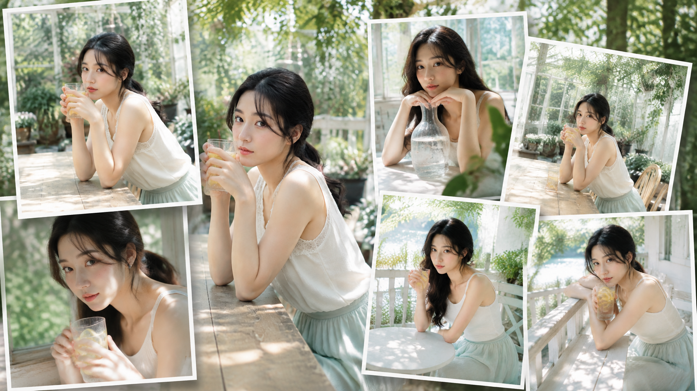
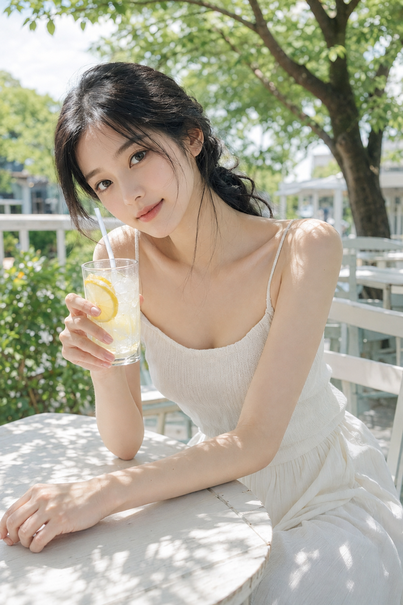
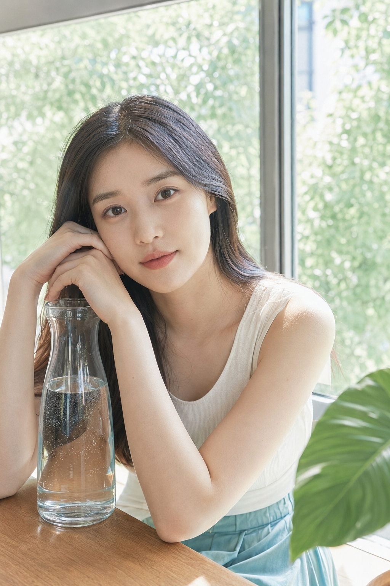
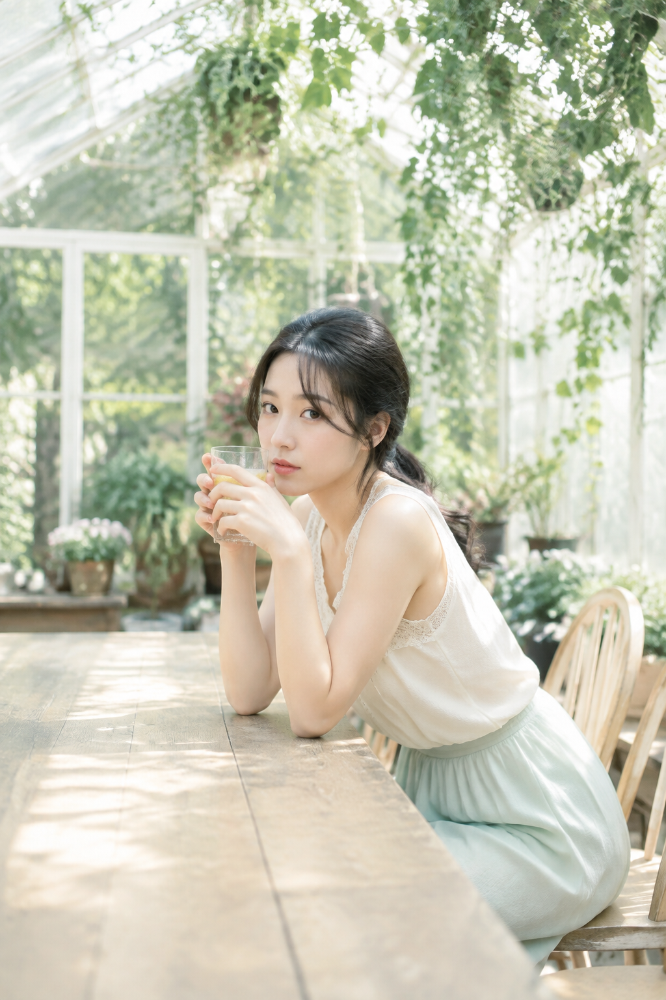
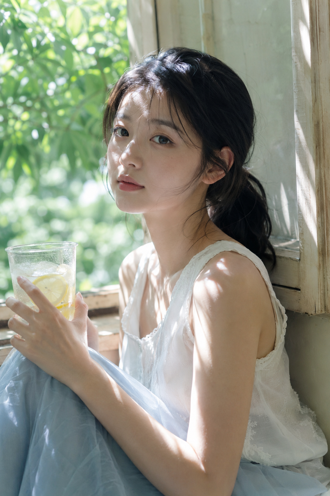
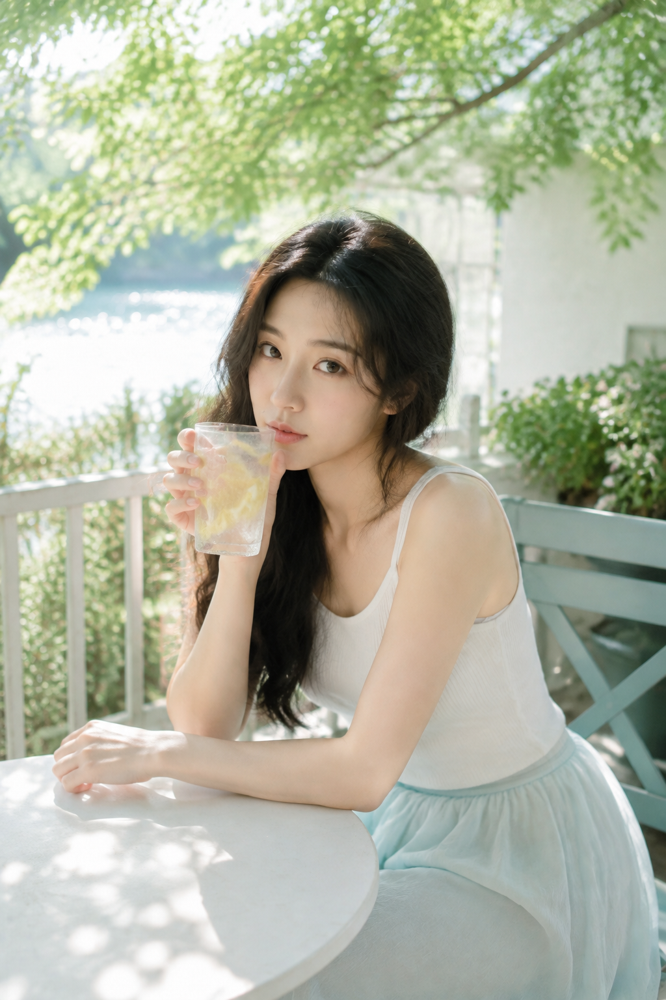
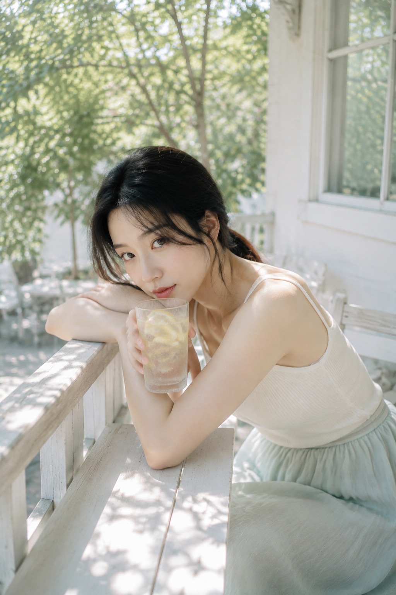

# 青绿盛夏的六种直拍：把自然光拍成一场清透幻境

盛夏直拍最怕两个问题：光线一暗，画面就失去呼吸；动作一满，人物就像在摆拍。这一组把青绿色环境、白色穿搭和玻璃冰饮放在同一条审美线上，再用六个不同支点，让女性的样貌、身材比例与气质自然出现。

## 01｜柠檬水侧身回望：先做一张“会呼吸”的主视觉

常见失败是背景太杂、人物太小。把脸和透明杯设为双中心，树影负责空气感，白桌负责干净边界。完整原版提示词如下：

竖版 2:3，2K 超高清，真实写实摄影，盛夏午后树荫咖啡露台的日系清透生活写真。一位 24 岁成年东亚女性坐在户外白色木质咖啡桌旁，身体微微前倾，手里举着透明玻璃柠檬水，杯中可见柠檬片、冰块和白色吸管，另一只手自然搭在桌面，头轻轻侧向手臂，安静看向镜头。她黑色长发低位松散扎发，脸侧几缕碎发，淡妆，五官自然清秀，面部干净，健康自然肤色，眼神真实，皮肤保留细腻自然纹理。穿白色细肩带针织背心与浅色长裙，服装完整得体，以肩颈、手臂和柔和腰线体现含蓄女性美。背景是浓密绿树、浅色庭院建筑、白色栏杆与模糊桌椅，阳光穿过树叶在脸颊、肩膀、手臂和桌面投下斑驳光影。50mm 中近景，人物占画面约三分之二，脸部与玻璃杯形成双视觉中心，浅景深但保留叶片和织物质感。主色为薄荷绿、树叶深绿、奶油白、浅肤粉和少量柠檬黄，明亮、低饱和、低对比、轻柔高光 blooming、清透空气感。光线采样 64 次，增加光线采样数，充分收敛噪点，减少随机颗粒、亮部噪声、暗部噪声和彩噪，最大程度保留发丝、皮肤、针织纹理、玻璃反光、叶片和桌面细节，同时去除噪点拟合，提升照片清晰度与质感。真实摄影，内容安全，避免 AI 美女脸、网红感、过度精修、塑料皮肤、暗沉肤色、明显痘印、明显皱纹、斑点、面部变形、服装透视、手指错误、背景杂乱、文字、水印、logo。

## 02｜玻璃水罐凝视：用透明材质制造前后景

水罐不是装饰，而是第二个焦点。让脸颊靠在手背上，姿态会更松弛；侧后光穿过玻璃，能把锁骨、手臂和气泡一起拍得轻盈。

## 03｜花房捧杯：把绿色变成柔软背景

花房适合半身中近景。人物放在右侧，左边留出桌面与藤蔓，画面自然形成留白。仙气来自真实空气和材质，不来自过度磨皮。

## 04｜老木窗漏光：用近景放大眼神

近景不等于只拍脸。冷饮杯放在前景，叶隙光落到额头和手臂，白衣、绿叶、冰块会组成清爽的色彩节奏。

## 05｜河畔树影：让动作有一个支点

一只手扶杯，另一只手搭桌缘，身体自然前倾，肩颈和腰线就不会僵硬。背景保留一点水面反光，直拍也会有杂志感。

## 06｜白色阳台：用微风收住情绪

最后把空间拉开，白栏杆和树冠形成上下层次。手臂交叠、头靠近手臂，配合杯壁冷凝水，画面明亮却不喧闹。

## 一套稳定的写法

提示词顺序可以固定为：人物状态 → 动作支点 → 景别焦段 → 光线方向 → 材质细节 → 降噪约束。先保证真实、清晰和亮色，再让仙气进入。换场景时只替换树影、窗台或桌椅，保留人物连续性与冷白自然光，六张图就会像同一天拍下的生活片段。

#GPTImage2 #生图提示词 #Prompt #户外直拍系列 #盛夏人像
