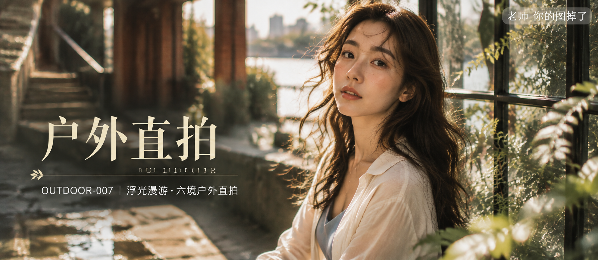

# OUTDOOR-007-浮光漫游·六境户外直拍 封面

## 封面提示词

浮光漫游·六境户外直拍，高端明亮写实人像概念海报。一位约 24 岁的成年东亚女性以正脸或 3/4 侧脸近景出现，主体足够大，面部占画面三分之一以上，位于画面右侧；深栗棕色长发自然披散，几缕碎发被风吹到脸侧，五官自然清秀、面部干净、健康自然肤色、眼神真实，皮肤保留细腻纹理与自然光泽。她穿奶油白与雾蓝层叠的轻盈完整得体服装，肩颈和手臂线条自然，气质清透、仙气飘逸又亲和。前景为玻璃花房叶片与浅金光斑，中景人物，远景叠入旧公寓台阶、红砖长廊、河岸水面和雨后书店的柔焦色块；明亮午后自然光从左侧照亮面部、发丝与织物，奶油白、雾蓝、砖红、鼠尾草绿和浅金形成丰富色彩层次。电影感光影、高清锐利、色彩层次、黄金比例构图、商业海报级完成度、视觉冲击力强、真实摄影质感，2.35:1 电影横构图，2K 超高清，至少 2048 像素长边。增加光线采样数（光线采样 64 次），充分收敛噪点，减少随机颗粒、亮部噪声和暗部噪声；最大程度保留五官、眼神、发丝、皮肤纹理、织物褶皱与环境细节和质感，去除噪点拟合并提升清晰度，不过度锐化；明亮通透、曝光稳定、画面干净，无模糊、脏污和压缩伪影；成年女性、自然审美、服装完整得体，性感仅作时装表达，不涉黄；保留指定文字排版，不生成额外文字或 Logo。避免 AI 美女脸、网红感、过度精修、塑料皮肤、暗沉肤色、明显痘印、明显皱纹、斑点、面部变形。

【文字排版-必须完整保留，不得省略或简化任何一项】画面左侧垂直居中偏下叠加文字排版：超大号衬线字体米白色主文案「户外直拍」，主文案正下方一条细横线左端带🌿，横线中央有透明英文水印 OUTDOOR，横线下方等宽白色字体副文案「OUTDOOR-007 ｜ 浮光漫游·六境户外直拍」；右上角浅色半透明圆角底衬配小号文字「老师 你的图掉了」（署名文字，必须出现，不可省略）；无整体蒙层，文字直接压图。【文字排版结束】

## 封面图片

