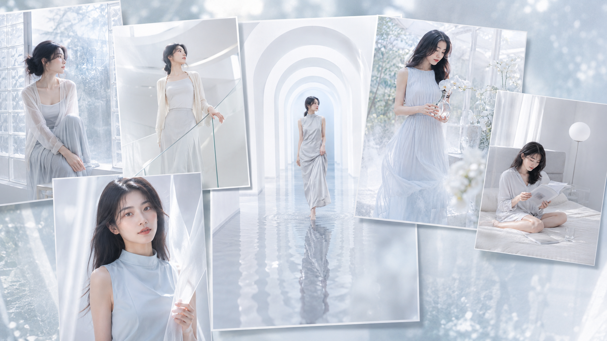
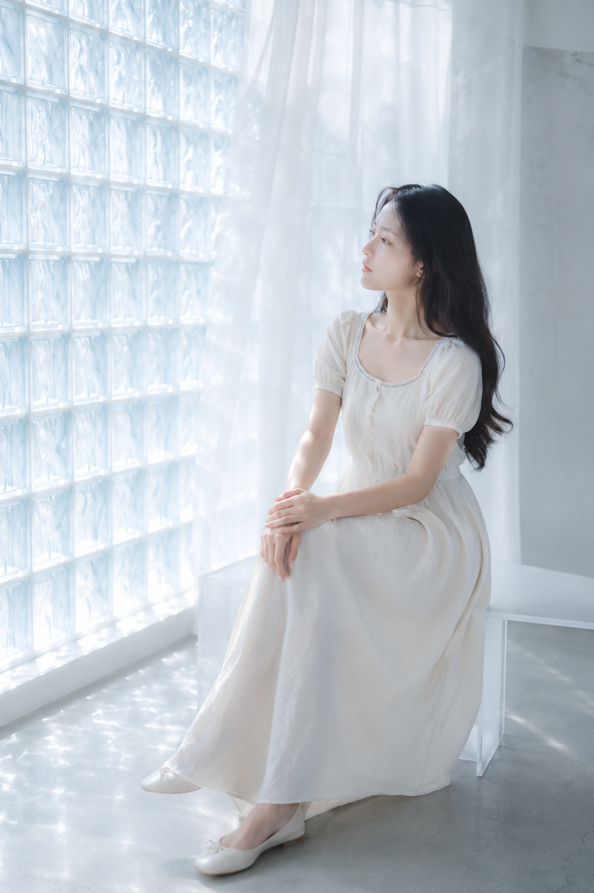
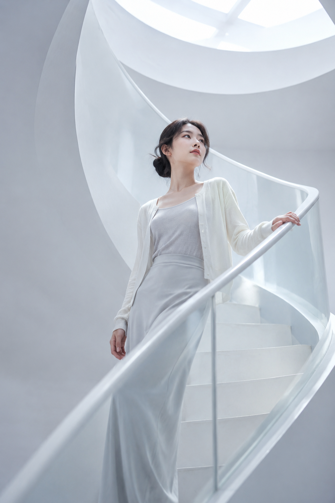
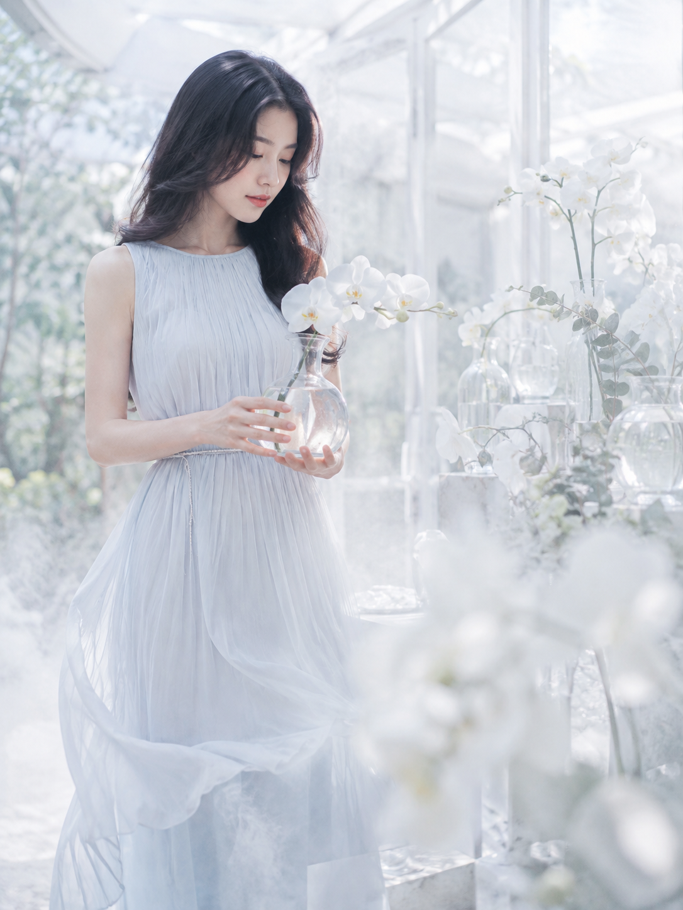
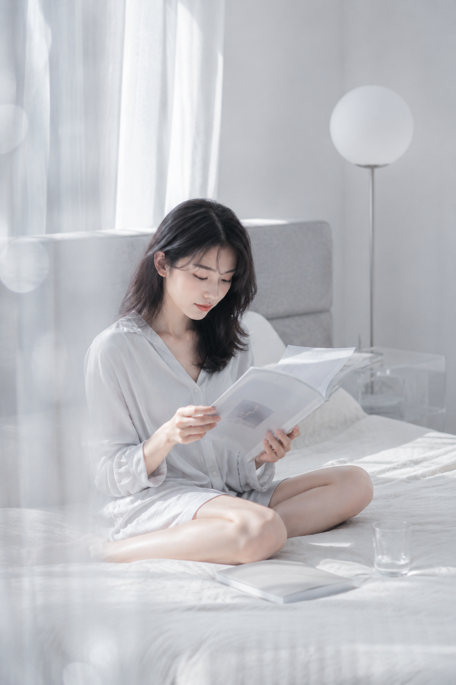
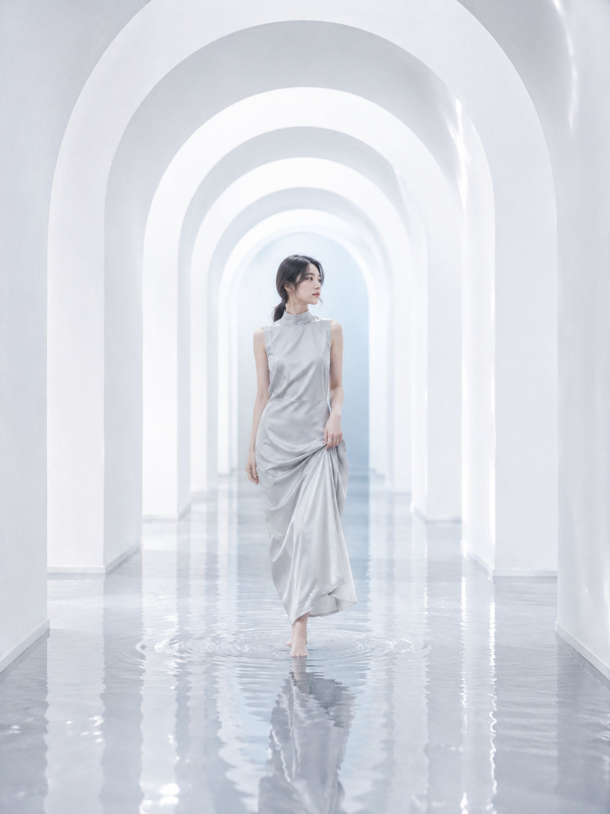

# 霜白六境·柔光通透写真

冷白高调的六个场景：玻璃砖晨雾、白色旋转楼梯、兰花花房、银白卧室、浅水拱廊、悬浮白纱。

思路很简单——先把光变成雾，再把杂乱交给雾气弱化。玻璃砖、薄纱帘、超大柔光箱都是同一件事：让光均匀包住人物，脸上不留鼻影和眼窝。色彩只在乳白、冰蓝、珍珠灰之间走，高明度、低饱和、低对比，白色区域要有层次而不是死白。

雪纺、丝缎、亚麻和半透明纱带负责质感，浅水倒影和拱廊纵深负责空间层次。仙气来自空气与留白，不来自后期。

