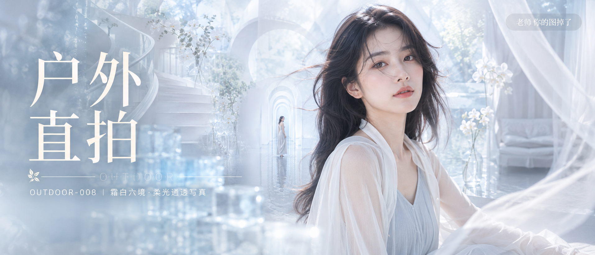

# OUTDOOR-008-霜白六境·柔光通透写真 封面

## 封面提示词

霜白六境·柔光通透写真，高端明亮写实人像概念海报。一位约 24 岁的成年东亚女性以正脸或 3/4 侧脸近景出现，主体足够大，面部占画面三分之一以上，位于画面右侧；黑色长发自然垂落微卷，几缕碎发被气流吹到脸侧，五官自然清秀、面部干净、健康自然肤色、眼神真实、皮肤光泽自然，皮肤保留细腻纹理与自然通透感。她穿象牙白与浅雾蓝层叠的轻盈雪纺与丝缎完整得体服装，肩颈、腰线和手臂线条自然优雅，气质清透高级、仙气飘逸又亲和。前景为半透明白色纱带与冰蓝玻璃砖光斑，中景人物，远景叠入白色旋转楼梯弧线、玻璃花房兰花、浅水拱廊倒影与银白卧室薄纱的柔焦色块；明亮冷白自然光从左侧照亮面部、发丝与织物，乳白、冰蓝、珍珠灰、浅银绿和柔粉肤色形成丰富色彩层次与清晰视觉层级。电影感光影、高清锐利、色彩层次、黄金比例构图、商业海报级完成度、视觉冲击力强、真实摄影质感，2.35:1 电影横构图，2K 超高清，至少 2048 像素长边。增加光线采样数（光线采样 64 次），充分收敛噪点，减少随机颗粒、亮部噪声和暗部噪声；最大程度保留五官、眼神、发丝、皮肤纹理、织物褶皱与环境细节和质感，去除噪点拟合并提升清晰度，不过度锐化；明亮通透、曝光稳定、画面干净，无模糊、脏污和压缩伪影；成年女性、自然审美、服装完整得体，性感仅作时装表达，不涉黄；保留指定文字排版，不生成额外文字或 Logo。避免 AI 美女脸、网红感、过度精修、塑料皮肤、暗沉肤色、明显痘印、明显皱纹、斑点、面部变形、暗调、强硬阴影、黄色灯光。

【文字排版-必须完整保留，不得省略或简化任何一项】画面左侧垂直居中偏下叠加文字排版：超大号衬线字体米白色主文案「户外直拍」，主文案正下方一条细横线左端带🌿，横线中央有透明英文水印 OUTDOOR，横线下方等宽白色字体副文案「OUTDOOR-008 ｜ 霜白六境·柔光通透写真」；右上角浅色半透明圆角底衬配小号文字「老师 你的图掉了」（署名文字，必须出现，不可省略）；无整体蒙层，文字直接压图。【文字排版结束】

## 封面图片

