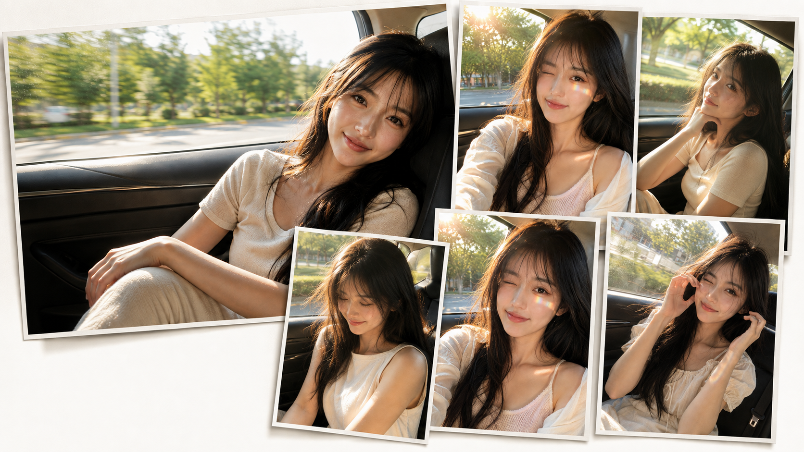
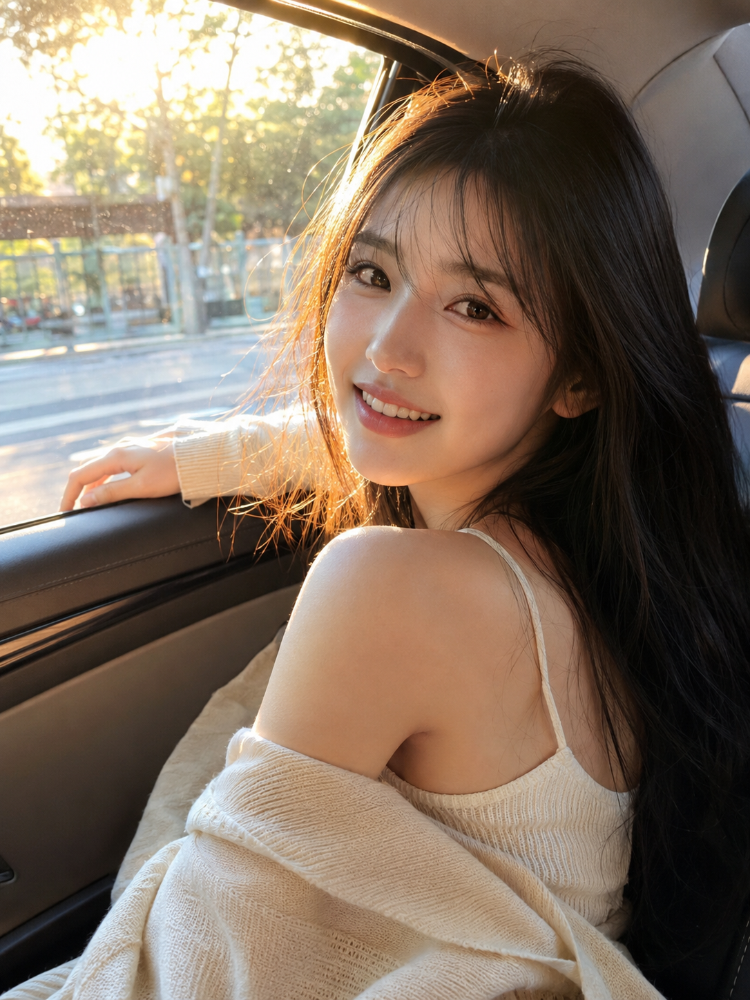
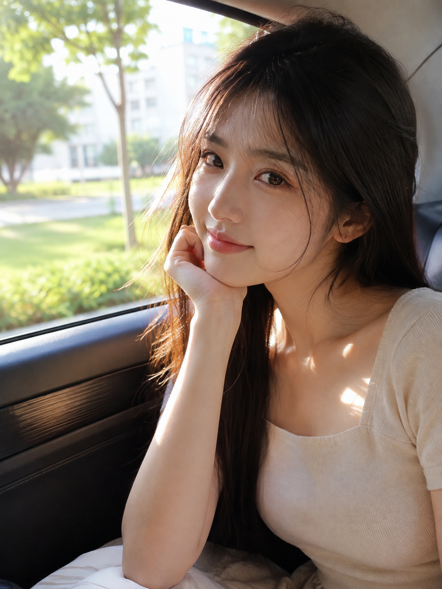
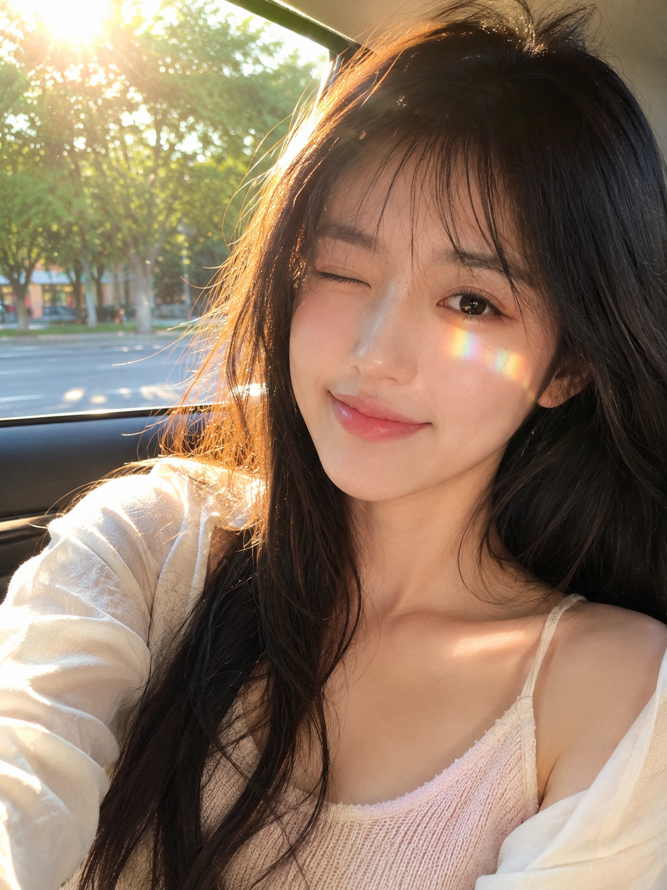
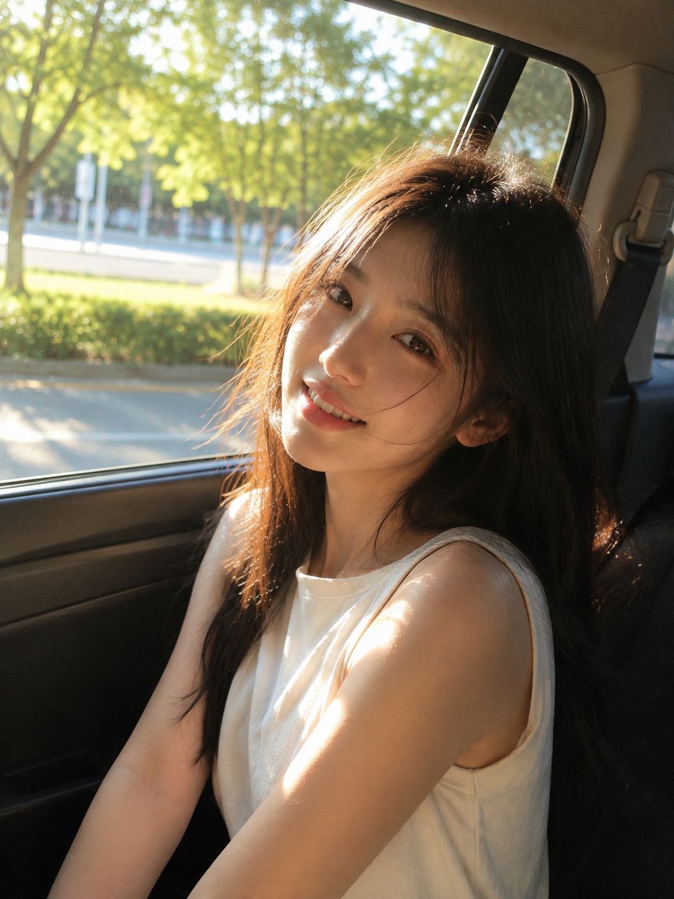
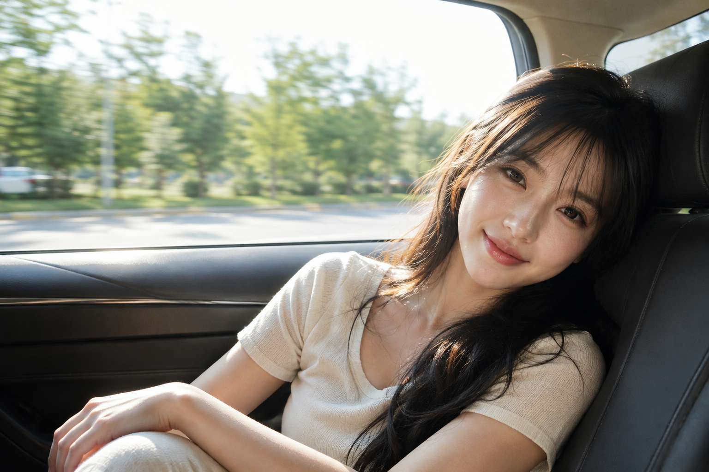
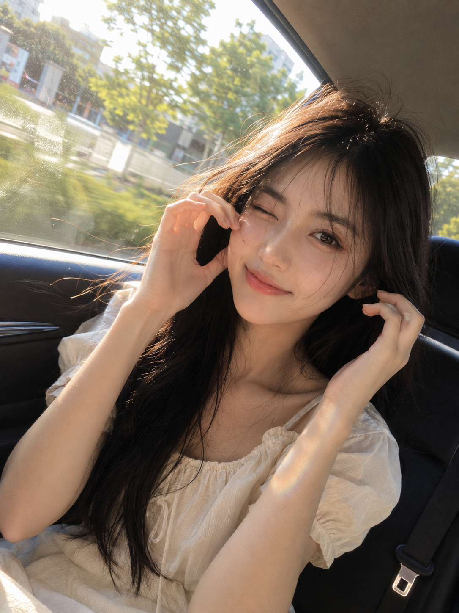

# 琥珀时刻：夏日车窗的一束斜阳，把随手拍变成写真

车里其实没有布光，只有一块玻璃和一束斜阳。所以这组六张的核心不是姿势，而是让光先成立，人再进画面。窗户就是柔光箱，深色内饰就是天然的黑旗，剩下的交给一个不刻意的瞬间。

## 01｜傍晚回头：先定一根金色的边

侧逆光的价值在轮廓，不在亮度。完整原版提示词如下：

竖版 3:4，夏日傍晚车内人像摄影，真实写实风格，一位 22 岁成年东亚女生坐在轿车后排靠窗位置，五官自然清秀、面部干净、健康自然肤色、眼神真实、皮肤光泽自然，皮肤保留细腻真实纹理，妆容清透裸妆，裸粉色水光唇。黑色长直发自然披散，轻薄空气刘海，发丝被微风轻轻吹起。她穿一件浅奶白色细吊带针织背心外搭薄款米色开衫，肩颈与手臂线条舒展优雅，身形比例自然纤长，服装完整得体。女生回头看向镜头，一只手轻轻搭在车窗边缘，露出自然温柔的微笑，表情松弛、清新、有亲近感。夕阳从车窗外斜照进来，在脸颊、鼻梁、肩膀和发丝边缘形成金色轮廓光，脸上有自然的光影切割，局部高光轻微过曝，氛围温暖通透明亮。背景是窗外被虚化的绿色树影、道路与城市街景，车内可见深色车门、车窗边框和少量座椅结构。近距离半身特写构图，人物占画面大部分，轻微抓拍感，不刻意摆拍。35mm 摄影镜头，f/2.0，浅景深，对焦在眼睛。暖金色、奶油白、植物绿、蜜桃肤色配色，高明度、中低对比，带一点生活化数码颗粒，像朋友在旅途中随手拍下的高质量夏日照片。真实摄影，无文字，无水印，无 logo。2K 超高清，增加光线采样数（光线采样 64 次），充分收敛噪点，减少随机颗粒、亮部噪声和暗部噪声；最大程度保留五官、眼神、发丝、皮肤纹理、织物褶皱与场景细节和质感，去除噪点拟合并提升照片清晰度，不过度锐化；明亮通透、曝光稳定、画面干净，无模糊、脏污和压缩伪影；成年女性、自然审美、服装完整得体，性感仅作时装表达，不涉黄。避免过度磨皮、浓妆、手部畸形、商业棚拍感、夸张滤镜、暗调、脏背景、AI 美女脸、网红感、过度精修、塑料皮肤、暗沉肤色、明显痘印、明显皱纹、斑点、面部变形。

## 02｜午后回眸：把光斑放到锁骨

同样是侧光，落点换一次画面就换一次气质。扶下巴不是为了可爱，是给手一个落点，肩线才不会僵。50mm 的 3/4 侧面留出一点窗外，夏日的流动感就有了。

## 03｜黄金时刻：一道折射光的克制

彩虹光很容易变成廉价特效，关键在两个词——**自然、克制**。写清"像阳光穿过玻璃偶然形成的光谱"，而不是"梦幻彩虹"，模型才知道这是物理现象不是滤镜。眨眼这类互动动作，一定补一句手指自然放松。

## 04｜低机位纪实：把摆拍写成瞬间

"低头轻笑后抬眼望向镜头"是一个动作序列，而不是一个姿势——描述前一秒，抓拍感就自己出现了。安全带、门板、玻璃反光这些不好看的细节反而要留，它们是真实的证据。

## 05｜横向旅行感：让背景动起来

唯一一张横构图。人物放右、左侧留窗外，再加一句"车辆行进中的轻微动感模糊"，静态照片就有了速度。暗部要提醒**通透不发死**，否则车内一律拍成黑洞。

## 06｜轻复古特写：允许画面歪一点

构图灵动、不完全对称、保留随手拍的倾斜感——这三句是对抗"AI 太正"的解药。双手在脸侧互动是风险动作，所以负向词里手指相关必须写满。

跟 AI 沟通的顺序，我固定成七段：人物状态 → 服装材质 → 环境结构 → 机位焦段 → 光线方向 → 色彩区间 → 降噪约束。想要"亮"，别反复说再亮一点，拆成**高明度、中低对比、局部轻微过曝**；想要"干净"，就写光线采样数、收敛噪点、保留皮肤纹理。

## 往期回顾

- 霜白六境：冷白高调与柔焦通透，把空气感写进写真
- 浮光漫游：六境户外直拍的人像光影与自然气质
- 青绿盛夏的六种直拍：把自然光拍成一场清透幻境
