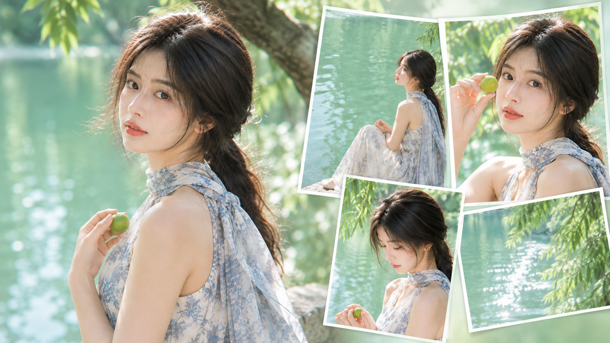
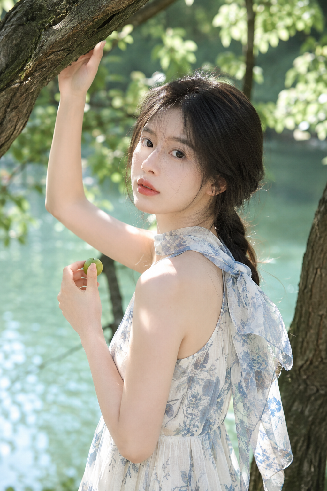
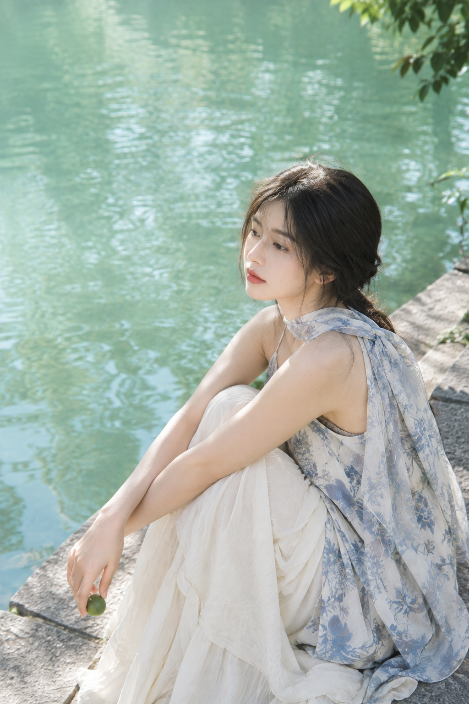
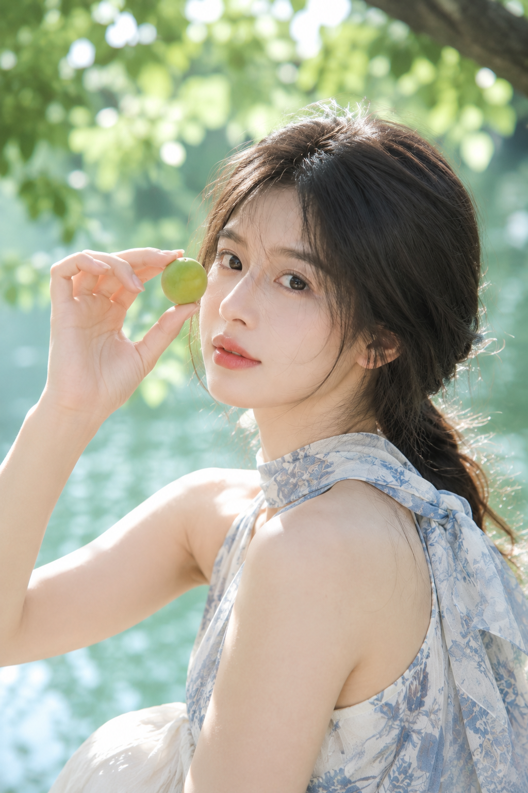
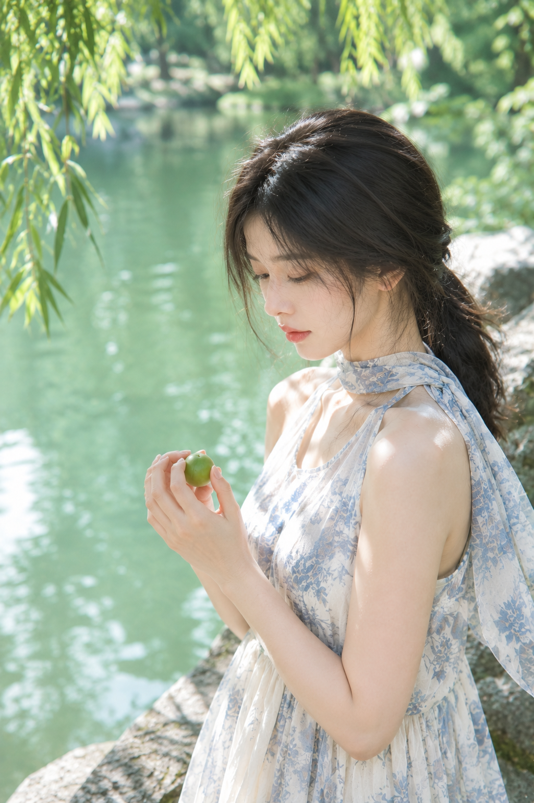
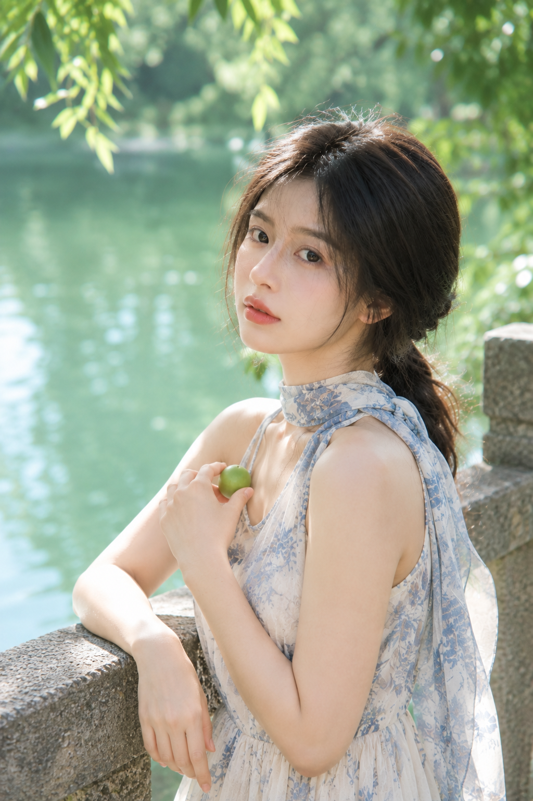
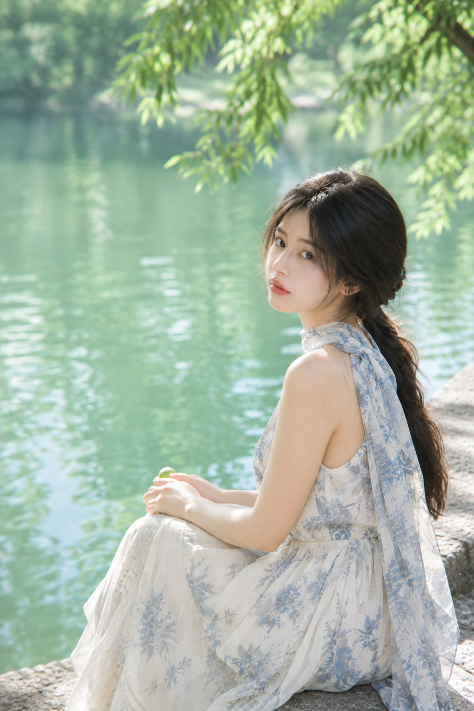

# 青梅浮翠：湖岸树荫下的一整片浅绿，是夏天最好的柔光箱

盛夏正午拍人像最怕两件事：顶光把脸打花，绿色一饱和就俗。这组六张的解法只有一句——把机位钉在树荫里，让湖水当反光板。树叶筛过的光天然柔和，浅翡翠绿的水面又从下方把光补回脸颊，不打灯也通透。手里那颗青梅是唯一的道具，它的作用是给手一个去处。

## 01｜湖岸树荫回眸：原版提示词长什么样

**问：** 一条能出片的提示词，信息该怎么排？

**答：** 顺序固定成 人物状态 → 服装材质 → 动作道具 → 环境层次 → 光线方向 → 色彩区间 → 镜头参数 → 负向约束，模型就不会把重点搞错。完整原版如下：

竖版 2:3，高端清透写实人像摄影，盛夏晴日下午的园林湖岸树荫下，一位 24 岁成年东亚女生站在临水大树旁，黑色长发自然中分，半扎低马尾，脸侧有被微风吹起的细碎发丝，五官自然清秀，面部干净，健康自然肤色，淡珊瑚色唇妆，眼神安静温柔。她穿奶白色无袖轻盈长裙，裙身带低饱和湖蓝与灰蓝植物花纹，肩颈围一条浅冰蓝碎花雪纺长丝巾，材质轻薄飘逸，肩颈与手臂线条舒展优雅，身形比例自然纤长。左手轻扶头顶上方伸出的粗树枝，右手在胸前轻握一颗青绿色小青梅，身体微微侧向镜头，脸部回望镜头，神情松弛。背景是被阳光照亮的浅翡翠绿色湖水与虚化树影，前景可有少量深色树干形成天然框景。整体高明度、低饱和、中低对比，树荫过滤后的自然日光柔和地落在脸颊、肩膀和手臂上，发丝边缘有轻微逆光高光，背景散景柔软通透。真实摄影，85mm 人像镜头观感，f/1.8，浅景深，高清细节，空气感强，日系夏日写真氛围。2K 超高清，真实摄影级细节，增加光线采样数（光线采样 64 次），充分收敛噪点，减少随机颗粒、亮部噪声与暗部噪声；最大程度保留五官、眼神、发丝、皮肤纹理、丝巾与织物纹理、水面波纹与树叶脉络的细节和质感，去除噪点拟合并提升照片清晰度，不过度锐化；画面明亮通透、曝光稳定、干净无模糊脏污与压缩伪影。避免 AI 美女脸、网红感、浓妆、过度精修、塑料皮肤、暗沉肤色、明显痘印、斑点、面部变形、错误手指、服装过透、背景杂乱、文字水印、logo。

## 02｜石阶抱膝：留白比人更重要

**问：** 环境人像怎么才不像游客照？

**答：** 把人压到画面右下角，左侧和上方整片交给浅翡翠绿的水面。留白不是空，是让画面能呼吸。焦段从 85mm 退到 50mm，抱膝的姿态才装得进环境。

## 03｜举起青梅：逆光要写成物理现象

**问：** 怎么让阳光看起来是真的？

**答：** 不要写"梦幻光效"，要写光落在哪里——**打亮发丝、手指和果实表面**，再补一句"白色高光散景在树叶之间闪烁"。举到眼前的动作把视线、手和道具串成一条线，脸不用摆就有戏。

## 04｜柳荫浅滩：低头也是一种表情

**问：** 不看镜头会不会显得没内容？

**答：** 恰恰相反。低头看手里的青梅，是给情绪一个具体落点，比对着镜头假笑真实得多。这张唯一多写的一句是 "丝巾一端被微风轻轻吹起"，布料一动，静态照片就有了空气。

## 05｜石栏半身：3/4 侧脸最保险

**问：** 想要正脸大特写，风险在哪？

**答：** 正脸对五官对称性要求最高，AI 一崩就崩在这里。3/4 角度加上手臂轻搭石栏，肩线有支点、脸有转折，成片率高得多。85mm、f/1.8，背景压成柔焦的一整片绿。

## 06｜水边回身：动作要写成一个序列

**问：** 回眸怎么写才不僵？

**答：** 写"先朝向湖面，再轻轻回身向镜头看过来"。描述前一秒，抓拍感就自己出现了。

六张图其实只换了三个变量：**景别、焦段、动作**。人、衣服、湖岸一动不动，所以它们是一组，而不是六张散图。想要"亮"，别反复说再亮一点，拆成 高明度、低饱和、中低对比；想要"干净"，就写光线采样数、收敛噪点、保留皮肤纹理——这几句比任何滤镜都管用。

## 往期回顾

- 琥珀时刻：夏日车窗的一束斜阳，把随手拍变成写真
- 霜白六境：冷白高调与柔焦通透，把空气感写进写真
- 浮光漫游：六境户外直拍的人像光影与自然气质
