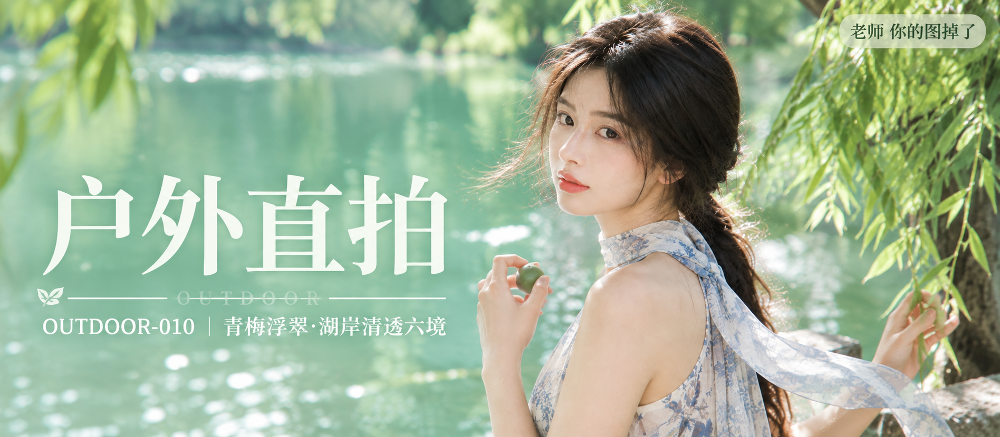

# OUTDOOR-010 封面

比例 2.35:1，电影宽银幕。

## 封面提示词

超宽画幅 2.35:1 电影宽银幕比例，高端清透写实人像摄影封面，盛夏园林湖岸树荫下，一位 24 岁成年东亚女生位于画面右侧偏中位置，主体足够大，脸部以 3/4 侧脸清晰面向镜头，眼神安静温柔有神，五官自然清秀、面部干净、健康自然肤色、皮肤光泽自然并保留细腻真实纹理，淡珊瑚色水光唇妆。黑色长发半扎低马尾，脸侧细碎发丝被微风吹起并带轻微逆光金边。她穿奶白色无袖轻盈长裙，裙身带低饱和湖蓝与灰蓝植物花纹，肩颈围一条浅冰蓝碎花雪纺长丝巾，丝巾一端被风轻轻托起，肩颈与手臂线条舒展优雅，身形比例自然纤长，服装完整得体。右手在胸前轻握一颗青绿色小青梅，左手轻扶身侧垂落的柳枝。画面左侧是大面积被阳光照亮的浅翡翠绿湖水、柔焦树影与漂浮的白色高光散景，形成干净留白与前后景层次，近景有虚化的深色树叶作天然框景。电影感光影，树荫过滤的自然日光柔和均匀，脸部与丝巾高光细腻，高明度、低饱和、中低对比，色彩层次丰富通透，黄金比例构图，85mm 镜头观感，f/2.0，浅景深，高清锐利，空气感强，杂志封面级质感。

文字排版：画面左侧垂直居中偏下，超大号衬线米白色主文案「户外直拍」，下方细横线左端带 🌿，横线中央透明英文水印 OUTDOOR，横线下方等宽白色副文案「OUTDOOR-010 ｜ 青梅浮翠·湖岸清透六境」；右上角浅色半透明圆角底衬配小号文字「老师 你的图掉了」。
