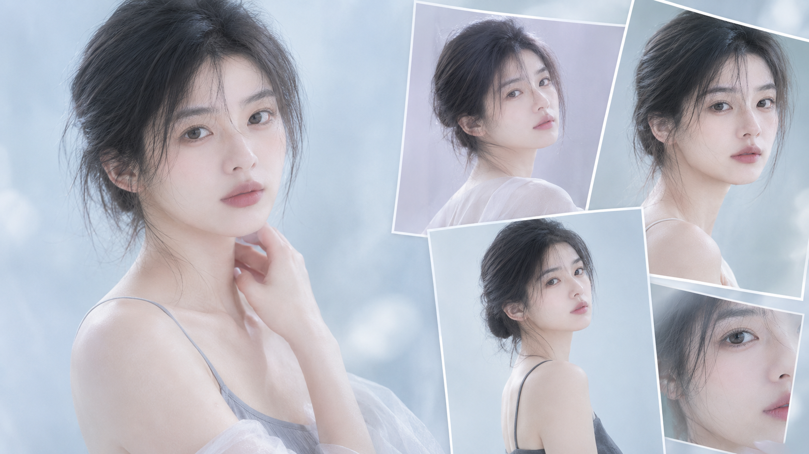
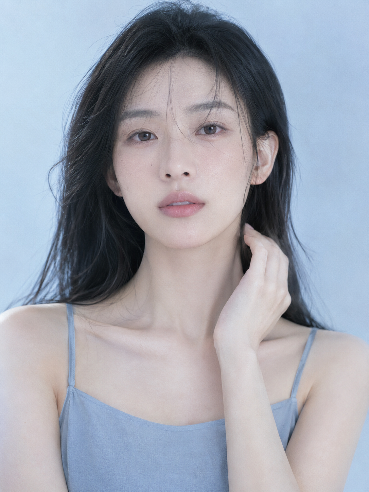
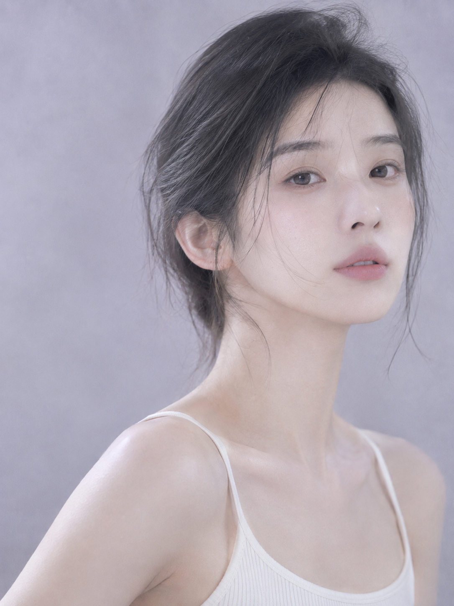
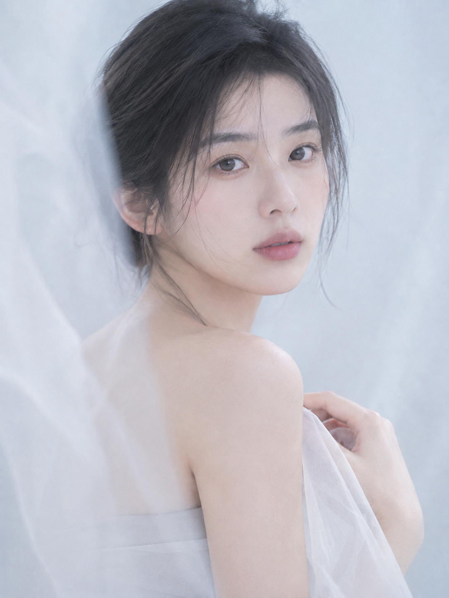
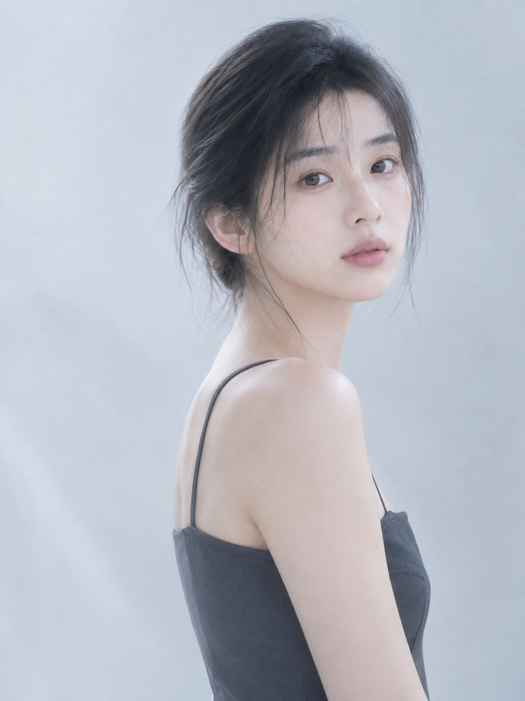
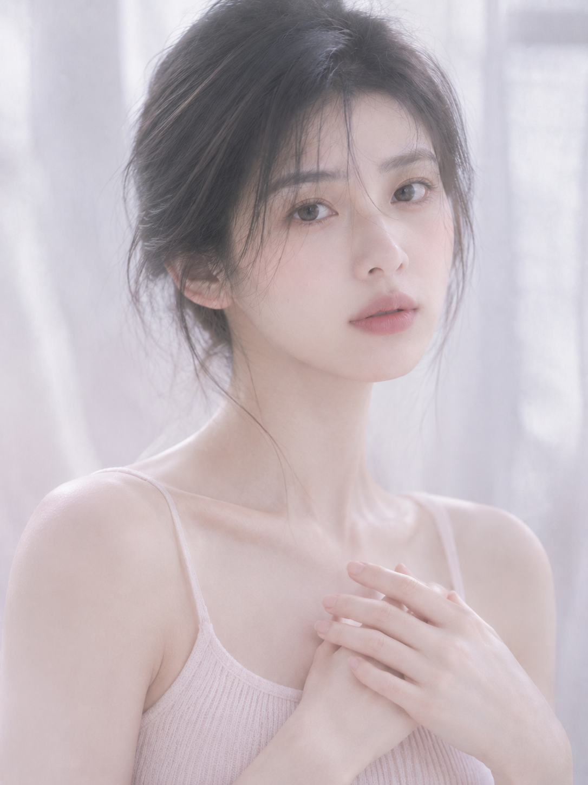
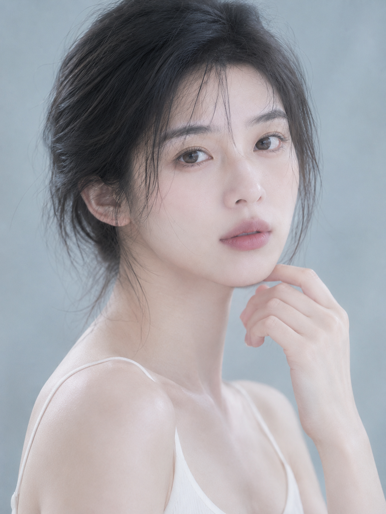

# 冰蓝薄雾：高键柔光的六种写法，把清冷通透写进皮肤

高键不是把曝光拉高。它是一组配比：阴影几乎不存在、整体明度上移、饱和度压到最低。这六张就锁死在同一个配比里，人没换、光位没大动，变的只有 背景色相、焦段和一层薄纱。

## 关键词｜高键柔光该怎么写给 AI

别对模型说"再亮一点"，它只会给你过曝。把"亮"拆成三个可执行的量：高明度 + 低饱和 + 低对比，再补一句"面部阴影很轻"锁住光比。背景写成"无缝渐变"，模型就不会自己往里加家具。

## 01｜冰蓝柔雾正面胸像：原版提示词

正面直视是最难的机位，五官对称性一崩整张就废。补救办法是把大面积柔光放到正前方偏左上，阴影薄到几乎看不出，脸的负担就交给了光。完整原版如下：

竖版 3:4，极简冷调高键人像摄影，一位 24 岁成年东亚女性，真实自然的东亚面孔，五官清秀耐看，神情安静克制，直视镜头，黑色长发自然披散，额前有几缕轻柔碎发，穿雾灰蓝色细肩带上衣，完整得体不过分暴露。胸像近景构图，人物位于画面中央，肩背微微向后打开，肩颈线条清晰修长，锁骨自然，一只手轻抬到颈侧、指尖放松自然，身姿舒展优雅。背景为冰蓝色到冷白色的无缝渐变背景，极简无道具。大面积柔光从正前方偏左上方照射，面部阴影很轻，皮肤呈冷白象牙色，保留细腻纹理和自然光泽。整体低饱和、低对比、高明度，轻微薄雾、柔焦扩散、空气感、细微 bloom 泛光，85mm 人像镜头，f/2.2，浅景深，高级美容杂志质感，安静、清冷、梦幻、通透，photorealistic, editorial beauty portrait, soft diffused lighting, cool pastel palette, subtle film grain, no text, no watermark, no logo。避免 AI 美女脸、避免网红感、避免塑料皮肤、避免过度磨皮、避免浓妆、避免高饱和、避免复杂背景、避免道具杂乱、避免面部变形、避免广角畸变。人物为 24 岁成年女性，五官自然清秀、面部干净、健康自然肤色、眼神真实、皮肤光泽自然，身形比例自然纤长，肩颈与手臂线条舒展优雅，气质清雅带仙气。2K 超高清，真实摄影级细节，增加光线采样数（光线采样 64 次），充分收敛噪点，减少随机颗粒、亮部噪声与暗部噪声；最大程度保留原图的细节和质感，同时去除噪点拟合，完整保留五官、眼神、发丝、皮肤纹理与织物纹理，提升照片清晰度，不过度锐化；画面明亮通透、高明度、曝光稳定、干净无模糊脏污与压缩伪影；成年女性、自然审美、服装完整得体不透视不走光，仅作高级美容与时装表达，不涉黄。避免 AI 美女脸、网红感、过度精修、塑料皮肤、暗沉肤色、明显痘印、明显皱纹、斑点、面部变形。

## 02｜淡薰衣草灰：换一个色相就是换一种情绪

冰蓝偏冷静，薰衣草灰偏梦。背景只挪了一个色相，配上三分之四侧脸和 105mm，气质立刻从"清冷"走向"静谧"。

## 03｜白纱：层次来自前景，不是背景

极简背景最容易拍平。这张在镜头和人之间加了一层虚化白纱，前景一糊，纵深就出来了。薄纱是最便宜的空气感道具。

## 04｜冷白侧身：身体侧过去，脸转回来

一句话拆成两个动作，肩颈就有了转折和长度。侧前光让锁骨和肩膀各得一道柔和高光，比正面平打立体得多。

## 05｜窗光：把光源写成一个具体的物件

"柔光"太抽象。写成"被柔光穿透的冷白窗纱"，模型才知道光从哪面来、该有多散。淡粉灰一进画面，冷调就不至于冷得没温度。

## 06｜冷青灰特写：100mm 和一只克制的手

焦段推到 100mm，人物占比拉满，考验就只剩皮肤质感。指背轻贴下颌一侧，是给特写一个支点——动作越克制，越像高级美容大片。

六张的变量其实只有三个：背景色相、焦段、前景遮挡。而真正决定成片干净不干净的，是那段谁都懒得写的收尾——光线采样数、收敛噪点、保留皮肤纹理，它比任何滤镜都管用。

## 往期回顾

- 青梅浮翠：湖岸树荫下的一整片浅绿
- 琥珀时刻：夏日车窗的一束斜阳
- 霜白六境：冷白高调与柔焦通透
