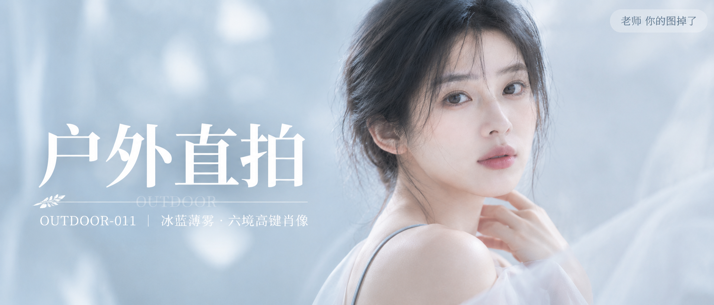

# OUTDOOR-011 封面

比例 2.35:1，电影宽银幕。

## 封面提示词

超宽画幅 2.35:1 电影宽银幕比例，高端冷调高键美容人像摄影封面，极简摄影棚场景，一位 24 岁成年东亚女性位于画面右侧偏中位置，主体足够大、占据画面右侧约二分之一高度，脸部以 3/4 侧脸清晰面向镜头，双眼注视镜头，眼神清澈安静有神，五官自然清秀、面部干净、健康自然肤色、皮肤光泽自然并保留细腻真实纹理，唇色为柔和裸粉色。黑色长发松散低盘，额前与脸侧有轻盈碎发并带极淡的乳白轮廓光。她穿雾灰蓝色细肩带上衣，外披一层极轻薄的珍珠白薄纱，材质通透飘逸，肩背微微向后打开，肩颈线条修长优雅，锁骨自然，身形比例纤长舒展，服装完整得体。一只手轻抬到颈侧，指尖放松自然，动作克制而有气质。画面左侧是大面积冰蓝到冷白的无缝渐变背景，浮动着极淡的薄雾与白色 bloom 光斑，形成干净留白与前后景层次，近景边缘有虚化的半透明白纱作天然框景。电影感光影，大面积柔光从正前方偏左上方均匀照射，面部阴影极轻，薄纱与发丝高光细腻，高明度、低饱和、低对比，冰蓝、雾灰蓝、珍珠白、象牙白、淡粉裸色构成丰富通透的色彩层次，黄金比例构图，100mm 人像镜头，f/2.2，浅景深，高清锐利，空气感强，杂志封面级质感，仙气飘飘、清冷、纯净。

文字排版：画面左侧垂直居中偏下，超大号衬线米白色主文案「户外直拍」，下方细横线左端带 🌿，横线中央透明英文水印 OUTDOOR，横线下方等宽白色副文案「OUTDOOR-011 ｜ 冰蓝薄雾·六境高键肖像」；右上角浅色半透明圆角底衬配小号文字「老师 你的图掉了」。
