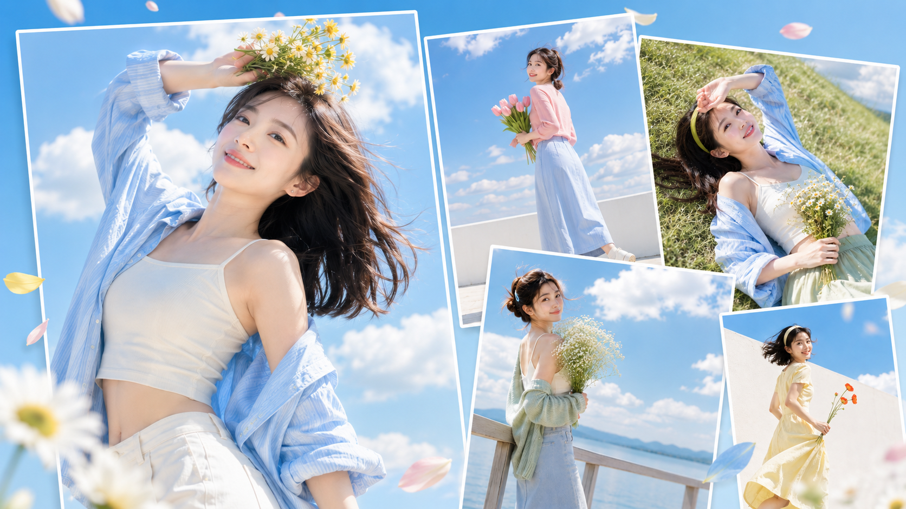
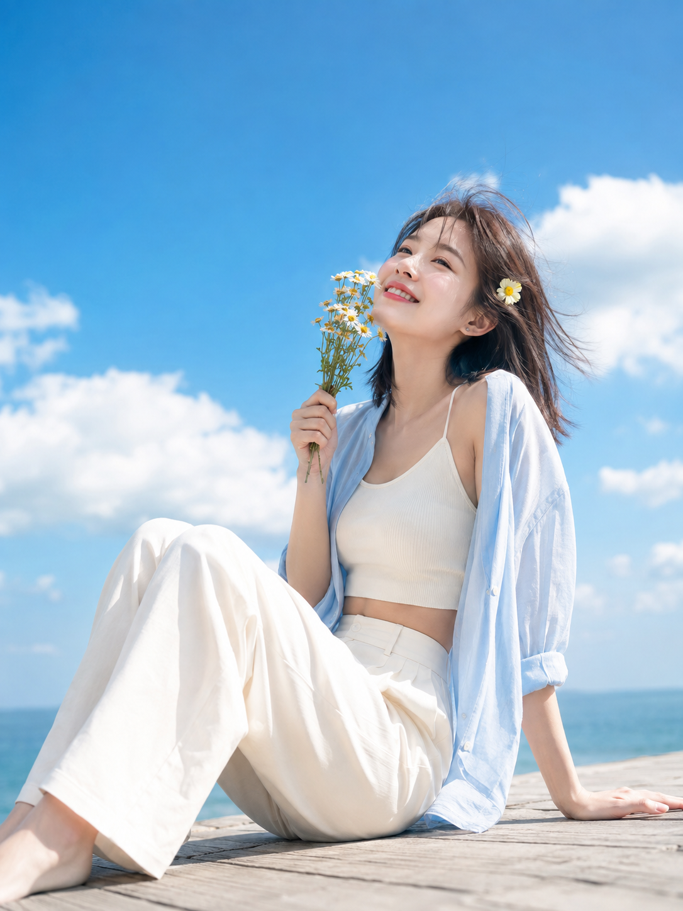
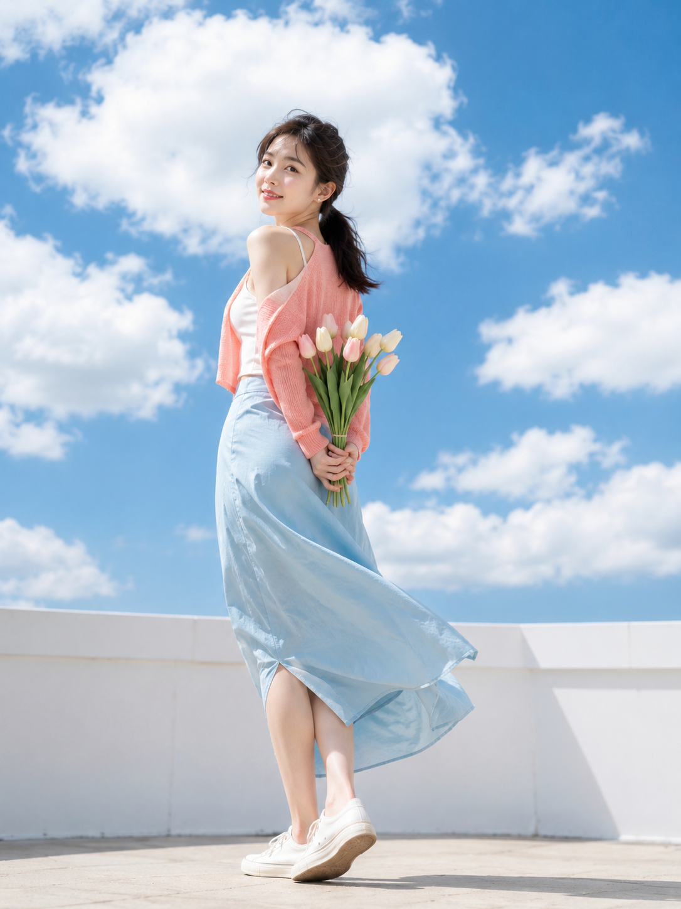
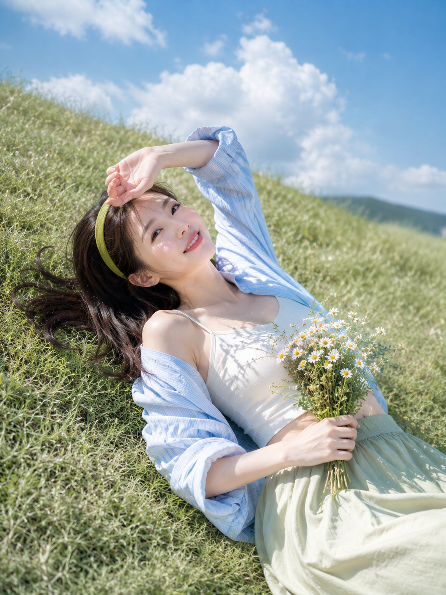
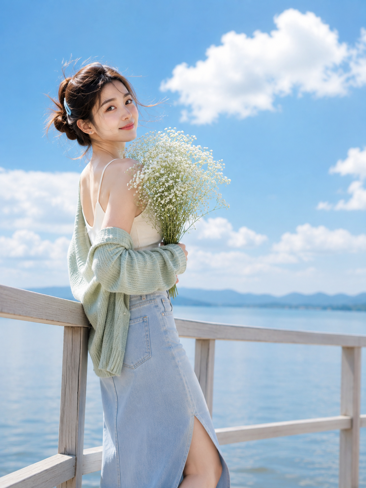
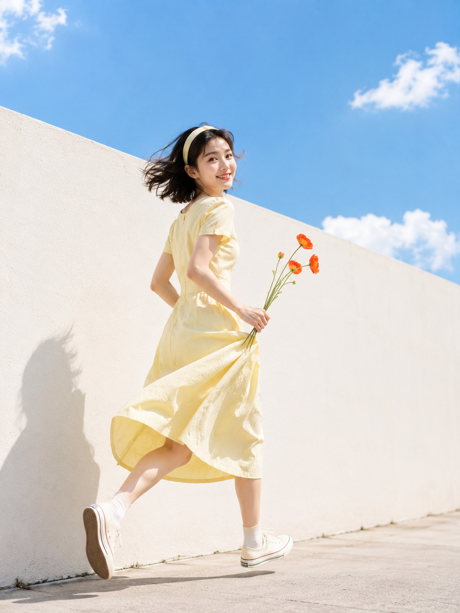
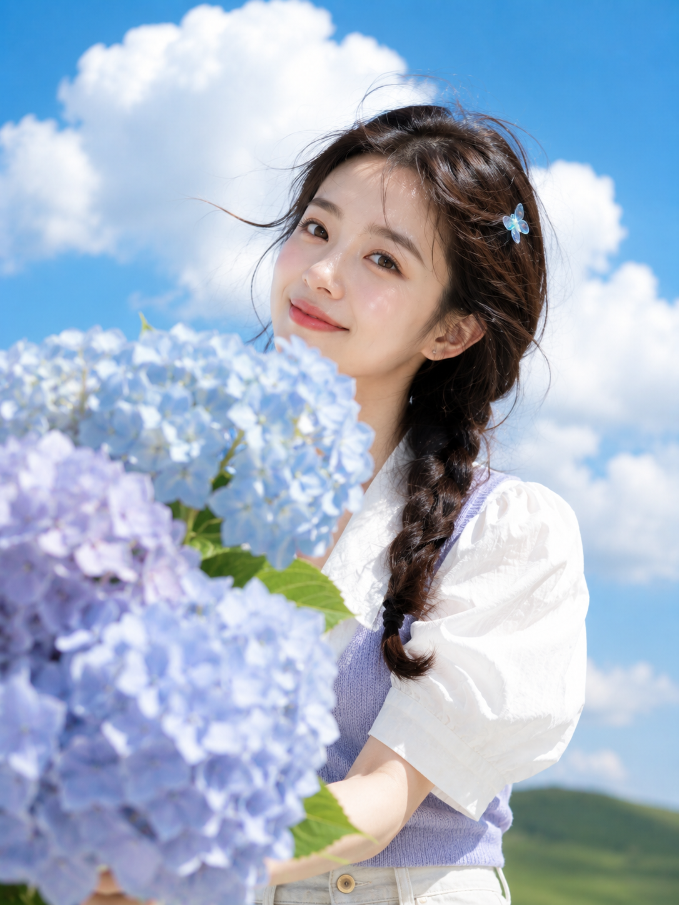

# 晴空花信：把蓝天当背景布，六幕明亮硬光的夏日花系直拍

晴天正午的硬光，大多数人都躲着走。但只要人背后是一整片蔚蓝，天空本身就是全场最大的那块反光板——高饱和蓝天 + 明亮硬光 + 一束花，这就是这组的全部配方。人和色系都没换，真正在动的只有焦段、机位高度和快门。

## 参数｜六张的镜头配比

| 场景 | 焦段 | 光圈 | 机位 |
| --- | --- | --- | --- |
| 海风雏菊 | 50mm | f/4 | 低机位微仰 |
| 屋顶郁金香 | 70mm | f/4.5 | 略低机位中远景 |
| 草坡洋甘菊 | 35mm | f/5 | 高位斜俯 |
| 湖畔满天星 | 85mm | f/3.5 | 平视侧身 |
| 白墙罂粟 | 35mm | f/5.6 | 低机位全身抓拍 |
| 云下绣球 | 70mm | f/3.2 | 近距离胸像 |

规律很直接：焦段越短，天空占比越大；光圈越小，云越有形状。想留住云的轮廓，就别急着把光圈开到最大。

## 01｜海风雏菊：完整原版提示词

低机位微仰是让蓝天吃掉杂物最省力的一招——镜头一压低，栈道上的栏杆、游客、远处建筑全部落到取景框外。50mm 接近人眼视角，f/4 保住云层轮廓。身体侧向镜头、腰背后倾、双腿向一侧收拢，是一个动作同时交出腰线和小腿线条。完整原版如下：

竖版 3:4，清新明亮的夏日海边人像写真，高级青春杂志与商业时装摄影质感。一位 23-25 岁成年东亚女生坐在浅色海边木栈道上，身体侧向镜头，腰背舒展微微后倾，双腿自然屈起并向一侧收拢，小腿线条修长干净，一只手撑在身后打开肩背，另一只手举着一小束奶油黄色雏菊靠近脸颊，微微仰头迎着海风自然微笑，颈部与下颌线条优雅。真实自然的东亚面孔，鹅蛋脸，五官清秀耐看，眼神明亮，健康暖白肤色，保留细腻自然皮肤纹理，淡粉腮红，水润珊瑚色嘴唇。黑棕色齐肩中长发自然披散，发尾轻微外翻，几缕碎发被风吹过额前，佩戴一枚浅黄色小花发夹。穿浅天蓝色宽松衬衫敞开外搭、袖口自然挽起，内搭奶油白色细肩带短款背心，露出纤细腰线与自然锁骨，下装为象牙白高腰阔腿长裤，收腰剪裁勾勒腰臀比例，衣料轻盈干净、完整得体不透视。背景为辽阔蔚蓝天空、蓬松白色积云和一小段低位海平线，不出现建筑和复杂游客。低机位微仰拍，人物位于画面右侧三分之一，左侧保留大面积蓝天和云层，花束作为黄色视觉点缀。晴朗午后强烈自然阳光从正前方偏侧照射，形成清晰眼神光、明亮面部高光和自然衣物阴影，整体高明度、高饱和、通透清爽。50mm 镜头，f/4，中等景深，高速快门凝固飞扬发丝，商业人像精度，真实布料纹理和花瓣细节，轻微柔焦但不过度磨皮。避免 AI 网红脸、塑料皮肤、过度精修、僵硬摆拍、夸张妆容、低龄感、手部畸形、花朵变形、衣服透肤、灰暗天空、杂乱背景、过度虚化、文字、Logo、水印。人物为成年女性（22-26 岁），五官自然清秀、面部干净、健康自然肤色、眼神真实、皮肤光泽自然，身形比例自然纤长匀称，腰线、肩颈与手臂线条舒展优雅，气质明亮清甜带仙气。2K 超高清，真实摄影级细节，增加光线采样数（光线采样 64 次），充分收敛噪点，减少随机颗粒、亮部噪声与暗部噪声；最大程度保留原图的细节和质感，同时去除噪点拟合，完整保留五官、眼神、发丝、皮肤纹理、花瓣与织物纹理，提升照片清晰度，不过度锐化；画面明亮通透、高明度、曝光稳定、干净无模糊脏污与压缩伪影；成年女性、自然审美、服装完整得体不透视不走光，仅作时装与生活方式表达，不涉黄。避免 AI 美女脸、网红感、过度精修、塑料皮肤、暗沉肤色、明显痘印、明显皱纹、斑点、面部变形。

## 02｜屋顶郁金香：身体转过去，脸留下来

背身 45 度再回眸，是全组性价比最高的姿态。它一次交出腰背曲线和眼神，还自带"被抓拍"的松弛感。70mm 把屋顶护栏压成画面底部的几条几何线，剩下的全部让给蓝天和白云。

## 03｜草坡洋甘菊：躺下来，让天空占掉一半

35mm 高位斜俯是唯一能同时装进人、草坡和整片云的机位。身体铺成一条对角线，画面就有了流动方向。俯拍要写清"斜俯"而不是"俯拍"，否则模型很容易给你一个压缩变形的正上方视角。

## 04｜湖畔满天星：85mm 是把环境推远

前三张都在抢环境，这张反过来。85mm、f/3.5，湖面和远山轻轻化掉，只留发丝的逆光轮廓。开衫松松挂在肩后而不是穿好，颈肩线条才露得出来。

## 05｜白墙罂粟：唯一需要写快门的一张

奔跑是全组唯一的动态帧，提示词里必须写死 1/1000 秒高速快门，不然发丝和裙摆会糊成一团。奶油白墙 + 蔚蓝天空是两块干净色块，红橙虞美人就是那个焦点。

## 06｜云下绣球：层次交给前景

极简天空最怕拍平。把绣球举到镜头前，让花瓣压在画面左下并轻微虚化，前后景一分开，纵深就出来了。f/3.2 刚好让花糊、脸清。

六张真正的变量只有三个：焦段、机位高度、快门。而决定成片干净还是脏的，是那段谁都懒得写的收尾——光线采样数、收敛噪点、保留皮肤与花瓣纹理，它比任何滤镜都管用。

## 往期回顾

- 冰蓝薄雾：高键柔光的六种写法
- 青梅浮翠：湖岸树荫下的一整片浅绿
- 琥珀时刻：夏日车窗的一束斜阳
