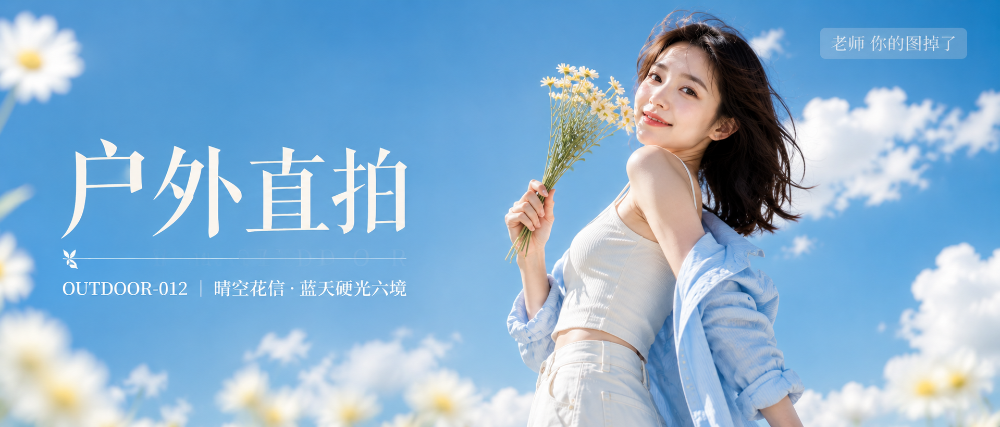

# OUTDOOR-012 封面

比例 2.35:1，电影宽银幕。

## 封面提示词

超宽画幅 2.35:1 电影宽银幕比例，高端明亮夏日花系人像摄影封面，蔚蓝天空与蓬松白云构成的开阔户外场景，一位 24 岁成年东亚女生位于画面右侧偏中位置，主体足够大、占据画面右侧约二分之一高度，脸部以 3/4 侧脸清晰面向镜头，双眼注视镜头，眼神明亮清澈，笑意含蓄自然，五官自然清秀、面部干净、健康暖白肤色、皮肤光泽自然并保留细腻真实纹理，唇色为水润珊瑚色。黑棕色中长发被风吹起几缕，发丝边缘带清晰阳光轮廓光。她穿浅天蓝色宽松衬衫敞开外搭、袖口自然挽起，内搭奶油白色细肩带短款背心，下装为象牙白高腰阔腿长裤，收腰剪裁勾勒纤细腰线与修长身形比例，肩背微微向后打开，肩颈与手臂线条修长优雅，锁骨自然，服装完整得体不透视不走光。一只手举起一小束奶油黄色雏菊靠近肩侧，指尖放松自然，动作轻盈而有气质。画面左侧是大面积蔚蓝天空与蓬松白色积云构成的干净留白，近景边缘有几片虚化的浅色花瓣作天然框景，形成前后景层次与纵深。电影感光影，晴朗午后强烈阳光从正前方偏侧照射，面部明亮通透、阴影干净利落，花瓣与发丝高光细腻，高明度、高饱和、色彩层次丰富，蔚蓝、天蓝、奶油白、柠檬黄、象牙白、珊瑚粉构成通透明快的色彩层次，黄金比例构图，85mm 人像镜头，f/2.8，浅景深，高清锐利，空气感强，杂志封面级质感，明亮、清甜、仙气飘飘。

文字排版：画面左侧垂直居中偏下，超大号衬线米白色主文案「户外直拍」，下方细横线左端带 🌿，横线中央透明英文水印 OUTDOOR，横线下方等宽白色副文案「OUTDOOR-012 ｜ 晴空花信·蓝天硬光六境」；右上角浅色半透明圆角底衬配小号文字「老师 你的图掉了」。
