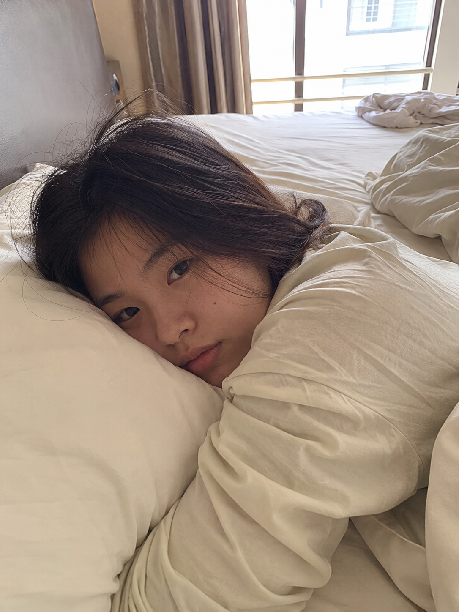
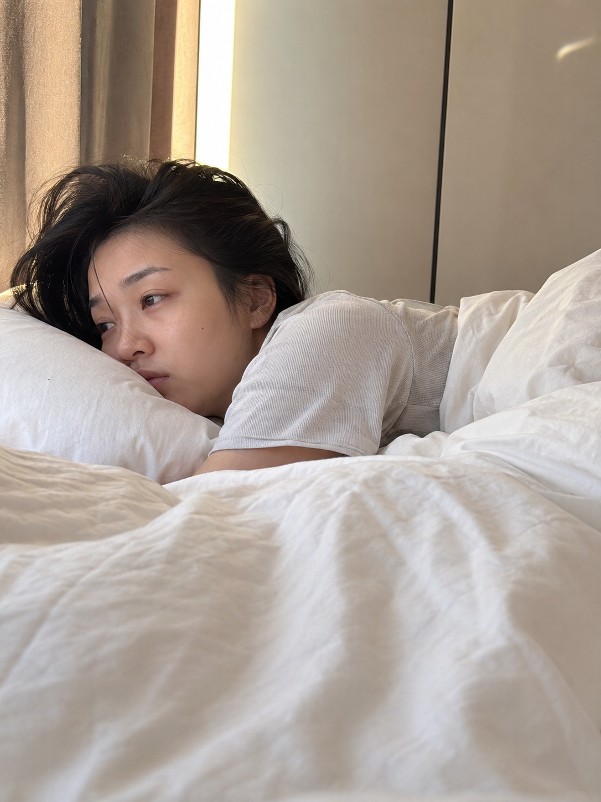

# MORNING-004｜趴在枕头边发呆

---

# GPT Image 2 生图提示词｜晨间女友 MORNING-004：趴在枕头边发呆

这是「真实女友感 Prompt 库」第 MORNING-004 期。

今天这组是「趴在枕头边发呆」，适合生成清晨刚醒、情绪很松、生活痕迹比较真实的亚洲女生照片。

它不是精修写真，也不是商业广告感，更像是早上醒来后，你随手拿手机拍到的一秒。

建议收藏这组 Prompt。后面只要替换枕头、床铺、窗光和动作，就可以继续扩展成一整组晨间女友感照片。

## 效果图 1

### 场景

清晨卧室里，亚洲女生趴在枕头边发呆，头发微乱，脸贴近柔软枕面，窗边自然光落在床铺和侧脸上，情绪安静、刚睡醒。

### 提示词

男友第一人称视角，24岁亚洲女生清晨趴在枕头边发呆，脸贴近白色枕头，头发微乱，宽松浅色居家睡衣，未整理的被子和床单，柔和窗光照进真实卧室，iPhone 随手抓拍，真实皮肤纹理，避免 AI 美女脸、写真感、网红感、过度精修。

## 效果图 2

### 场景

镜头贴近床沿，女生半趴在枕头上看向窗外，眼神放空，房间里有凌乱被褥和清晨淡金色自然光，画面更像真实情侣日常抓拍。

### 提示词

男友第一人称视角，亚洲女生刚睡醒半趴在枕头上看向窗外，眼神放空，凌乱床单和白色被子占据前景，清晨淡金色自然光从窗帘缝隙照进来，宽松居家 T 恤，素颜生活状态，iPhone 原相机抓拍，真实卧室质感，避免摆拍和商业写真感。

## 效果图 3

### 场景

女生趴在床上用手指轻轻压着枕边，像还没完全清醒，镜头带一点男友视角的亲近感，但整体保持自然、安静、生活化。

### 提示词

男友第一人称视角，22-28岁亚洲女生清晨趴在床上，手指轻轻压着枕头边，侧脸靠近枕面发呆，窗帘半开，柔和晨光落在脸颊和被褥上，头发自然凌乱，宽松睡衣，真实生活摄影，iPhone 随手抓拍，避免网红感和过度精修。

## 使用建议

想更真实：保留 iPhone 原相机、自然皮肤纹理、未整理床铺、非商业摄影感。

想换场景：把「枕头边」替换成「床沿」「被窝里」「窗边地毯」，动作保持发呆或刚醒状态。

想做系列：固定男友第一人称视角和清晨自然光，只替换动作、构图和床品颜色。

## 封面图提示词

亚洲女生清晨趴在枕头边发呆，真实卧室，凌乱被褥，柔和窗光，宽松浅色居家睡衣，iPhone 生活摄影质感，2.35:1 电影横构图。画面左侧垂直居中偏下叠加文字排版：超大号衬线字体米白色主文案「晨间女友」，主文案正下方一条细横线左端带太阳图标☀横线中央有透明英文水印 MORNING，横线下方等宽白色字体副文案「MORNING-004 ｜ 趴在枕头边发呆」；右上角浅色半透明圆角底衬配小号文字「老师 你的图掉了」；无整体蒙层，文字直接压图。

## 相关推荐

MORNING-005｜半睡半醒拉着被子

MORNING-006｜俯身叫你起床

MORNING-007｜轻轻拉开被子

如果你也喜欢这种真实生活感 AI 摄影，可以点个赞。这个系列会持续更新，后面会补齐完整的亚洲女生真实生活场景库。

## 标签

#GPTImage2 #生图提示词 #Prompt #亚洲女生 #真实女友感 #生活摄影 #情侣日常 #男友视角 #AI绘画
