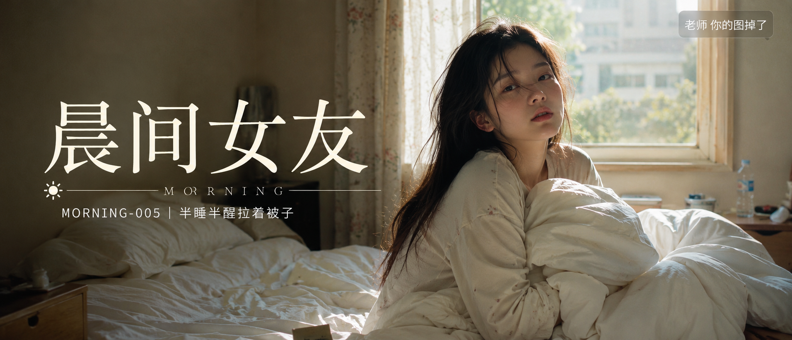
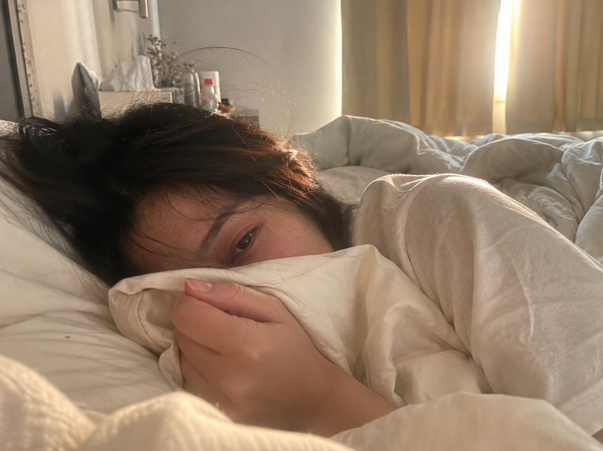

# MORNING-005 | 半睡半醒拉着被子

---

## title: "GPT Image 2 生图提示词｜晨间女友 MORNING-005：半睡半醒拉着被子"  
author: "老师 你的图掉了"  
summary: "这一期是晨间女友系列里很适合收藏的一组清晨卧室 Prompt：半睡半醒、拉着被子、不太想起床，画面更接近真实生活里的随手抓拍。"

这是「晨间女友系列」第 MORNING-005 期。

今天这组是「半睡半醒拉着被子」。它适合生成清晨卧室里刚醒来的一瞬间：人还没完全清醒，手里拉着被角，光线从窗边慢慢进来。

这类画面不要做成精修写真，关键是保留床铺凌乱、表情松弛、皮肤真实和镜头随手拍的感觉。

场景说明

清晨的真实卧室里，女生半睡半醒地缩在被子里，手指轻轻拉着被角，看向镜头或还没完全睁开眼。画面重点是柔和窗光、未整理的床铺、宽松居家服和刚醒来的自然状态。

提示词 1

男友第一人称视角，24岁亚洲女生清晨半睡半醒地侧躺在床上，一只手轻轻拉着白色被子看向镜头，头发微乱，宽松浅色居家睡衣，未整理的枕头和床单，柔和窗光照进真实卧室，iPhone 随手抓拍，真实皮肤纹理，避免 AI 美女脸、写真感、网红感、过度精修。

效果图 1  
[配图1：见文末图片 img1.png]

提示词 2

男友第一人称视角，亚洲女生刚睡醒蜷在被子里，手指攥着被角遮住半张脸，眼神半睁半闭，清晨淡金色自然光从窗帘缝隙照进来，宽松居家 T 恤，凌乱床铺和生活痕迹，iPhone 原相机抓拍，真实卧室质感，避免摆拍和商业写真感。

效果图 2  
[配图2：见文末图片 img2.png]

提示词 3

男友第一人称视角，22-28岁亚洲女生清晨坐在床上拉着被子不想起床，肩膀裹在白色被子里，侧脸被柔和晨光照亮，头发自然凌乱，素颜生活状态，35mm 自然抓拍，真实皮肤纹理，避免网红感和过度精修。

效果图 3  
[配图3：见文末图片 img3.png]

使用建议

1. 想让画面更真实，保留「iPhone 随手抓拍」「真实皮肤纹理」「未整理床铺」这几个关键词，不要把人物写成商业写真。
2. 想调整镜头氛围，可以在「侧躺」「蜷在被子里」「坐在床上」之间替换动作，同时固定清晨窗光和卧室环境。
3. 想控制细节，重点改被子颜色、窗帘开合、镜头远近和表情状态，人物年龄、气质和居家服尽量保持一致。

建议收藏这组 Prompt。后续只需要替换动作、光线和床边细节，就能继续延展同类型的清晨真实女友感照片。

#GPTImage2 #生图提示词 #Prompt #晨间女友系列 #睡醒时刻 #真实女友感 #生活摄影 #男友视角

睡醒时刻 · 目录  
上一期：MORNING-004｜趴在枕头边发呆  
本期：MORNING-005｜半睡半醒拉着被子  
下一期：MORNING-006｜俯身叫你起床

[封面图：见文末图片 cover.png]

