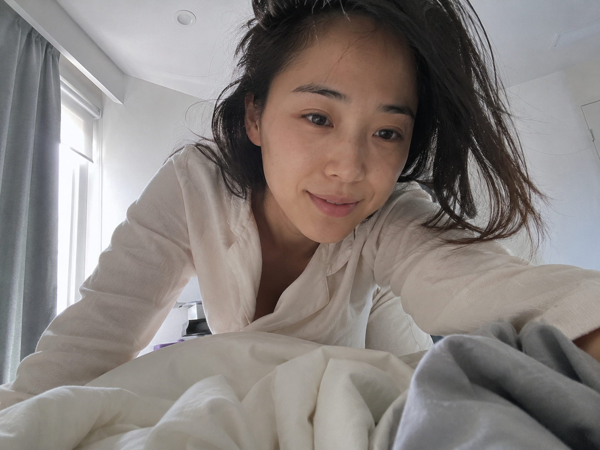
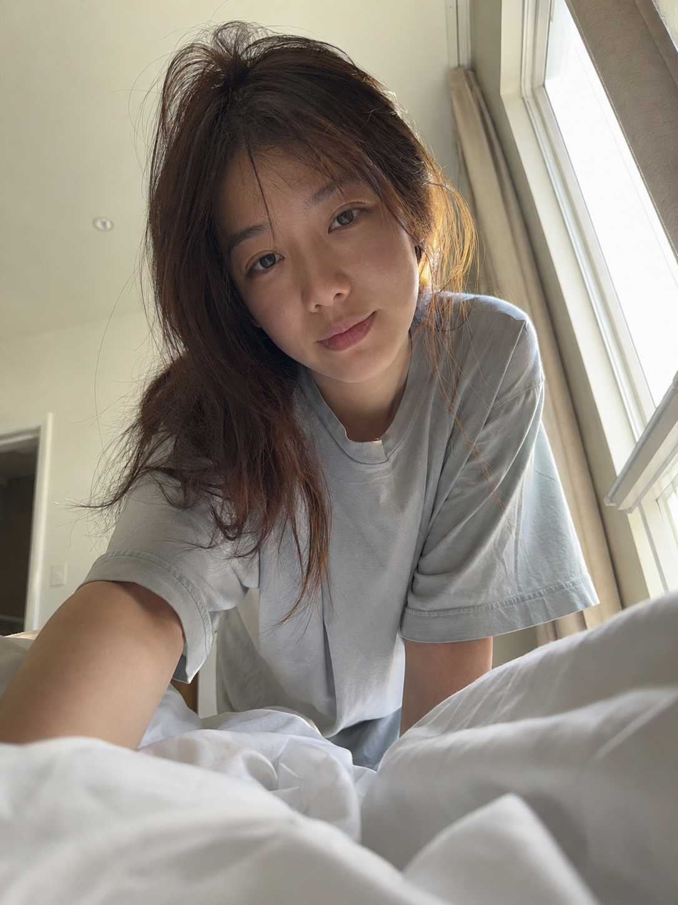
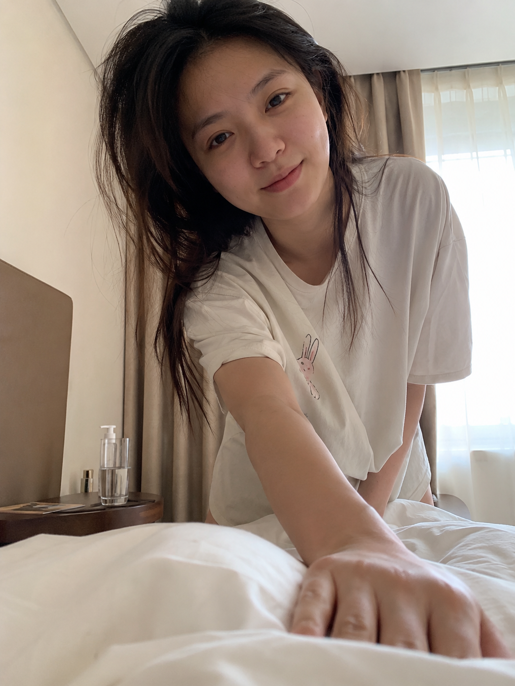

# MORNING-006｜俯身叫你起床

# GPT Image2 提示词｜晨间女友系列 MORNING.006：俯身叫你起床，iPhone 生活抓拍

作者：老师 你的图掉了

[封面图：见同目录 cover.png]

这是「晨间女友系列」第 MORNING-006 期。

今天这组是「俯身叫你起床」，适合生成清晨卧室里很近、很生活化的一瞬间：她刚睡醒，俯身靠近镜头，像是在轻声叫你起床。

这组 Prompt 的重点不是精修写真，而是男友第一人称视角、自然窗光、凌乱被褥和真实皮肤质感。建议收藏，后面只要替换动作和场景，就能继续延展同类型清晨日常。

## 场景说明

清晨的真实卧室里，床铺还没有整理，窗帘半开，柔和自然光照进来。镜头从躺在床上的男友视角拍摄，她俯身靠近你，动作亲密但不过度摆拍，像一个刚发生的生活瞬间。

## 提示词 1

男友第一人称视角，24岁亚洲女生清晨俯身靠近镜头叫你起床，一只手轻轻撑在枕头边，头发微乱，宽松浅色居家睡衣，未整理被褥占据前景，柔和窗光照进真实卧室，iPhone 随手抓拍，真实皮肤纹理，避免 AI 美女脸、写真感、网红感、过度精修。

[配图1：见同目录 img1.png]

## 提示词 2

男友第一人称视角，镜头从床上仰拍，亚洲女生刚睡醒弯腰探过来轻声叫醒你，脸部靠近但表情自然，白色被子和枕头边缘在画面下方，窗帘半开，清晨淡金色自然光，宽松居家 T 恤，真实卧室生活感，35mm 自然抓拍，避免摆拍和商业写真感。

[配图2：见同目录 img2.png]

## 提示词 3

男友第一人称视角，22-28岁亚洲女生清晨站在床边俯身伸手拍了拍被子叫你起床，头发自然凌乱，素颜生活状态，宽松浅色睡衣，床头柜和半杯水在背景里，柔和晨光落在侧脸和被褥上，iPhone 原相机抓拍，真实皮肤纹理，避免网红感和过度精修。

[配图3：见同目录 img3.png]

## 使用建议

1. 想更真实：保留男友第一人称视角、iPhone 原相机、自然皮肤纹理和未整理床铺。
2. 想加强清晨感：重点控制窗帘半开、柔和晨光、浅色被褥和刚睡醒的头发状态。
3. 想做成系列：固定人物气质和居家服，只替换叫醒动作、镜头距离和床边小物。

建议收藏这组 Prompt。这个系列会持续更新，后面会继续补齐更多清晨日常场景。

#GPTImage2 #生图提示词 #Prompt #晨间女友系列 #俯身叫你起床 #真实女友感 #生活摄影 #男友视角

亲密叫醒 · 目录

上一期：MORNING-005｜半睡半醒拉着被子

下一期：MORNING-007｜轻轻拉开被子

关注「老师 你的图掉了」，持续更新真实生活感 Prompt。
