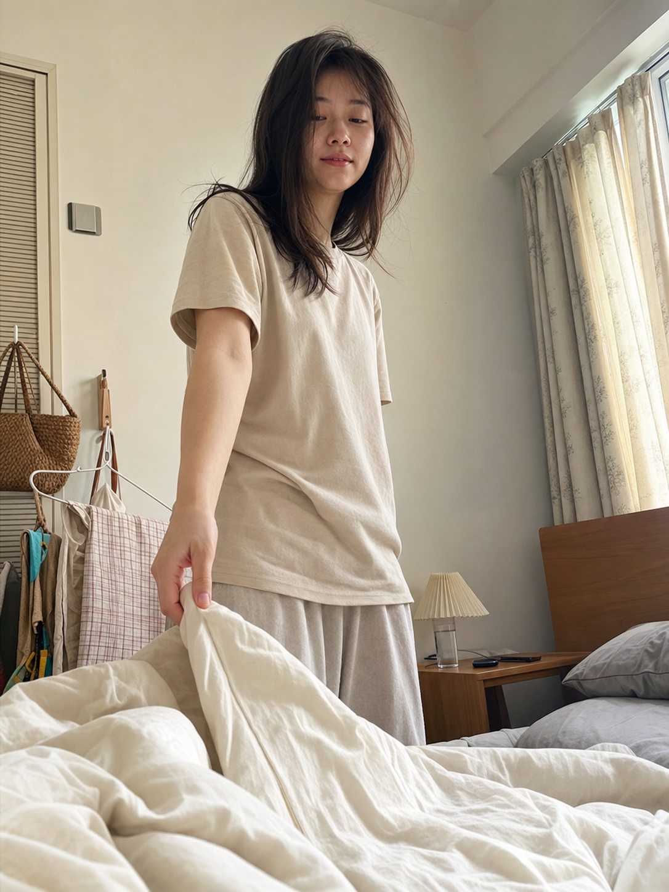

# MORNING-007 | 轻轻拉开被子

---

## title: "GPT Image2 提示词｜晨间女友系列 MORNING.007：轻轻拉开被子，iPhone 生活抓拍"  
author: "老师 你的图掉了"  
summary: "晨间女友系列第 MORNING-007 期，适合生成清晨卧室里轻轻拉开被子的真实女友感生活照片。"  
cover: "cover.png"

这是「晨间女友系列」第 MORNING-007 期。

今天这组是「轻轻拉开被子」，适合生成清晨卧室里很近、很生活化的一瞬间：她站在床边或坐在床边，轻轻把被子拉开，像是在用很自然的方式叫你起床。

这组 Prompt 主要按 GPT Image 2 的中文自然语言写法整理，也可以在豆包、千问及其他支持中文提示词的生图工具上尝试。不同工具出图会有差异，可以微调画幅、镜头距离和生活细节。

场景说明

清晨卧室里，床铺还没整理好，窗帘半开，柔和自然光照进来。镜头从躺在床上的男友视角拍摄，她轻轻拉开白色被子，动作亲密但不过度摆拍，重点是自然、松弛、像随手拍下来的生活瞬间。

提示词 1

男友第一人称视角，24岁亚洲女生清晨轻轻拉开你身上的白色被子，一只手捏着被角靠近镜头，头发微乱，宽松浅色居家睡衣，未整理床铺和枕头占据前景，柔和窗光照进真实卧室，iPhone 原相机随手抓拍，真实皮肤纹理，避免 AI 美女脸、写真感、网红感、过度精修。

效果图 1  
[配图1：见下方图片 img1.png]

提示词 2

男友第一人称视角，亚洲女生清晨站在床边低头看向镜头，手里轻轻拉起白色被子一角，宽松米色居家 T 恤和睡裤，床头柜、半杯水和手机在背景里，窗帘半开，淡金色自然光，真实卧室生活感，35mm 自然抓拍，避免摆拍和商业写真感。

效果图 2  
[配图2：见下方图片 img2.png]

提示词 3

男友第一人称视角，24岁亚洲女生清晨坐在床边，轻轻把被子从镜头前拉开，头发自然凌乱，宽松浅色睡衣，白色被褥形成前景虚化，柔和晨光从窗边落在脸上，素颜生活状态，iPhone 随手抓拍，真实皮肤纹理，避免网红感和过度精修。

效果图 3  
[配图3：见下方图片 img3.png]

使用建议

1. 想更真实：保留男友第一人称视角、iPhone 原相机、自然皮肤纹理和未整理床铺，不要把画面做成商业写真。
2. 想加强清晨感：重点控制窗帘半开、柔和晨光、浅色被褥和刚睡醒的头发状态。
3. 想延展同系列：固定人物气质和居家服，只替换拉被子的力度、镜头距离、床边小物和表情状态。

建议收藏这组 Prompt。感兴趣的朋友们，欢迎收藏、关注，也可以在评论区留言你喜欢的系列或话题，我会继续补更多同类型场景。

#GPTImage2 #豆包 #千问 #生图提示词 #Prompt #晨间女友系列 #轻轻拉开被子 #真实女友感 #生活摄影 #男友视角

亲密叫醒 · 目录  
上一期：MORNING-006｜俯身叫你起床  
下一期：MORNING-008｜靠近镜头说早安  
关注「老师 你的图掉了」，持续更新真实生活感 Prompt。

