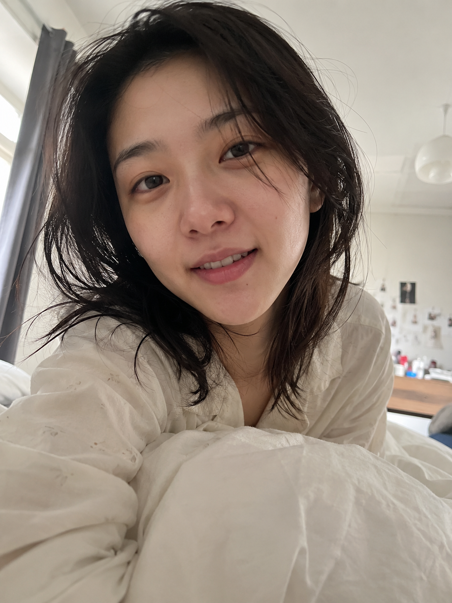
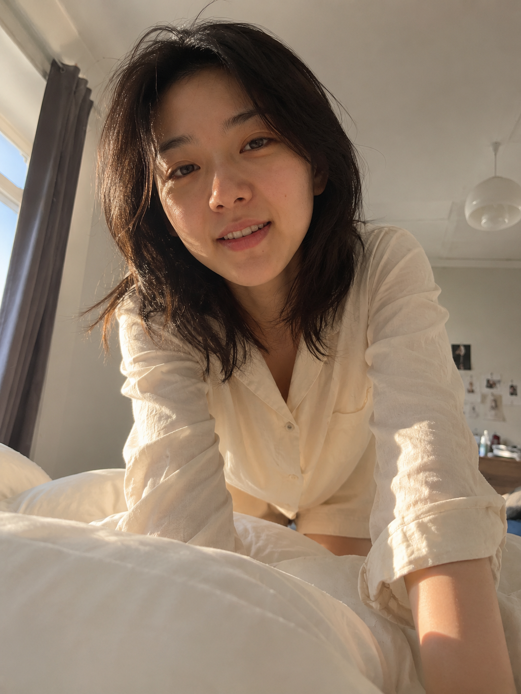
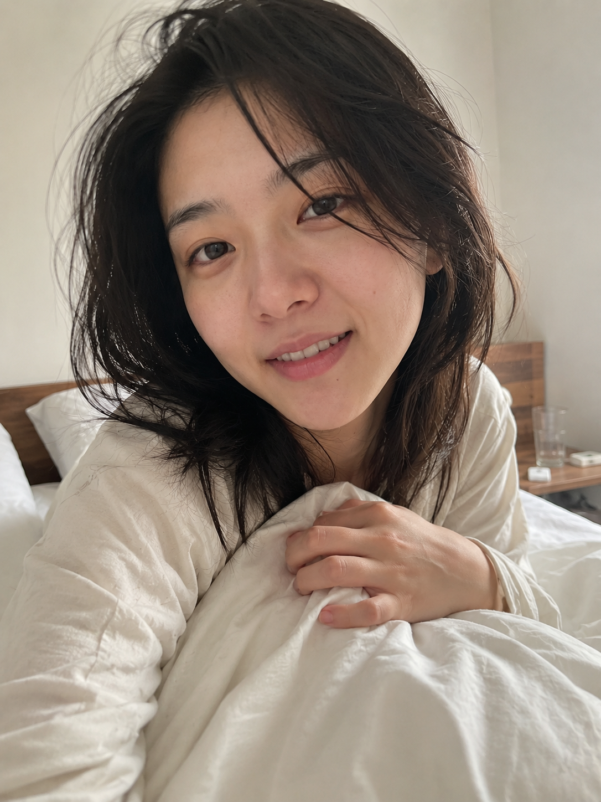

# MORNING-008 | 靠近镜头说早安

---

title: "GPT Image2 提示词｜晨间女友系列 MORNING.008：靠近镜头说早安，iPhone 生活抓拍"  
author: "老师 你的图掉了"  
summary: "晨间女友系列第 MORNING-008 期，适合生成清晨卧室里靠近镜头说早安的真实女友感生活照片。"  
cover: "cover.png"  
topics:

- GPT Image 2
- 豆包
- 千问
- 生图提示词
- Prompt
- 晨间女友系列
- 靠近镜头说早安

---

这是「晨间女友系列」第 MORNING-008 期。

今天这组是「靠近镜头说早安」，适合生成清晨卧室里很近、很自然的一瞬间：她刚睡醒，靠近镜头，像是在床边轻声和你说早安。

这组 Prompt 主要按 GPT Image 2 的中文自然语言写法整理，也可以在豆包、千问及其他支持中文提示词的生图工具上尝试。不同工具出图会有差异，可以按画幅、镜头距离和光线细节微调。

重点不是精修写真，而是男友第一人称视角、柔和窗光、白色被褥和真实皮肤质感。建议收藏，后面只要替换动作和床边细节，就能继续延展同类型清晨日常。

场景说明

清晨的真实卧室里，床铺还没整理，窗帘半开，柔和自然光照进来。镜头从躺在床上的男友视角拍摄，她靠近镜头说早安，距离很近，但动作和表情都保持生活化。

提示词 1

男友第一人称视角，24岁亚洲女生清晨靠近镜头轻声说早安，脸部距离很近但表情自然，头发微乱，宽松浅色居家睡衣，白色被子和枕头在画面下方，柔和窗光照进真实卧室，iPhone 原相机随手抓拍，真实皮肤纹理，避免 AI 美女脸、写真感、网红感、过度精修。

效果图 1  
[配图1：见下方图片 img1.png]

提示词 2

男友第一人称视角，镜头从床上轻微仰拍，亚洲女生刚睡醒跪坐在床边，双手撑在枕头旁靠近镜头说早安，窗帘半开，清晨淡金色自然光落在侧脸和被褥上，宽松米白色居家 T 恤，真实卧室生活感，35mm 自然抓拍，避免摆拍和商业写真感。

效果图 2  
[配图2：见下方图片 img2.png]

提示词 3

男友第一人称视角，22-28岁亚洲女生清晨趴在床边靠近镜头，嘴角轻轻笑着说早安，一只手压着白色被角，头发自然凌乱，素颜生活状态，床头柜和半杯水在背景里，柔和晨光，iPhone 随手抓拍，真实皮肤纹理，避免网红感和过度精修。

效果图 3  
[配图3：见下方图片 img3.png]

使用建议

1. 想更真实：保留男友第一人称视角、iPhone 原相机、自然皮肤纹理和未整理床铺，不要把人物修得太精致。
2. 想加强镜头氛围：重点控制靠近镜头的距离、清晨窗光、白色被褥前景和刚睡醒的头发状态。
3. 想控制细节：固定人物气质和浅色居家服，只替换手部动作、床边小物和镜头角度。

感兴趣的朋友们，欢迎收藏、关注，也可以在评论区留言你喜欢的系列或话题，我会继续补更多同类型场景。

#GPTImage2 #豆包 #千问 #生图提示词 #Prompt #晨间女友系列 #靠近镜头说早安 #真实女友感 #生活摄影 #男友视角

**亲密叫醒 · 目录**  
上一期：MORNING-007｜轻轻拉开被子  
下一期：MORNING-009｜坐起身整理头发  
关注「老师 你的图掉了」，持续更新真实生活感 Prompt。

